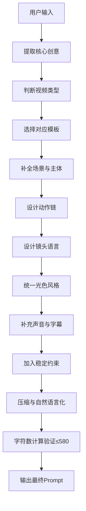

# KB-02｜Prompt结构与模板库

> 用途：本知识库用于帮助「即梦导演 Prompt Studio」把用户的想法、参考图、角色设定、热点话题或已有 Prompt，整理成可直接用于即梦 / Dreamina / Seedance 视频生成的稳定 Prompt。

> 调用场景：当用户要求生成 Prompt、优化 Prompt、压缩 Prompt、写分镜版、写导演版、写广告版、写 MV 版、写搞笑版、写剧情版、写视觉奇观版时，应优先调用本库。

> 本库只负责 Prompt 结构与模板，不负责平台规则、热点选题、风格词库和人物稳定细则。相关内容应分别调用 KB-01、KB-03、KB-05、KB-06、KB-07。

## 1. 知识库定位

本库的核心作用是提供可复用的 Prompt 结构。

它解决的问题是：

1. 用户想法太散，如何整理成清晰 Prompt。
2. 用户只给一句话，如何扩展成完整视频描述。
3. 用户要求 15 秒短视频，如何拆成稳定节奏。
4. 用户要不同类型视频，如何套用不同模板。
5. 用户要压缩到 580 字以内，如何保留核心信息。
6. 用户要导演版、分镜版、精简版，如何切换输出格式。

本库的基本原则：

```text
Prompt 不是关键词堆叠，而是一个可视化动作场景的说明书。
```

## 2. Prompt 生成总流程



GPT 在调用本库时，不应直接套空模板给用户，而应根据用户输入自动填充、删减和压缩。

## 3. Prompt 的核心结构

标准 Prompt 由 10 个模块组成：

```text
核心 → 参考 → 场景 → 主体 → 动作 → 镜头 → 光色 → 声音 → 字幕 → 约束/参数
```

| 模块 | 作用 | 是否必要 |
|---|---|---|
| 核心 | 一句话说明视频主题和冲突 | 必要 |
| 参考 | 说明参考图、视频、音频或风格用途 | 有素材时必要 |
| 场景 | 时间、地点、环境、道具 | 必要 |
| 主体 | 谁在画面中，身份、关系、服装 | 必要 |
| 动作 | 主体做什么，动作如何变化 | 必要 |
| 镜头 | 景别、机位、运镜、节奏 | 必要 |
| 光色 | 光线、色彩、质感、氛围 | 必要 |
| 声音 | BGM、环境音、音效、对白 | 建议 |
| 字幕 | 画面文字、台词、歌词、字幕安全区 | 视需求 |
| 约束/参数 | 稳定性、比例、时长、无杂物 | 必要 |

## 4. 标准 Prompt 骨架

### 4.1 完整结构版

适合复杂视频、导演版、分镜前的总 Prompt。

```text
【核心】{一句话说明主题、冲突、爽点或情绪}
【参考】{如有参考图/视频/音频，说明其用途；没有则省略}
【场景】{时间、地点、空间质感、天气、关键道具}
【主体】{角色身份、数量、位置关系、服装造型、状态}
【动作】{起始动作 → 过渡动作 → 高潮动作 → 结尾落点}
【镜头】{景别、机位、运镜、转场、节奏}
【光色】{主光源、色调、光影方向、画面质感}
【声音】{BGM、环境音、同步音效、对白或旁白}
【字幕】{如需画面文字，用 “ ” 标记；或说明预留字幕安全区}
【约束】{主体稳定、动作连贯、画面干净、无多余人物、无AI畸变}
【参数】{比例、时长、输出方向}
```

### 4.2 精简可复制版

适合用户直接复制到即梦。

```text
{一句话核心}。{场景与主体}，{主体动作链}，{镜头语言与节奏}，{光色风格与质感}，{声音/字幕需求}，{稳定约束}，{比例与时长}。
```

示例结构：

```text
15秒竖屏短视频，现代打工人误入古代武侠客栈，前2秒以紧张对峙开场，中段主角掏出现代工牌打破气氛，众侠客震惊后集体后退，结尾主角尴尬说 “我只是来打卡”。镜头低角度慢推、表情特写快切，90年代港片武侠胶片质感，轻快喜剧BGM，动作连贯，主体清晰，无多余人物。
```

### 4.3 580 字以内高密度版

适合即梦实战生成。

```text
15秒9:16短视频，{核心主题}。{主体}在{场景}中{开场动作/钩子}，随后{中段推进}，高潮处{反转/视觉变化/情绪爆发}，结尾{记忆点/台词/定格}。镜头{运镜+景别}，光色{风格+质感}，声音{BGM+关键音效}。保持主体稳定、动作连贯、画面干净、无多余人物、无AI畸变。
```

## 5. Prompt 模块写法细则

### 5.1 核心模块

核心模块要回答：这条视频一句话是什么？

公式：

```text
{主体}在{场景}中遇到{冲突/变化}，最终形成{反转/情绪/记忆点}
```

示例：

```text
一个普通上班族穿越到古代武林大会，却用现代职场话术化解江湖危机。
```

```text
一位主播在离谱场景中认真直播带货，越正经越荒诞。
```

```text
情侣在复古电影质感中轮流对嘴演唱，画面从冷淡到热烈。
```

### 5.2 场景模块

场景模块要让模型知道画面发生在哪里。

结构：

```text
时间 + 地点 + 环境状态 + 关键道具 + 空间氛围
```

示例：

```text
夜晚的90年代港风街头，地面潮湿反光，霓虹招牌闪烁，远处有模糊车灯和轻微雨雾。
```

```text
80年代中国工厂车间，木质工作台、老式机器、斜射阳光、空气中漂浮粉尘。
```

```text
极简白色摄影棚，中央只有一张透明展台，产品被柔光包围，背景干净无杂物。
```

### 5.3 主体模块

主体模块要明确画面中谁最重要。

结构：

```text
主体身份 + 数量 + 位置 + 服装/造型 + 当前状态
```

示例：

```text
一名年轻程序员坐在老式木桌前，穿格子衬衫，神情疲惫但认真。
```

```text
@角色A站在画面中央，穿深色长风衣，表情冷静，身后是霓虹雨夜街道。
```

```text
两位主角并肩站在舞台中央，一人负责主唱动作，一人负责舞蹈反应，位置左右分明。
```

### 5.4 动作模块

动作模块要写成连续动作链，不要只写静态造型。

稳定公式：

```text
起始动作 → 过渡动作 → 高潮动作 → 结尾落点
```

示例：

```text
主角低头翻看旧照片，慢慢抬头，发现周围场景变成80年代工厂，最后露出惊讶微笑。
```

```text
主角先认真拉弓瞄准，箭飞出后镜头跟随，最后意外射中旁边人的衣角，形成喜剧反转。
```

```text
主角举起麦克风轻声开唱，镜头推进，副歌处灯光爆发，结尾定格在正面特写。
```

### 5.5 镜头模块

镜头模块要写清楚「怎么拍」。

常用结构：

```text
景别 + 机位 + 运镜 + 节奏 + 转场
```

示例：

```text
开场中景建立场景，随后低角度缓慢推进到主角近景，高潮处快速切到表情特写，结尾定格。
```

```text
稳定器跟拍主角穿过走廊，镜头轻微横移制造空间层次，转身瞬间用遮挡完成转场。
```

```text
固定机位拍摄直播间全景，关键笑点切到脸部近景，结尾快速推近形成夸张喜剧效果。
```

### 5.6 光色模块

光色模块要统一视觉，不要多风格混乱。

结构：

```text
主光源 + 主色调 + 辅助色 + 质感 + 情绪
```

示例：

```text
暖黄主光，冷蓝阴影，轻微胶片颗粒，复古港片质感，情绪压抑又戏剧化。
```

```text
柔和自然光，浅色低饱和调色，皮肤质感真实，整体清新治愈。
```

```text
深色背景，粉紫蓝霓虹反光，体积雾明显，赛博朋克未来感。
```

### 5.7 声音模块

声音模块要服务节奏和情绪。

结构：

```text
BGM类型 + 环境音 + 关键同步音效 + 台词/旁白
```

示例：

```text
轻快喜剧BGM，箭飞出时有夸张“咻”的音效，结尾音乐突然停顿制造笑点。
```

```text
低频悬疑氛围音乐，脚步声和呼吸声清晰，门打开瞬间音乐戛然而止。
```

```text
K-pop电子鼓点，动作与重拍同步，副歌处加入人声对嘴和舞台欢呼声。
```

### 5.8 字幕模块

字幕模块只在需要时写。

短文字写法：

```text
画面底部出现清晰字幕 “我只是来打卡”。
```

长字幕建议：

```text
画面预留底部字幕安全区，字幕建议后期添加。
```

### 5.9 约束模块

约束模块用于提高稳定性。

通用约束：

```text
主体清晰居中，动作连贯缓慢，画面稳定，无多余人物，无杂物，无AI畸变，无穿模，风格统一。
```

人物约束：

```text
保持人物面部、发型、服装一致，避免面部变形，避免快速遮挡脸部。
```

产品约束：

```text
产品外观清晰稳定，Logo区域不变形，背景干净，镜头不遮挡产品主体。
```

### 5.10 图片素材拆分模板

当用户要求「图片素材」「素材参考图」「先处理素材」「拆三张参考图」「给即梦做素材」时，优先输出素材参考图需求，而不是直接进入最终视频 Prompt。

适用输入：原始参考图、文字描述、图片提示词、视频提示词、图文混合、多张参考图、已有概念或想延伸的视频内容。

输出结构：

```text
【参考图1｜纯背景图】根据输入提取场景氛围，保留场景风格、色调、光影、空间层次、建筑、道具、雾气和装饰元素；无完整人物、无清晰完整人脸、无正面肖像。

【参考图2｜服装、发型、妆容与配饰展示图】展示服装剪裁、布料、鞋子、配饰、发型轮廓、假发或发丝材质；妆容拆成眼影色块、单眼眼妆、眉形线稿、唇色卡、腮红位置、高光材质等分离元素；使用无脸人台、平铺展示、设计稿或妆容板；不要组成完整脸。

【参考图3｜动作与运镜草图】用 storyboard sketch / motion reference sheet 表现站位、姿态、动作节奏、镜头路径、推拉摇移、景别变化和箭头标记；人物只能是无脸轮廓、火柴人、背影、剪影或简化人体结构。
```

灵活规则：三张图不是固定平均分配；场景重要就强化背景，造型重要就强化造型，动作重要就强化运镜草图。最终素材目标是高可用、高可读、低人脸风险，并帮助即梦稳定理解场景、造型和镜头调度。

## 6. 通用 15 秒结构模板

适合大多数即梦短视频。

```text
0–3秒：直接给钩子，出现异常画面、强反差、冲突或视觉奇观。
3–7秒：主体开始行动，观众理解人物、场景和目标。
7–12秒：动作升级，出现反转、变化、笑点、视觉高潮或情绪爆发。
12–15秒：定格、台词、字幕、表情特写或海报感结尾，留下记忆点。
```

### 6.1 通用 15 秒 Prompt 模板

```text
15秒9:16短视频，{主体}在{场景}中{开场钩子}。3–7秒{动作推进}，7–12秒{高潮变化/反转}，12–15秒{结尾记忆点}。镜头{运镜设计}，光色{视觉风格}，声音{BGM与音效}。保持主体稳定、动作连贯、画面干净、无多余人物、无AI畸变。
```

## 7. 类型模板库

## 7.1 剧情类 Prompt 模板

适合：微剧情、悬疑、情绪、恋爱、反转、连续剧。

结构重点：

```text
人物目标 → 阻碍 → 情绪变化 → 转折 → 余味
```

模板：

```text
15秒9:16剧情短视频，{主角}在{场景}中正准备{目标动作}，开场前2秒直接出现{异常/冲突钩子}。中段主角{推进动作}，发现{关键信息/阻碍}，情绪从{初始情绪}转为{变化情绪}。高潮处{转折动作或反转信息}，结尾停在{表情/台词/定格画面}。镜头以{中景/近景/跟拍/慢推}表现情绪，光色为{风格}，配{音乐/环境音}，主体稳定、动作连贯、无多余人物。
```

示例：

```text
15秒9:16剧情短视频，一名年轻职员深夜坐在旧办公室加班，开场前2秒电脑突然弹出 “你不是一个人”。中段他紧张回头，发现身后空无一人，桌上的旧照片却慢慢移动。高潮处灯光闪烁，照片里的人出现在门口，结尾停在主角震惊表情。镜头手持轻晃、慢推近景，冷蓝低调光，低频悬疑音乐，主体稳定、动作连贯、无多余人物。
```

## 7.2 搞笑反转类 Prompt 模板

适合：沙雕、无厘头、反差、社畜梗、古今错位。

结构重点：

```text
认真铺垫 → 离谱转折 → 表情反应 → 一句话封口
```

模板：

```text
15秒9:16搞笑短视频，{主角/多人}在{看似严肃的场景}中认真{动作}，前2秒制造{严肃钩子}。中段所有人以为会发生{正常预期}，结果{离谱反转}。高潮处给{表情特写/动作夸张反应}，结尾主角说 “{短台词}” 或画面定格。镜头固定全景+表情近景快切，配轻快喜剧BGM和关键音效，节奏快，主体清晰，无多余人物。
```

示例：

```text
15秒9:16搞笑短视频，三位古代神箭手站在训练场，前2秒前两人连续正中红心，表情得意。中段第三人严肃拉弓，全场屏息，箭却偏离靶心飞向旁边人的衣角。高潮给被吓到的表情特写，结尾第三人尴尬说 “I am sorry”。镜头全景建立、箭飞出跟拍、表情快切，轻快鼓点喜剧BGM，箭声夸张，画面稳定，无血腥，无多余人物。
```

## 7.3 变装 / 变身类 Prompt 模板

适合：Before/After、古风变装、帅气反差、妆造展示、卡点变身。

结构重点：

```text
普通状态 → 遮挡/动作触发 → 瞬间变化 → 高光展示
```

模板：

```text
15秒9:16变装视频，{主角}开场以{普通状态}出现在{场景}，前2秒表现{反差前状态}。中段主角{触发动作：转身/挥手/贴近镜头/纸张遮挡/灯光闪白}，画面卡点转场。高潮处变成{变装后造型}，动作{展示动作}，结尾定格在{高光姿势/眼神/海报画面}。镜头稳定跟拍，转场干净，BGM强节拍卡点，保持人物面部稳定、服装清晰、无穿模。
```

示例：

```text
15秒9:16变装视频，主角开场穿普通外套站在教室走廊，头发微乱，表情疲惫。中段他把一张写着毛笔字的纸贴近镜头，纸张遮满画面瞬间卡点转场。高潮处变成古代长发侠客，黑色长发与纸张随风飘动，眼神冷峻，结尾低角度定格成海报感。镜头稳定慢推，暖黄胶片光，鼓点卡点，保持人物面部稳定、动作连贯、无穿模。
```

## 7.4 广告类 Prompt 模板

适合：产品展示、品牌质感、场景种草、概念广告。

结构重点：

```text
痛点/氛围 → 产品出现 → 产品细节 → 记忆点
```

模板：

```text
15秒9:16广告短视频，{目标人群/主角}在{使用场景}中遇到{轻微痛点或情境}，前2秒建立{需求/氛围}。中段{产品}自然出现，镜头展示{核心卖点/材质/使用方式}。高潮处{产品效果或情绪变化}，结尾停在{产品特写/品牌感画面/一句广告语}。镜头干净稳定，产品特写清晰，光色{广告风格}，配{音乐/音效}，背景简洁，无杂物。
```

示例：

```text
15秒9:16极简广告短视频，清晨白色厨房中，一位年轻上班族疲惫坐下，前2秒阳光照到桌面水杯。中段一瓶无品牌高端饮品被放到透明台面，镜头切到瓶身水珠和开盖细节。高潮处主角喝下一口后精神放松，结尾产品居中定格，画面底部出现 “Refresh Your Morning”。棚拍柔光，浅色高级质感，轻快清晨BGM，产品清晰稳定，背景干净。
```

## 7.5 MV / 舞蹈类 Prompt 模板

适合：K-pop、J-pop、C-pop、对嘴、舞台、男女主 MV、团体舞。

结构重点：

```text
视觉主题 → 对嘴/舞蹈动作 → 舞台变化 → 副歌高光
```

模板：

```text
15秒9:16音乐MV短视频，{主角/组合}在{舞台/场景}中表演，前2秒以{强视觉钩子/造型亮相}开场。中段角色对嘴演唱 “{歌词短句}”，配合{舞蹈动作/眼神互动}。高潮处灯光和场景切换到{特殊场景/舞蹈场景}，结尾定格在{队形/特写/舞台高光}。镜头跟随节拍切换，中景舞蹈+近景对嘴，光色{风格}，BGM强节拍，动作与鼓点同步，主体清晰。
```

示例：

```text
15秒9:16 K-pop暗黑MV，双主角站在黑色镜面舞台中央，前2秒红色追光扫过眼神特写。中段两人轮流对嘴演唱 “Run into the night”，动作简洁有力，手势与鼓点同步。高潮切到红黑雨夜舞蹈场景，镜头环绕半圈，结尾两人并肩定格看向镜头。低调光、红光点睛、镜面反射、强电子鼓点，人物清晰，动作稳定，无多余人物。
```

## 7.6 视觉奇观类 Prompt 模板

适合：怪兽、城市变化、超现实、能量爆发、植物生长、空间折叠。

结构重点：

```text
异常出现 → 变化扩散 → 视觉高潮 → 定格
```

模板：

```text
15秒9:16视觉奇观短视频，{普通场景}中突然出现{异常现象}，前2秒直接给强视觉钩子。中段{变化过程}从局部扩散到整个空间，主体保持清晰。高潮处{最大视觉变化/能量爆发/空间变形}，结尾停在{震撼全景/主体特写/海报感画面}。镜头从近景到全景，光色{风格}，配史诗/电子/环境音效，变化连贯，画面不杂乱。
```

示例：

```text
15秒9:16超现实奇观视频，普通地铁车厢中一束阳光照到乘客肩膀，前2秒他的头发突然长出细小藤蔓。中段藤蔓沿扶手和座椅快速蔓延，车厢地面开出小花。高潮处整节车厢变成春日森林，结尾主角站在花海中惊讶看向镜头。镜头从近景拉到广角，明亮春日光，植物生长音效，画面清晰，主体稳定，无杂乱人物。
```

## 7.7 艺术情绪类 Prompt 模板

适合：治愈、孤独、浪漫、怀旧、诗意、写真感。

结构重点：

```text
情绪场景 → 细节动作 → 情绪放大 → 余味定格
```

模板：

```text
15秒9:16艺术情绪短视频，{主角}在{安静场景}中{细微动作}，前2秒用{情绪钩子/画面细节}吸引注意。中段镜头捕捉{手部/眼神/风/光影/道具细节}，情绪从{初始情绪}慢慢转为{目标情绪}。结尾停在{温柔定格/背影/眼神特写/一句文字}。镜头缓慢推进或轻跟拍，光色{风格}，环境音清晰，音乐轻柔，画面留白，动作缓慢。
```

示例：

```text
15秒9:16治愈情绪短视频，清晨窗边一位主角慢慢拉开白色窗帘，前2秒阳光穿过纱帘照亮手指。中段他倒水、看向窗外，窗边植物轻轻晃动，情绪从疲惫变得平静。结尾停在他微笑的侧脸，画面底部出现 “今天也慢慢来”。镜头缓慢推进，自然柔光，浅色低饱和，环境风声和轻钢琴，画面安静留白。
```

## 7.8 直播 / 口播类 Prompt 模板

适合：主播世界、TED演讲、知识口播、直播带货、虚拟直播间。

结构重点：

```text
身份建立 → 观点/话术输出 → 反应/互动 → 结尾金句
```

模板：

```text
15秒9:16口播短视频，{主角身份}站在{舞台/直播间/讲台}，前2秒以{强开场句/视觉身份}建立主题。中段主角面对镜头说 “{短台词}”，配合{手势/表情/屏幕元素}。高潮处{观众反应/弹幕/灯光变化/观点落点}，结尾定格在主角自信表情。镜头中景稳定慢推，人声清晰，背景干净，字幕安全区预留，主体稳定。
```

示例：

```text
15秒9:16专业演讲视频，主角穿蓝色西装站在极简TED风舞台中央，前2秒大屏显示 “AI VIDEO CREATION”。中段主角面对观众自信演讲，手势简洁，说 “Every idea can become a scene”。高潮处舞台灯光缓慢增强，结尾定格在主角正面微笑。镜头中景慢推，干净蓝白灯光，轻微科技氛围音乐，人声清晰，背景简洁。
```

## 7.9 古风 / 武侠类 Prompt 模板

适合：邵氏武侠、仙侠、古风剧情、侠客对峙、古今反差。

结构重点：

```text
江湖氛围 → 对峙/动作 → 反差/爆发 → 定格
```

模板：

```text
15秒9:16古风武侠短视频，{主角/多人}在{古代场景}中{对峙/出场/动作}，前2秒建立{压迫感/江湖氛围/反差钩子}。中段主角{拔剑/转身/开口/展示动作}，气氛升级。高潮处{武侠动作/反转笑点/特效爆发}，结尾停在{低角度特写/定格/台词}。镜头低角度慢推、表情特写、轻微胶片颗粒，光色{邵氏/港片/国风}，音效有风声、鼓点或武器声，动作连贯。
```

示例：

```text
15秒9:16邵氏武侠喜剧短视频，两名侠客在古代客栈桌前严肃对峙，前2秒低角度拍出压迫感。中段一人缓慢拔剑，另一人却拿出账单说 “先把饭钱结了”。全场气氛瞬间崩塌，高潮给众人震惊表情特写，结尾定格在掌柜无语的脸。90年代港片胶片质感，暖黄灯笼光，鼓点突然停顿，动作稳定，无多余人物。
```

## 7.10 POV 第一人称类 Prompt 模板

适合：男友视角、女友视角、沉浸体验、游戏感、Vlog、恋爱互动。

结构重点：

```text
第一人称进入 → 对方互动 → 情绪变化 → 亲密/反转落点
```

模板：

```text
15秒9:16第一人称POV视频，镜头代表{观看者身份}，在{场景}中看见{对方角色}。前2秒对方做出{吸引注意的动作/表情}，中段对方靠近镜头并{互动动作/台词/递物}，高潮处{情绪变化/场景变化/反差动作}，结尾停在{眼神特写/手部互动/温柔定格}。镜头轻微手持但稳定，景深自然，光色{风格}，环境音真实，动作自然。
```

示例：

```text
15秒9:16女友视角POV，镜头代表女友坐在家中沙发上，男主穿白衬衫从厨房端来热咖啡。前2秒他回头微笑，中段他走近镜头把咖啡递过来，轻声说 “小心烫”。高潮处阳光照在他侧脸，结尾停在他温柔看向镜头的近景。镜头轻微手持，暖色自然光，生活感环境音，动作自然稳定，画面干净。
```

## 8. 输出格式模板

## 8.1 只输出最终 Prompt

适合用户要求「直接给我」。

```text
{最终Prompt内容}
```

## 8.2 Prompt + 标题 + 标签

适合即梦发布。

```text
【Prompt】
{最终Prompt}

【标题】
{标题}

【标签】
#{标签1} #{标签2} #{标签3} #{标签4} #{标签5}
```

## 8.3 分镜版输出

适合用户要求「分镜」「时间轴」。

```text
【0–3秒】{钩子画面}
【3–7秒】{动作推进}
【7–12秒】{高潮变化}
【12–15秒】{结尾记忆点}
【整体风格】{光色/质感}
【声音】{BGM/音效/对白}
【约束】{稳定要求}
```

## 8.4 优化版输出

适合用户给已有 Prompt。

```text
【问题诊断】
1. {问题1}
2. {问题2}
3. {问题3}

【优化版Prompt】
{优化后的Prompt}

【修改重点】
- {修改点1}
- {修改点2}
- {修改点3}
```

## 9. 压缩规则

当用户要求压缩到 580 字以内，保留优先级如下：

```text
主体 > 场景 > 动作 > 镜头 > 风格 > 声音 > 约束 > 细节修饰
```

优先删除：

- 重复形容词
- 多余背景解释
- 过多风格词
- 不影响画面的抽象词
- 复杂副线
- 过长字幕
- 非必要道具

### 9.1 压缩前

```text
这是一条充满电影感和高级审美的短视频，主角是一位非常帅气、气质冷峻、眼神深邃的年轻男性，他站在一个非常宏大、非常震撼、充满东方神秘美学的古代宫殿中，周围有大量烟雾、灯光、金色符文、飘动的布料、复杂的背景人物和史诗级的音乐……
```

### 9.2 压缩后

```text
15秒9:16短视频，冷峻主角站在古代宫殿中央，黑金长袍随风微动。镜头低角度慢推，金色符文与烟雾从地面升起，高潮处主角抬眼看向镜头，结尾定格成东方史诗海报感。暗金低调光，鼓点史诗BGM，主体稳定，背景简化，无多余人物。
```

## 10. Prompt 质量检查

输出前必须检查：

```text
[ ] 是否一句话能看懂主题？
[ ] 是否明确主体是谁？
[ ] 是否明确场景在哪里？
[ ] 是否有连续动作链？
[ ] 是否写清镜头怎么拍？
[ ] 是否只有一个主风格？
[ ] 是否有前2秒钩子？
[ ] 是否有结尾记忆点？
[ ] 是否有声音或节奏说明？
[ ] 是否加入稳定约束？
[ ] 是否避免过多人物和动作？
[ ] 是否适合用户要求的字数？
[ ] 最终可直接使用 Prompt 是否已按字符数验证 ≤580字，并计入符号、空格与换行？
[ ] 若用户要求图片素材，是否已拆成纯背景图、造型展示图、动作与运镜草图？
```

## 11. 本库给 GPT 的执行指令

当调用本库时，GPT 应遵守：

1. 不要把用户想法直接原样包装成 Prompt，必须结构化。
2. 先判断视频类型，再选择模板。
3. 每个 Prompt 必须至少包含：主体、场景、动作、镜头、风格、约束。
4. 复杂视频优先输出分镜版。
5. 即梦实战优先输出 580 字以内高密度版，并在输出前进行字符数计算验证。
6. 用户要「更电影」，优先增强镜头、光影、节奏，不堆空泛形容词。
7. 用户要「更爆款」，优先增强 Hook、反差、高潮、结尾记忆点。
8. 用户要「更稳定」，优先减少人物、动作、风格数量。
9. 用户要「保留结构」，不要大改原意，只做最小增强。
10. 用户只说一个主题时，自动补全默认 15 秒竖屏短视频结构。
11. 用户要求图片素材时，优先输出最多三张素材参考图需求，不直接混成视频 Prompt。

## 12. 总结

本库的核心价值是让 Prompt 从「想法」变成「可生成的视频说明书」。

最终标准：

```text
一个好的即梦 Prompt，必须让模型清楚知道：谁出现、在哪里、做什么、镜头怎么拍、画面什么风格、声音怎么配、最后停在哪里。
```

