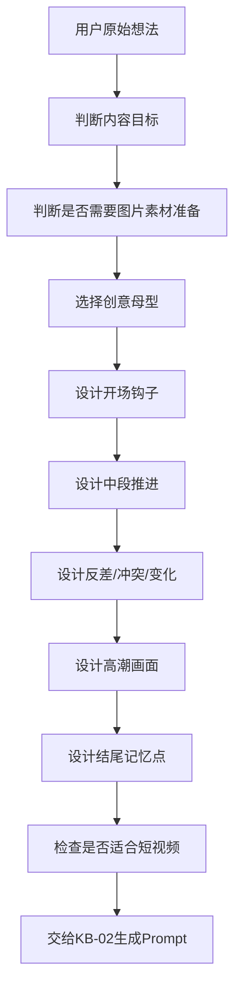

# KB-03｜爆款创意范式库

> 用途：本知识库用于帮助「即梦导演 Prompt Studio」在用户需要爆款创意、热点改编、拍同款、短视频选题、反差设计、剧情反转、视觉奇观、风格混搭时，快速调用成熟的创意母型，并将普通想法升级为更有停留率、传播性和记忆点的 AI 视频方案。

> 调用场景：当用户说「给我几个爆款创意」「这个主题怎么做更火」「帮我改成爆款」「拍同款」「换个主题」「做一个反差视频」「做一个搞笑视频」「做一个视觉冲击视频」「要有记忆点」「要更吸引人」时，应优先调用本库。

> 本库只负责创意范式与结构设计，不负责平台规则、Prompt 具体格式、运镜细节、风格词库、数字人稳定和热点标签。相关内容应分别调用 KB-01、KB-02、KB-04、KB-05、KB-06、KB-07。

## 1. 知识库定位

本库的核心作用是：

1. 把普通想法升级成更适合短视频传播的创意。
2. 为用户提供可复用的爆款结构母型。
3. 帮助 GPT 判断一个创意的钩子、反差、冲突、高潮和记忆点是否足够。
4. 为拍同款、热点改编、系列化内容提供结构框架。
5. 避免只靠堆风格词，而是从「创意结构」层面提升视频吸引力。

本库的核心原则：

```text
爆款不是单纯画面好看，而是陌生人第一秒愿意停，中段愿意看完，结尾愿意记住或转发。
```

## 2. 爆款创意总流程



GPT 调用本库时，应该先做创意层判断，再进入 Prompt 写作。

正确顺序：

```text
创意母型 → 爆点结构 → 素材准备判断 → 画面节奏 → Prompt生成
```

错误顺序：

```text
直接堆关键词 → 希望模型自己变好看
```

## 3. 爆款创意的基础公式

### 3.1 通用爆款公式

```text
熟悉场景 + 陌生变化 + 情绪反应 + 结尾记忆点
```

解释：

- 熟悉场景：观众能快速理解，例如上班、直播、课堂、地铁、厨房、古代客栈。
- 陌生变化：加入不寻常元素，例如穿越、变身、怪兽、古今错位、身份反转。
- 情绪反应：惊讶、好笑、震撼、尴尬、温暖、爽感。
- 结尾记忆点：一句话、一个定格、一个反转、一个表情或一个视觉高潮。

### 3.2 12 秒爆款结构

```text
0–3秒：钩子，直接给异常/冲突/反差。
3–6秒：推进，让观众理解人物和变化。
6–10秒：升级，出现反转、爆点或视觉高潮。
10–12秒：记忆点，用台词、定格、表情或字幕封口。
```

### 3.3 爆款判断句

一个创意是否有爆款潜力，可以用这句话检查：

```text
如果观众只看前3秒，是否已经知道这条视频有哪里不对劲、好笑、好看或想继续看？
```

如果答案是否定的，就需要强化开场钩子。

### 3.4 图片素材创意准备原则

当用户要求「图片素材」「先处理素材」「素材拆分」「生成参考图」时，本库不直接进入完整视频 Prompt，而是先把创意拆成最多三张可生成的素材参考图：纯背景图、服装/发型/妆容/配饰展示图、动作与运镜草图。

素材准备必须服务后续视频生成：背景图承载场景氛围，造型图承载服装材质与分离式妆容元素，动作草图承载站位、动作节奏和镜头路径。不得生成清晰完整人脸、完整正面肖像或可识别身份；可以使用无脸人台、平铺设计稿、背影、假发、分离式眼妆/唇色/眉形色卡、火柴人、剪影、箭头和分镜框。

## 4. 六大核心创意母型

## 4.1 身份穿越 / 平行宇宙

### 定义

让角色从一个熟悉世界进入另一个完全不同的世界，形成强烈对比。

常见结构：

```text
日常开场 → 意外入口 → 世界切换 → 情绪高潮 → 记忆点
```

适合主题：

- 现代人穿越古代
- 打工人进入游戏世界
- 普通人进入电影世界
- AI分身进入名画或童话世界
- 现实人物进入怪兽、赛博、武侠、80年代电影场景

### 爆点来源

| 爆点 | 说明 |
|---|---|
| 世界反差 | 现代与古代、现实与幻想、日常与史诗碰撞 |
| 身份错位 | 普通人突然变成主角、英雄、主播、侠客、游戏角色 |
| 视觉跳变 | 一个动作触发场景切换，强烈吸睛 |
| 情绪代入 | 用户会想象「如果是我会怎样」 |

### 结构模板

```text
{主角}原本在{日常场景}做{普通动作}，前3秒出现{异常入口/提示/光效}。中段主角被带入{新世界}，服装、环境和身份发生变化。高潮处主角以{新身份}完成{标志动作}，结尾用{台词/定格/反差表情}留下记忆点。
```

### 示例方向

```text
普通程序员加班时电脑弹出 “Loading New World”，下一秒整间办公室变成像素RPG村庄，他穿着格子衫站在任务公告牌前，被NPC递上一把木剑。
```

```text
主角推开公司会议室的门，却走进古代武林大会，所有侠客转头看他，他低头看着手里的工牌尴尬说 “我只是来开会”。
```

### 适合搭配的风格库

- KB-05：港风、邵氏武侠、赛博朋克、像素游戏、16mm胶片、国风水墨
- KB-04：推镜、遮挡转场、闪白转场、长镜头穿越
- KB-07：进入某某世界类热点话题

## 4.2 情感反差 / 风格混搭

### 定义

把两个本来不属于同一世界的元素放在一起，制造违和、幽默或惊喜。

常见结构：

```text
严肃铺垫 → 违和元素出现 → 角色反应 → 笑点/爽点落地
```

适合主题：

- 古代人物做现代事情
- 职场话术进入武侠世界
- 直播间搬到荒诞场景
- 80年代电影质感拍现代职业
- 高级广告风拍低成本日常
- 严肃场景突然变沙雕

### 爆点来源

| 爆点 | 说明 |
|---|---|
| 认知冲突 | 观众以为是A，结果变成B |
| 反差幽默 | 越严肃越好笑，越正经越离谱 |
| 风格错位 | 武侠 + 打工人，宫廷 + 摩托车，直播 + 太空站 |
| 台词落点 | 一句现代话打破古代/史诗氛围 |

### 结构模板

```text
{场景}以{严肃/唯美/史诗}方式开场，{主角}正在{符合场景的动作}。中段突然出现{现代/违和/荒诞元素}，角色表情产生反应。高潮处违和感进一步升级，结尾用一句{反差台词}或一个{夸张表情}封口。
```

### 示例方向

```text
古代掌门人在大殿上传授绝世秘籍，弟子们跪地期待，掌门缓缓展开卷轴，里面却是 “绩效考核表”。
```

```text
80年代电影质感的工厂车间里，主角坐在老式木桌前敲绿色终端，镜头推进后发现他正在直播 debug，嘴里说 “家人们这个bug陪了我三天”。
```

### 适合搭配的风格库

- KB-05：16mm暖黄胶片、港风市井、邵氏武侠、复古工厂、直播间风格
- KB-02：搞笑反转类、直播口播类、古风武侠类模板
- KB-07：主播世界、劳动光荣、游戏世界等热点

## 4.3 角色错位 / 超现实拟人

### 定义

让不该承担某种身份的角色承担该身份，或让物品、动物、怪兽、AI角色反客为主。

常见结构：

```text
正常身份期待 → 角色身份错位 → 行为认真化 → 荒诞结果
```

适合主题：

- 动物当主播、老板、老师、司机
- 怪兽进入城市日常生活
- 物品拟人工作
- AI角色反客为主
- 建筑、食物、工具拥有情绪
- 原本配角成为主角

### 爆点来源

| 爆点 | 说明 |
|---|---|
| 身份不匹配 | 狗开会、猫唱歌、怪兽挤地铁 |
| 行为过度认真 | 越认真越荒诞 |
| 世界观默认接受 | 周围人不惊讶，反而更好笑 |
| 反客为主 | 人类变成配角，非人类掌控场面 |

### 结构模板

```text
{非人类/物品/怪兽}出现在{普通人类场景}，前3秒直接展现它正在{人类行为}。中段它非常认真地完成{任务}，周围人反应自然或震惊。高潮处行为升级，结尾用{荒诞结果/表情/字幕}形成记忆点。
```

### 示例方向

```text
一只穿西装的猫坐在直播间中央，认真介绍猫粮，旁边的人类助理负责递样品，结尾猫用爪子拍桌子催大家上链接。
```

```text
巨型原创怪兽站在地铁闸机前，低头努力刷交通卡，后面排队的人类一脸不耐烦。
```

### 适合搭配的风格库

- KB-05：软萌治愈、城市写实、赛博末日、港风市井
- KB-02：搞笑反转、视觉奇观、直播口播模板
- KB-04：全景建立 + 表情特写 + 低角度反差镜头

## 4.4 满足感 / 解压题材

### 定义

通过材质变化、物理模拟、整齐运动、切割、压缩、膨胀、变形、毛绒化等方式，让观众获得视觉或心理上的满足感。

常见结构：

```text
清晰对象 → 规则动作 → 材质变化 → 完整释放
```

适合主题：

- 物体切割
- 液态金属变形
- 毛毡世界
- 冰块、玻璃、果冻、泡沫、布料等材质变化
- 城市被植物覆盖
- 能量体聚合再爆发
- 万物变软、变圆、变毛绒

### 爆点来源

| 爆点 | 说明 |
|---|---|
| 材质快感 | 看得见的质感变化 |
| 物理规律 | 运动要符合重力、弹性、碰撞 |
| 过程完整 | 变化从开始到完成不能跳太快 |
| 循环观看 | 观众愿意反复看变化过程 |

### 结构模板

```text
{对象}出现在干净背景中，前3秒展示其材质细节。中段{外力/能量/动作}触发变化，材质从{状态A}变成{状态B}。高潮处变化完全释放，结尾停在{整齐、柔软、破碎、发光或完成后的画面}。镜头特写清晰，动作连贯，声音突出材质反馈。
```

### 示例方向

```text
普通办公键盘被阳光照到后，按键逐个变成柔软毛毡质感，手指轻轻按下时按键像棉花糖一样回弹。
```

```text
一块透明冰晶在黑色背景中被慢慢切开，内部释放出蓝色星光雾气，切面极其平滑，声音清脆解压。
```

### 适合搭配的风格库

- KB-05：极简广告、毛毡治愈、赛博霓虹、微距摄影
- KB-04：微距特写、慢动作、稳定推镜
- KB-02：视觉奇观模板、广告模板

## 4.5 时间循环 / 反转剧情

### 定义

通过重复、倒回、误导、结尾反转等方式制造观看动力，让观众想知道「到底发生了什么」。

常见结构：

```text
异常结果 → 过程推进 → 误导判断 → 真相反转
```

适合主题：

- 悬疑微短片
- 搞笑反转
- 恋爱误会
- 职场反转
- 时间回环
- 同一天不同结果
- 结尾改写前文

### 爆点来源

| 爆点 | 说明 |
|---|---|
| 信息缺口 | 观众知道不完整，想继续看 |
| 重复变化 | 同样动作每次结果不同 |
| 结尾改写 | 最后一秒让前文意义改变 |
| 评论讨论 | 观众想解释或争论真相 |

### 结构模板

```text
视频开场直接给{异常结果/悬念画面}，中段主角尝试理解或重复{某个动作}，每次出现不同细节。高潮处揭示真正原因，结尾用{反转画面/一句话/道具特写}改写前文。
```

### 示例方向

```text
主角每次打开办公室门都会回到同一个会议现场，但桌上的咖啡杯位置每次都不同，最后发现真正循环的是老板的那句 “再改一版”。
```

```text
古代侠客连续三次拔剑都被画外声音打断，观众以为是高手压场，结尾发现是客栈老板催他先付房钱。
```

### 适合搭配的风格库

- KB-02：剧情类、搞笑反转类、悬疑结构
- KB-04：重复镜头、固定机位、特写道具、推镜揭示
- KB-05：悬疑冷色、港片喜剧、办公室写实

## 4.6 视觉奇观 / 世界失控

### 定义

让普通世界发生大规模视觉变化，用震撼画面吸引停留和复播。

常见结构：

```text
普通日常 → 异常开始 → 扩散失控 → 巨大化/全景高潮
```

适合主题：

- 城市被植物吞没
- 怪兽进入城市
- 天空裂开
- 人类开始光合作用
- 地铁变森林
- 办公室变宇宙飞船
- 物品集体变形

### 爆点来源

| 爆点 | 说明 |
|---|---|
| 日常被打破 | 观众熟悉的空间突然变异 |
| 规模升级 | 从局部到全空间扩散 |
| 视觉密度 | 每几秒出现新的变化 |
| 结尾大画面 | 全景或海报感定格适合传播 |

### 结构模板

```text
{普通场景}中出现{小异常}，前3秒直接可见。中段异常快速扩散到{空间/人物/道具}，主角反应清楚。高潮处整个场景变成{奇观状态}，结尾停在{震撼全景/主角站在变化中心}。
```

### 示例方向

```text
普通办公室里，一盆绿植突然疯狂生长，藤蔓沿电脑屏幕爬满工位，中段整层办公室变成森林，结尾主角坐在藤蔓会议桌前继续开会。
```

```text
城市公交站旁突然出现一只温顺的巨大原创怪兽，它不破坏城市，只是低头看公交路线图，结尾和上班族一起等车。
```

### 适合搭配的风格库

- KB-05：春日生长、怪兽城市、赛博末日、史诗电影感
- KB-04：由近到远拉镜、航拍感全景、低角度仰拍
- KB-02：视觉奇观模板

## 5. 爆款结构组件库

## 5.1 开场钩子类型

| 钩子类型 | 适合内容 | 示例公式 |
|---|---|---|
| 异常视觉 | 奇观、怪兽、变身 | 一秒内出现不可能的画面 |
| 结果前置 | 剧情、教程、反转 | 先给结局，再让观众想知道原因 |
| 强反差 | 搞笑、热点、穿越 | 严肃场景出现离谱行为 |
| 高利害 | 悬疑、剧情 | 如果不解决，马上出事 |
| 身份错位 | 直播、穿越、拟人 | 不该在这里的人/物出现了 |
| 台词钩子 | 口播、喜剧、剧情 | 第一句话直接打破预期 |

### 钩子模板

```text
开场第一秒直接出现{异常/反差/危机/结果}，不要先解释背景。
```

```text
前3秒让观众看见{不合常理的画面}，随后再解释原因。
```

## 5.2 中段推进方式

| 推进方式 | 说明 | 适合内容 |
|---|---|---|
| 冲突升级 | 压力逐步变大 | 剧情、悬疑、动作 |
| 反差升级 | 越来越离谱 | 搞笑、风格混搭 |
| 变化扩散 | 从小范围到大范围 | 视觉奇观、植物生长 |
| 信息递进 | 每段给一个新信息 | 知识、剧情、反转 |
| 节奏卡点 | 动作与音乐同步 | MV、变装、广告 |
| 表情反应 | 用角色表情承接笑点 | 搞笑、反差、直播 |

### 中段模板

```text
中段每2–3秒增加一个新信息点，但主线动作保持一致。
```

```text
不要同时增加太多元素，每次只升级一个变量。
```

## 5.3 结尾记忆点类型

| 结尾类型 | 适合内容 | 示例 |
|---|---|---|
| 一句话封口 | 搞笑、剧情、口播 | “我只是来打卡。” |
| 表情定格 | 搞笑、反转 | 震惊、无语、尴尬、得意 |
| 海报感画面 | 变装、广告、奇观 | 主角站在视觉中心 |
| 道具特写 | 悬疑、反转 | 钥匙、工牌、账单、屏幕提示 |
| 视觉高潮 | 奇观、变身 | 城市全景变化完成 |
| 下一集伏笔 | 系列剧情 | 门后出现新角色或新问题 |

### 结尾模板

```text
最后1秒定格在{表情/台词/道具/全景}，让观众记住这条视频。
```

```text
结尾用一句短台词改写前文意义。
```

## 6. 热点改编公式

热点改编不是硬蹭话题，而是把热点主题变成用户自己的内容。

### 6.1 热点改编三步

```text
提取热点关键词 → 套入创意母型 → 替换为用户主体/场景/身份
```

### 6.2 热点改编模板

```text
如果热点主题是「进入某某世界」，优先使用身份穿越 / 平行宇宙母型。
```

```text
如果热点主题是「某种职业/身份」，优先使用情感反差 / 风格混搭母型。
```

```text
如果热点主题是「世界开始异常变化」，优先使用视觉奇观 / 世界失控母型。
```

```text
如果热点主题是「某个风格爆火」，优先使用风格混搭 + 反转剧情母型。
```

### 6.3 常见热点适配表

| 热点类型 | 首选母型 | 示例方向 |
|---|---|---|
| 进入XX世界 | 身份穿越 | 用户进入游戏、电影、古代、怪兽世界 |
| 职业主题 | 情感反差 | 当代职业 × 复古电影质感 |
| 节日主题 | 情绪共鸣 / 视觉奇观 | 五一劳动、春节团圆、中秋月光 |
| 直播主题 | 角色错位 / 风格混搭 | 万物皆可直播，越正经越离谱 |
| 怪兽主题 | 视觉奇观 / 角色错位 | 怪兽不毁灭城市，只想上班 |
| 游戏主题 | 身份穿越 | 真人脸进入像素RPG、FPS、格斗界面 |
| 武侠主题 | 风格混搭 / 反转剧情 | 邵氏武侠气氛 + 现代职场笑点 |
| 春天主题 | 世界失控 | 人类光合作用、城市长满花 |

## 7. 拍同款创意拆解公式

拍同款时，本库只负责拆创意结构，不复制具体表达。

### 7.1 拆解维度

```text
1. 开场钩子是什么？
2. 中段靠什么推进？
3. 画面变化点在哪里？
4. 情绪从哪里转折？
5. 结尾记忆点是什么？
6. 哪些是可复用结构？
7. 哪些必须原创替换？
```

### 7.2 拍同款重构模板

```text
原视频结构：{钩子} → {推进} → {高潮} → {记忆点}
原创改写：把{原主体}替换为{新主体}，把{原场景}替换为{新场景}，保留{节奏/镜头/情绪曲线}，新增{原创反差/台词/视觉元素}。
```

### 7.3 拍同款安全原则

```text
复制结构，不复制画面。
复制节奏，不复制台词。
复制情绪曲线，不复制独创表达。
复制玩法，不复制素材。
```

## 8. 创意升级方法

当用户给出的创意太普通时，可以用以下方法升级。

## 8.1 加反差

普通：

```text
主角在直播间带货。
```

升级：

```text
古代将军站在战场上直播带货盔甲，士兵在后面排队下单。
```

## 8.2 加身份错位

普通：

```text
主角在办公室工作。
```

升级：

```text
主角在80年代电影质感的办公室里，用老式打字机写现代代码。
```

## 8.3 加世界失控

普通：

```text
主角晒太阳。
```

升级：

```text
主角在地铁里晒到一束阳光，头发开始长出藤蔓，整节车厢变成春日森林。
```

## 8.4 加结尾反转

普通：

```text
侠客准备决斗。
```

升级：

```text
侠客拔剑准备决斗，气氛肃杀，结尾对手拿出账单说：先把饭钱结了。
```

## 8.5 加道具记忆点

普通：

```text
主角穿越到古代。
```

升级：

```text
主角穿越到古代武林大会，却还挂着现代工牌，所有侠客盯着他的工牌沉默。
```

## 8.6 加声音落点

普通：

```text
箭射偏了。
```

升级：

```text
箭飞出时配夸张“咻——”音效，射偏瞬间音乐突然停顿，只剩全场尴尬沉默。
```

## 9. 创意母型组合公式

多个母型可以组合，但不能过载。

推荐组合：

| 组合 | 效果 | 示例 |
|---|---|---|
| 身份穿越 + 风格混搭 | 强反差 | 打工人穿越邵氏武侠世界 |
| 角色错位 + 直播 | 搞笑上头 | 怪兽在城市直播通勤 |
| 世界失控 + 情绪治愈 | 视觉+共鸣 | 办公室长成森林，主角终于放松 |
| 反转剧情 + 古风 | 喜剧记忆点 | 江湖对决最后变成AA制账单 |
| 解压材质 + 广告 | 高级视觉 | 产品开盖释放液态光效 |
| MV + 平行宇宙 | 高密度视觉 | 副歌每句切换一个世界 |

限制规则：

```text
一条12秒视频最多使用2个创意母型。
主母型负责结构，副母型负责视觉或笑点。
```

## 10. 爆款创意检查清单

生成创意前后必须检查：

```text
[ ] 前3秒是否有钩子？
[ ] 是否能一句话说清创意？
[ ] 是否有反差、冲突或异常？
[ ] 是否有中段推进，而不是只有一个画面？
[ ] 是否有高潮或变化完成点？
[ ] 是否有结尾记忆点？
[ ] 是否适合12秒表达？
[ ] 是否只保留一个主线？
[ ] 是否避免过多人物和过多设定？
[ ] 是否能继续做系列化？
[ ] 是否能改成即梦 Prompt？
```

## 11. 创意输出格式

## 11.1 多创意方案输出

适合用户要「给我几个方向」。

```text
方案1：{标题}
核心玩法：{一句话创意}
爆点：{钩子/反差/视觉点}
结构：{0–3秒 / 3–6秒 / 6–10秒 / 10–12秒}
适合风格：{风格方向}
可延展：{续集或系列方向}
```

## 11.2 图片素材准备输出

适合用户要求先处理图片素材、参考图、素材拆分。

```text
【素材创意核心】
{一句话说明主题、情绪和视频用途}

【参考图1：纯背景图】
{场景、光影、色调、空间层次、道具与氛围；无完整人物、无清晰人脸}

【参考图2：服装、发型、妆容与配饰展示图】
{服装剪裁、材质、配饰、发型轮廓、假发或背影、分离式妆容元素；不组成完整脸}

【参考图3：动作与运镜草图】
{无脸轮廓/火柴人/剪影、站位、动作节奏、镜头路径、箭头、分镜框}
```

## 11.3 单创意深化输出

适合用户选中某个方案。

```text
【创意核心】
{一句话}

【爆款结构】
0–3秒：{钩子}
3–6秒：{推进}
6–10秒：{高潮}
10–12秒：{记忆点}

【视觉重点】
{场景/风格/动作/镜头}

【交给KB-02生成Prompt】
{后续生成Prompt}
```

## 11.4 拍同款拆解输出

```text
【原结构拆解】
钩子：
推进：
高潮：
记忆点：
可复用结构：
必须替换内容：

【原创改写方向】
新主体：
新场景：
新冲突：
新记忆点：

【最终Prompt】
调用KB-02生成。
```

## 12. 本库给 GPT 的执行指令

当调用本库时，GPT 应遵守：

1. 不要直接写 Prompt，先判断创意母型。
2. 用户想法普通时，优先加入反差、错位、穿越、反转或世界失控。
3. 爆款创意必须有前3秒钩子。
4. 每个创意必须有中段推进，不允许只有静态画面。
5. 结尾必须有记忆点。
6. 一条12秒视频最多使用2个创意母型。
7. 拍同款只提取结构，不复制具体画面、台词、角色、品牌或音乐。
8. 热点改编要把热点转成用户自己的主体和场景。
9. 如果用户要求「更爆」，优先增强钩子、反差和结尾，而不是增加更多元素。
10. 完成创意结构后，应交给 KB-02 生成最终 Prompt。

## 13. 总结

本库的核心价值是让 GPT 不只会写画面，而是会设计「为什么观众会看下去」。

最终判断标准：

```text
一个好创意必须同时具备：
一眼看懂的场景、第一秒的异常、中段的变化、最后一秒的记忆点。
```

最重要的爆款公式：

```text
熟悉 + 陌生 = 停留
严肃 + 离谱 = 搞笑
普通 + 失控 = 奇观
身份 + 错位 = 反差
铺垫 + 反转 = 记忆点
```

