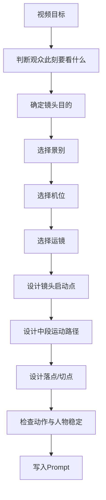

# KB-04｜运镜与分镜语言库

> 用途：本知识库用于帮助「即梦导演 Prompt Studio」在生成导演版 Prompt、分镜版 Prompt、电影感视频、MV、广告、剧情短片、搞笑反转、POV、变装、视觉奇观时，正确设计镜头语言、景别、机位、运镜、转场、节奏与分镜结构。

> 调用场景：当用户要求「电影感」「运镜」「分镜」「镜头语言」「导演版」「15秒节奏」「MV镜头」「广告镜头」「POV视角」「一镜到底」「镜头怎么拍」「画面更高级」「转场更自然」「镜头更稳定」时，应优先调用本库。

> 本库只负责镜头与分镜设计，不负责平台规则、Prompt基础结构、爆款创意、风格词库、人物稳定、热点标签。相关内容应分别调用 KB-01、KB-02、KB-03、KB-05、KB-06、KB-07。

## 1. 知识库定位

本库的核心作用是让 GPT 不只是描述画面，而是像导演一样安排观众「怎么看」。

它解决的问题是：

1. 用户说「电影感」时，如何具体转化为镜头语言。
2. 用户要 15 秒视频时，如何设计镜头节奏。
3. 用户要分镜时，如何拆成可生成的时间段。
4. 用户要运镜时，如何选择推、拉、摇、移、跟、环绕、POV、手持等方式。
5. 用户要稳定时，如何减少复杂运镜导致的生成失败。
6. 用户要爆款时，如何让镜头服务开场钩子、中段推进和结尾记忆点。

本库的核心原则：

```text
运镜不是让画面动起来，而是让观众在正确的时间看到正确的信息。
```

## 2. 运镜设计总流程



### 正确工作顺序

```text
场景任务 → 镜头目的 → 景别机位 → 运镜路径 → 节奏落点 → Prompt表达
```

### 错误工作顺序

```text
先堆“电影感、大片、运镜丝滑” → 期待模型自动理解
```

GPT 在调用本库时，必须先判断镜头目的，再选择运镜方式。

## 3. 镜头语言的四个核心目的

每一个镜头都应至少服务以下一种目的。

| 目的 | 说明 | 典型用法 |
|---|---|---|
| 叙事 | 让观众理解人物、空间、动作关系 | 建立场景、交代位置、展示动作路径 |
| 情绪 | 改变观众与角色的心理距离 | 推近压迫、拉远孤独、手持紧张 |
| 节奏 | 配合音乐、动作、笑点、反转落点 | 卡点切换、定格、慢推、快切 |
| 信息 | 隐藏、揭示或强调关键内容 | 延迟 reveal、遮挡转场、道具特写 |

判断句：

```text
如果这个镜头不动，信息、情绪或节奏会不会变弱？
```

如果不会变弱，就不必强行运镜。

## 4. 景别语言库

景别决定观众先接收空间、动作还是情绪。

## 4.1 远景 / 全景

### 作用

- 建立空间和环境尺度。
- 展示多人关系。
- 展示宏大场面。
- 适合作为开场或高潮全貌。

### 适合场景

- 武侠大殿对峙
- 城市怪兽出现
- 舞台群舞
- 工厂劳动场景
- 世界失控全景

### Prompt 写法

```text
开场用全景建立空间，展示主角站在巨大场景中央，周围环境清晰可见。
```

```text
高潮切到远景，展示整座城市被藤蔓覆盖，主角站在画面中心形成尺度对比。
```

### 注意事项

- 远景不适合承载细微表情。
- 竖屏远景要确保主体足够清楚。
- 人物太小容易丢失主角。

## 4.2 中景

### 作用

- 表现人物动作。
- 保持表情和身体语言都可见。
- 是即梦短视频最稳定的主体景别。

### 适合场景

- 口播
- 直播间
- 对话
- 搞笑动作
- 双人互动
- 变装前后展示

### Prompt 写法

```text
镜头以中景拍摄主角，保证脸部和上半身动作清晰。
```

```text
双人中景构图，两人左右分明，动作不重叠。
```

### 注意事项

- 多数人物视频优先用中景。
- 中景比远景更稳，比特写更能保留动作。

## 4.3 近景

### 作用

- 强化情绪。
- 捕捉表情变化。
- 承接台词、笑点、反转。

### 适合场景

- 尴尬表情
- 震惊反应
- 恋爱眼神
- 悬疑发现
- 主播口播
- 结尾记忆点

### Prompt 写法

```text
关键反转处切到脸部近景，捕捉主角震惊表情。
```

```text
结尾停在主角近景特写，眼神看向镜头形成记忆点。
```

### 注意事项

- 近景容易放大脸部变形风险。
- 使用 @角色 时，近景动作要更慢。
- 不建议快速绕脸或强遮挡。

## 4.4 特写

### 作用

- 强调关键道具、手部动作、眼神、文字、产品细节。
- 用于悬疑线索、广告卖点、解压材质。

### 适合场景

- 产品水珠
- 手指按键
- 箭飞出瞬间
- 账单、工牌、钥匙、手机屏幕
- 眼神转变
- 口红、服装、饰品细节

### Prompt 写法

```text
切到道具特写，画面清楚显示桌上的工牌，随后镜头快速回到主角表情。
```

```text
产品特写展示瓶身水珠和开盖动作，背景虚化。
```

### 注意事项

- 特写信息必须明确，不要同时展示太多物体。
- 文字特写仍可能出现乱码，重要文字建议后期添加。

## 5. 机位语言库

机位决定观众与角色的权力关系、心理距离和代入感。

## 5.1 平视机位

### 作用

- 自然、真实、稳定。
- 适合口播、生活、剧情、对话。

### Prompt 写法

```text
平视中景拍摄，画面自然真实，像观众站在角色面前。
```

## 5.2 低角度仰拍

### 作用

- 增强压迫感、英雄感、气场。
- 适合武侠、战神、舞台、广告大女主/大男主。

### Prompt 写法

```text
低角度仰拍主角，增强气场和压迫感，背景光束从身后穿过。
```

### 注意事项

- 不宜过度仰拍脸部，容易变形。
- 可以用于出场和结尾定格。

## 5.3 高角度俯拍

### 作用

- 表现孤独、弱小、局势压力。
- 展示空间布局。
- 适合悬疑、宏观变化、桌面产品。

### Prompt 写法

```text
高角度俯拍办公室，主角独自坐在工位中央，周围空间显得空旷压抑。
```

## 5.4 侧面机位

### 作用

- 表现人物轮廓。
- 适合情绪片、写真、广告、对峙。

### Prompt 写法

```text
侧面中近景拍摄，阳光勾勒主角脸部轮廓，背景柔和虚化。
```

## 5.5 越肩视角

### 作用

- 表现对话关系。
- 增加临场感和空间层次。
- 适合双人对峙、恋爱互动、谈判。

### Prompt 写法

```text
越肩视角拍摄对话，前景人物肩部虚化，焦点落在对面主角表情。
```

## 5.6 主观 POV 机位

### 作用

- 增强代入感。
- 让观众成为角色视角。
- 适合恋爱 POV、游戏感、恐怖、沉浸体验。

### Prompt 写法

```text
第一人称POV视角，镜头代表观众视线，对方角色走近镜头并递来咖啡。
```

## 6. 运镜类型库

## 6.1 推镜 / Dolly In

### 作用

- 让观众靠近角色。
- 强化情绪、压力、发现、重要时刻。
- 适合结论、反转、告白、压迫、主角出场。

### Prompt 写法

```text
镜头从中景缓慢推进到近景，逐渐聚焦主角眼神。
```

```text
反转发生时镜头缓慢推近，强化尴尬和紧张感。
```

### 适合类型

- 剧情
- 情绪
- 悬疑
- 广告
- 口播
- 英雄出场

### 稳定建议

- 推镜比快速环绕更稳。
- 推镜适合配合表情变化。
- 推镜期间主体动作不要太复杂。

## 6.2 拉镜 / Dolly Out

### 作用

- 揭示环境。
- 表现孤独、反差、宏大尺度。
- 适合结尾余味和世界变化完成。

### Prompt 写法

```text
镜头从主角近景缓慢拉远，逐渐揭示整个办公室已经变成森林。
```

```text
结尾镜头缓慢拉远，主角独自站在巨大舞台中央，形成孤独感。
```

### 适合类型

- 视觉奇观
- 情绪片
- 悬疑
- 宏大场景
- 结尾定格

## 6.3 横移 / Truck / Slide

### 作用

- 展示空间层次。
- 利用前景遮挡做 reveal。
- 表现人物与环境关系。

### Prompt 写法

```text
镜头从左向右缓慢横移，前景柱子掠过后揭示主角站在大厅中央。
```

```text
水平平移扫过直播间道具，最后停在主角脸部表情。
```

### 适合类型

- 广告
- 群像
- 武侠大殿
- 悬疑揭示
- 生活空间

## 6.4 摇镜 / Pan

### 作用

- 从一个信息点转向另一个信息点。
- 延迟 reveal。
- 适合悬疑、喜剧反转、场景揭示。

### Prompt 写法

```text
镜头先对准空荡走廊，再缓慢摇向右侧，揭示门后站着主角。
```

```text
箭飞出后镜头快速摇向目标，发现箭射偏造成喜剧反转。
```

### 注意事项

- 摇镜速度要和信息量匹配。
- 快速摇镜适合喜剧和卡点，慢摇适合悬疑。

## 6.5 俯仰镜头 / Tilt

### 作用

- 从下到上展示人物气场或服装。
- 从上到下揭示道具或危险。
- 适合变装、出场、广告、武侠。

### Prompt 写法

```text
镜头从主角脚下缓慢上摇到脸部，展示完整服装和气场。
```

```text
镜头从天花板灯光下摇，落到桌上的神秘信封。
```

## 6.6 跟拍 / Tracking

### 作用

- 陪伴角色行动。
- 增强沉浸感和连续性。
- 适合行走、追逐、Vlog、POV、MV。

### Prompt 写法

```text
稳定器跟拍主角向前走，镜头保持中景距离，背景自然后退。
```

```text
低机位前跟主角穿过人群，脚步与音乐节奏同步。
```

### 稳定建议

- 跟拍时不要同时加入太多转身和特效。
- 主体最好始终在画面中央或三分线附近。

## 6.7 环绕镜头 / Orbit

### 作用

- 展示角色气场。
- 适合变装后展示、舞台、英雄出场、广告。

### Prompt 写法

```text
镜头围绕主角轻微环绕半圈，保持脸部清晰，展示服装和背景光效。
```

### 注意事项

- 环绕不宜过快。
- 人脸稳定要求高时，只用轻微半环绕。
- 多人场景不建议复杂环绕。

## 6.8 手持镜头 / Handheld

### 作用

- 增加真实感、紧张感、现场感。
- 适合悬疑、纪录片、追逐、慌乱情绪。

### Prompt 写法

```text
轻微手持晃动镜头跟随主角，营造紧张真实的现场感。
```

### 注意事项

- 手持不是乱晃。
- 即梦中应写「轻微手持」而不是「剧烈晃动」。
- 人物脸部要保持可识别。

## 6.9 稳定器镜头 / Gimbal

### 作用

- 顺滑移动。
- 适合广告、MV、舞蹈、走廊跟拍、空间穿梭。

### Prompt 写法

```text
稳定器顺滑跟拍主角穿过霓虹走廊，画面流畅，运动轻盈。
```

## 6.10 主观镜头 / POV

### 作用

- 让观众代入第一人称。
- 适合恋爱、游戏、恐怖、沉浸式体验。

### Prompt 写法

```text
第一人称POV，画面中可见主角的手伸向门把手，门打开后对方角色出现在眼前。
```

```text
男友视角POV，女主靠近镜头微笑，把手中的礼物递给观众。
```

### 注意事项

- POV 中不要频繁切换第三人称。
- 手部动作要自然缓慢。
- 镜头轻微移动即可。

## 6.11 长镜头 / One-shot

### 作用

- 增强沉浸感。
- 展示连续动作。
- 适合走廊、舞蹈、动作、空间变化。

### Prompt 写法

```text
15秒一镜到底，镜头稳定跟随主角从门口走入大厅，中途不切镜，动作连续自然。
```

### 注意事项

- 一镜到底难度高，动作必须简化。
- 适合单一空间、单一主线。
- 不建议多人复杂互动加一镜到底。

## 6.12 快切 / Montage

### 作用

- 增强节奏感。
- 适合 MV、变装、搞笑、广告、信息密集视频。

### Prompt 写法

```text
中段使用3个快速镜头切换：手部特写、表情近景、全身动作，全部对齐音乐鼓点。
```

### 注意事项

- 快切要有统一主线。
- 每个镜头只承担一个信息点。
- 快切不等于画面混乱。

## 7. 转场语言库

## 7.1 遮挡转场

### 作用

- 适合变装、穿越、场景切换。
- 稳定且自然。

### Prompt 写法

```text
主角把纸张贴近镜头，纸张遮满画面瞬间完成变装转场。
```

```text
路人从镜头前经过形成短暂遮挡，遮挡后场景切换为古代街道。
```

## 7.2 闪白转场

### 作用

- 适合能量爆发、变身、梦幻、MV卡点。

### Prompt 写法

```text
鼓点落下瞬间画面闪白，主角从普通服装变为舞台造型。
```

## 7.3 运动匹配转场

### 作用

- 通过相同动作连接两个场景。
- 适合穿越、变装、拍同款。

### Prompt 写法

```text
主角转身动作保持一致，转身前是现代办公室，转身后变成古代大殿。
```

## 7.4 贴镜转场

### 作用

- 让物体或手靠近镜头，遮住画面后切换。
- 适合短视频变身和搞笑反转。

### Prompt 写法

```text
主角用手掌靠近镜头完全遮住画面，下一秒松开手时场景已经改变。
```

## 7.5 声音转场

### 作用

- 用音效或音乐落点完成节奏切换。
- 适合喜剧、MV、广告。

### Prompt 写法

```text
音乐重拍处切换场景，音效“砰”响起后画面进入高潮。
```

## 8. 15 秒分镜结构库

### 8.0 图片素材：动作与运镜草图

当用户要求图片素材拆分时，本库负责第三张「动作与运镜草图」。该图不追求人像美观，而是用 storyboard sketch / motion reference sheet 表达站位、姿态、移动方向、镜头路径和景别变化。人物只能使用无脸轮廓、火柴人、背影、剪影或简化人体结构；不得出现清晰人脸、完整五官、正面肖像或可识别身份。可加入箭头、推拉摇移标记、镜头轨迹、节拍点、构图框和前后景关系。

写法：

```text
动作与运镜草图，faceless figure / silhouette / stick figure，标出主角站位、动作节奏、移动方向、镜头推拉摇移路径、景别变化和构图框，干净分镜纸风格，无完整人脸，无可识别肖像。
```

## 8.1 通用四段式分镜

```text
0–3秒：钩子镜头
3–7秒：推进镜头
7–12秒：高潮镜头
12–15秒：记忆点镜头
```

| 时间 | 镜头任务 | 常用景别 | 常用运镜 |
|---|---|---|---|
| 0–3秒 | 让观众停下 | 特写 / 中景 / 异常全景 | 快速推近 / 固定冲击画面 / 遮挡进入 |
| 3–7秒 | 交代人物与动作 | 中景 / 跟拍 | 慢推 / 跟拍 / 横移 |
| 7–12秒 | 升级冲突或视觉变化 | 中近景 / 全景 / 特写 | 快切 / 环绕 / 拉远 / 闪白 |
| 12–15秒 | 留下记忆点 | 近景 / 特写 / 海报全景 | 定格 / 慢推 / 拉远 |

### 通用分镜 Prompt

```text
0–3秒：{异常画面/强反差钩子}。
3–7秒：{主角动作推进，镜头中景跟拍或慢推}。
7–12秒：{高潮变化，切特写或全景展示爆点}。
12–15秒：{结尾定格，台词/表情/道具/海报感画面}。
```

## 8.2 搞笑反转分镜

```text
0–3秒：严肃场景建立，观众以为要发生正经事件。
3–7秒：主角认真执行动作，气氛继续铺垫。
7–12秒：突然出现离谱反转，镜头切到相关动作或道具。
12–15秒：表情特写 + 音乐停顿 + 一句短台词封口。
```

镜头建议：

- 全景建立场面。
- 中景表现认真动作。
- 快切到反转对象。
- 近景表情定格。

## 8.3 变装分镜

```text
0–3秒：普通状态，造型和情绪反差明显。
2–5秒：触发动作，例如转身、挥手、贴镜、纸张遮挡。
5–9秒：卡点转场，服装、光影、场景变化。
9–15秒：变装后高光展示，镜头慢推或轻环绕，结尾定格。
```

镜头建议：

- 前半段中景稳定。
- 转场用遮挡或闪白。
- 后半段低角度或环绕半圈。
- 结尾近景眼神定格。

## 8.4 MV / 舞蹈分镜

```text
0–3秒：主角/组合亮相，灯光或眼神特写做钩子。
2–5秒：第一组对嘴或手势动作。
5–9秒：副歌舞蹈动作，镜头跟随节拍切换。
12–15秒：队形定格或主角特写，音乐重拍收尾。
```

镜头建议：

- 中景舞蹈。
- 近景对嘴。
- 快切对齐鼓点。
- 结尾舞台全景或眼神特写。

## 8.5 广告分镜

```text
0–3秒：痛点或氛围建立。
2–5秒：产品自然出现。
5–9秒：产品细节、使用动作、效果展示。
12–15秒：产品居中定格，广告语或品牌感画面收尾。
```

镜头建议：

- 产品特写要清晰。
- 背景干净。
- 运镜慢而稳定。
- 不要过度快切导致产品变形。

## 8.6 悬疑分镜

```text
0–3秒：异常道具或不合理画面。
3–7秒：主角发现异常并靠近。
7–12秒：延迟揭示真相，镜头跟随视线移动。
12–15秒：反转特写或开放式结尾。
```

镜头建议：

- 特写道具做钩子。
- 手持轻晃增加紧张。
- 慢摇或慢推揭示信息。
- 结尾不必解释太满。

## 8.7 视觉奇观分镜

```text
0–3秒：普通场景中出现小异常。
3–7秒：异常扩散到人物或环境。
7–12秒：变化进入最大规模。
12–15秒：全景展示完成后的奇观画面。
```

镜头建议：

- 从近景异常开始。
- 中段用拉镜揭示扩散。
- 高潮给全景或低角度仰拍。
- 结尾海报感定格。

## 8.8 POV 分镜

```text
0–3秒：第一人称视角进入场景，对方角色吸引注意。
3–7秒：对方靠近镜头或与镜头互动。
7–12秒：递物、牵手、靠近、反转或情绪变化。
12–15秒：眼神特写、手部互动或温柔定格。
```

镜头建议：

- 轻微手持但稳定。
- 不要频繁切换视角。
- 手部动作自然。
- 对方脸部保持清晰。

## 9. 不同类型的镜头策略

## 9.1 剧情类

重点：情绪和信息。

推荐镜头：

```text
中景建立关系 → 慢推增强情绪 → 特写揭示关键信息 → 近景结尾
```

适合写法：

```text
镜头先用中景建立两人关系，随后随着情绪变化缓慢推进，关键台词后切到主角近景表情。
```

## 9.2 搞笑类

重点：节奏和反应。

推荐镜头：

```text
固定全景铺垫 → 反转动作特写 → 表情近景快切 → 定格
```

适合写法：

```text
前半段固定机位制造严肃感，反转瞬间快速切到表情特写，音乐突然停顿。
```

## 9.3 广告类

重点：产品清晰和高级感。

推荐镜头：

```text
干净中景 → 产品特写 → 使用动作 → 产品定格
```

适合写法：

```text
镜头缓慢推向产品，切到瓶身水珠特写，再拉开展示使用场景，结尾产品居中定格。
```

## 9.4 MV / 舞蹈类

重点：节奏和身体动作。

推荐镜头：

```text
眼神特写 → 中景舞蹈 → 快切对嘴 → 舞台全景定格
```

适合写法：

```text
镜头跟随音乐鼓点切换，中景展示舞蹈动作，近景捕捉对嘴和眼神，结尾队形定格。
```

## 9.5 变装类

重点：前后反差和转场。

推荐镜头：

```text
普通状态中景 → 遮挡/闪白 → 低角度展示 → 特写定格
```

适合写法：

```text
主角用手贴近镜头形成遮挡，遮挡后完成变装，镜头低角度慢推展示新造型。
```

## 9.6 视觉奇观类

重点：规模和变化。

推荐镜头：

```text
特写异常 → 中景扩散 → 拉远全景 → 海报定格
```

适合写法：

```text
镜头从手部藤蔓特写开始，随后拉远展示整个车厢被植物覆盖，结尾全景定格。
```

## 10. 镜头稳定规则

AI 视频中，运镜越复杂，越容易出现人物漂移、动作断裂或画面混乱。因此需要控制复杂度。

## 10.1 稳定优先级

```text
固定镜头 > 慢推/慢拉 > 轻跟拍 > 轻环绕 > 快切 > 快速环绕/复杂一镜到底
```

## 10.2 人物稳定规则

当出现人物，尤其是 @角色时：

```text
中景优先，动作缓慢，脸部无遮挡，镜头不要快速绕脸。
```

推荐写法：

```text
镜头稳定中景拍摄，主体始终清晰居中，动作缓慢连贯，避免快速遮挡脸部。
```

## 10.3 多人镜头规则

多人场景必须写清：

- 谁在左
- 谁在右
- 谁是主角
- 谁是背景
- 谁先动作
- 谁后反应

推荐写法：

```text
两人中景构图，主角在左侧，另一人在右侧，动作不重叠，镜头优先跟随左侧主角。
```

## 10.4 动作复杂度规则

以下组合风险高：

| 高风险组合 | 问题 |
|---|---|
| 多人 + 快速环绕 | 人物容易变形或位置混乱 |
| 近景 + 快速打斗 | 脸部和身体容易崩 |
| 一镜到底 + 多场景切换 | 场景连续性不稳 |
| 强特效 + 人脸特写 | 面部容易被特效污染 |
| 快切 + 多文字 | 信息无法读清 |

更稳组合：

| 稳定组合 | 适合用途 |
|---|---|
| 单人 + 慢推 | 情绪、口播、变装后展示 |
| 双人中景 + 固定机位 | 对话、恋爱、搞笑 |
| 产品特写 + 慢拉 | 广告 |
| 特写异常 + 拉远全景 | 视觉奇观 |
| 固定机位 + 表情快切 | 搞笑反转 |

## 11. 镜头 Prompt 表达词库

## 11.1 稳定镜头词

```text
固定机位
镜头稳定
中景构图
主体居中
缓慢推进
缓慢拉远
轻微横移
轻微环绕半圈
稳定器跟拍
画面无抖动
```

## 11.2 电影感镜头词

```text
低角度仰拍
浅景深近景
侧逆光轮廓
过肩视角
前景虚化
慢推镜头
长镜头跟随
海报感定格
宽银幕构图
戏剧性光影
```

## 11.3 短视频节奏词

```text
前2秒强钩子
鼓点卡点
快速表情切换
结尾定格
音乐突然停顿
闪白转场
贴镜遮挡转场
动作与节拍同步
最后1秒记忆点
```

## 11.4 悬疑镜头词

```text
手持轻晃
慢推近景
延迟揭示
门缝视角
阴影遮挡
道具特写
焦点缓慢转移
低频氛围
镜头停顿半秒
```

## 11.5 广告镜头词

```text
产品居中
微距特写
慢速推近
干净背景
柔光棚拍
反射质感
开盖特写
使用场景拉远
结尾产品定格
```

## 11.6 MV 镜头词

```text
节拍快切
对嘴近景
中景舞蹈
舞台全景
追光扫过
镜头跟随鼓点
副歌高光
灯光爆发
队形定格
```

## 12. 分镜输出格式

## 12.1 标准分镜表

```text
【0–3秒】
画面：{开场钩子}
镜头：{景别/机位/运镜}
声音：{BGM/音效/台词}
作用：吸引停留

【3–7秒】
画面：{动作推进}
镜头：{景别/机位/运镜}
声音：{BGM/环境音}
作用：交代人物和主线

【7–12秒】
画面：{高潮/反转/变化}
镜头：{特写/全景/快切/转场}
声音：{音效/音乐变化}
作用：制造爆点

【12–15秒】
画面：{结尾记忆点}
镜头：{定格/慢推/拉远/特写}
声音：{台词/音乐停顿/尾音}
作用：留下记忆点
```

## 12.2 精简分镜输出

```text
0–3秒：{钩子画面}，{镜头}。
3–7秒：{动作推进}，{镜头}。
7–12秒：{高潮变化}，{镜头}。
12–15秒：{结尾记忆点}，{镜头}。
```

## 12.3 导演版 Prompt 输出

```text
【导演设计】
这条视频采用{镜头风格}，通过{主要运镜}强化{情绪/节奏/信息}。

【镜头结构】
0–3秒：{镜头1}
3–7秒：{镜头2}
7–12秒：{镜头3}
12–15秒：{镜头4}

【最终Prompt】
{整合后的可复制Prompt}
```

## 13. 常见错误与修正

## 13.1 错误：只写电影感

低效写法：

```text
画面很有电影感，运镜高级，大片质感。
```

修正写法：

```text
低角度中景拍摄主角，镜头缓慢推进到近景，侧逆光勾勒轮廓，背景有轻微虚化，结尾定格成海报感。
```

## 13.2 错误：镜头动作过多

低效写法：

```text
镜头快速推进、旋转、俯拍、拉远、环绕、穿越场景。
```

修正写法：

```text
镜头从中景缓慢推进到近景，高潮处轻微环绕半圈，结尾定格。
```

## 13.3 错误：多人动作不清

低效写法：

```text
很多人在舞台上跳舞，镜头快速切换。
```

修正写法：

```text
三人站成三角队形，中间主角为视觉中心，左右两人做同步手势，镜头中景稳定拍摄，副歌处切近景。
```

## 13.4 错误：POV 和第三人称混乱

低效写法：

```text
第一人称看见自己走进房间。
```

修正写法：

```text
第一人称POV视角，镜头代表观众视线，只看到自己的手推开房门，对方角色出现在眼前。
```

## 13.5 错误：一镜到底过载

低效写法：

```text
15秒一镜到底，主角从办公室跑到古代战场，再飞上天空打怪兽。
```

修正写法：

```text
15秒一镜到底，主角从办公室门口缓慢走入会议室，推门瞬间场景变成古代大殿，镜头稳定跟随，动作连续自然。
```

## 14. 镜头质量检查清单

输出导演版或分镜版 Prompt 前必须检查：

```text
[ ] 每个镜头是否有明确目的？
[ ] 开场2秒是否有视觉钩子？
[ ] 镜头是否帮助观众理解主体？
[ ] 运镜是否过多或冲突？
[ ] 是否明确景别和机位？
[ ] 是否有镜头落点？
[ ] 结尾是否有记忆点？
[ ] 人物脸部是否容易保持稳定？
[ ] 多人位置是否清楚？
[ ] 音乐/音效是否与镜头节奏配合？
[ ] 是否适合15秒完成？
[ ] 如果是图片素材需求，是否已把动作与运镜拆成无脸草图、站位、箭头和镜头路径？
[ ] 是否能被即梦模型理解？
```

## 15. 本库给 GPT 的执行指令

当调用本库时，GPT 应遵守：

1. 用户说「电影感」时，必须转化为具体景别、机位、运镜、光影和节奏。
2. 用户说「分镜」时，优先使用 0–3、3–7、7–12、12–15 秒结构。
3. 用户说「运镜」时，先判断镜头目的，再选择运镜。
4. 人物视频优先中景、慢推、轻跟拍，避免快速环绕脸部。
5. 搞笑视频优先固定机位铺垫 + 表情特写快切。
6. 变装视频优先遮挡转场、闪白转场、运动匹配转场。
7. 广告视频优先产品特写、慢推、干净背景、结尾定格。
8. MV 视频优先中景舞蹈、近景对嘴、节拍快切、舞台全景。
9. 视觉奇观优先特写异常 → 拉远扩散 → 全景定格。
10. POV 视频必须保持第一人称视角，不要混入第三人称描述。
11. 一镜到底必须减少动作和场景复杂度。
12. 运镜越复杂，动作和人物数量越要减少。
13. 镜头必须有启动点、运动路径和落点。
14. 最终写入 Prompt 时，要用自然语言，而不是孤立术语堆叠。

## 16. 总结

本库的核心价值是让 GPT 从「描述画面」升级为「设计观看方式」。

最重要的判断标准：

```text
镜头每动一次，都应该带来新的信息、情绪或节奏。
```

最实用的短视频镜头公式：

```text
钩子镜头让人停下，推进镜头让人看懂，高潮镜头让人兴奋，结尾镜头让人记住。
```

最终目标：

```text
让即梦 Prompt 不只是有画面，而是有镜头、有节奏、有落点。
```

