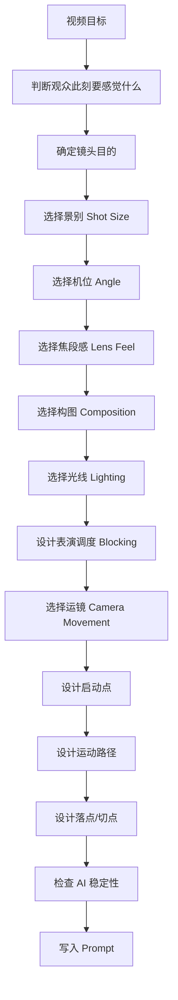

# KB-04｜运镜与分镜语言库（融合增强版）

> 版本定位：本文件是 `KB-04｜运镜与分镜语言库` 的重写增强版，已融合另一份《摄影机运动与电影摄影知识库》的 research 内容。  
> 核心用途：帮助「即梦导演 Prompt Studio」把用户的创意要求转化为更专业、更稳定、更有镜头意识的导演版 Prompt、分镜版 Prompt、图生视频 Prompt、MV Prompt、广告 Prompt、剧情短片 Prompt、POV Prompt、变装 Prompt、视觉奇观 Prompt 与动作参考图 Prompt。  
> 核心原则：本库不只是提供“运镜词汇”，而是让 GPT 像导演、摄影指导和剪辑师一样，决定观众在每一拍应该看到什么、感受到什么、何时知道信息、何时产生情绪、何时被节奏击中。

## 0. 调用边界与协同关系

### 0.1 适合调用本库的场景

当用户出现以下意图时，应优先调用本库：

```text
电影感
运镜
镜头语言
分镜
导演版
12秒视频
MV镜头
广告镜头
POV
一镜到底
镜头怎么拍
转场更自然
画面更高级
镜头更稳定
图生视频怎么动
参考图怎么利用
动作与运镜草图
电影摄影
构图
焦段
光影
布光
表演调度
经典导演手法
希区柯克变焦
伦勃朗光
昆汀推拉
迈克尔贝环绕
邵氏大变焦
```

### 0.2 本库负责什么

本库负责：

1. 镜头目的判断。
2. 景别、机位、焦段、构图、光线、表演调度、运镜与剪辑节奏设计。
3. 12 秒短视频分镜结构。
4. 图生视频中的运动提示与镜头控制。
5. 多镜头视频的镜头编号、时间戳与镜头内容。
6. 变装、MV、广告、剧情、搞笑、悬疑、动作、POV、视觉奇观等类型的镜头策略。
7. 将专业摄影术语转化为可被 AI 视频模型理解的自然语言 Prompt。

### 0.3 本库不负责什么

本库不单独负责：

| 内容 | 应调用 |
|---|---|
| 平台规则、审核、合规、长度限制 | KB-01 |
| Prompt 总体结构、基础模板、输出格式 | KB-02 |
| 爆款创意、短视频主题、内容钩子 | KB-03 |
| 视觉风格、色彩、材质、艺术流派 | KB-05 |
| 人物身份稳定、@数字人、人像一致性 | KB-06 |
| 热点标签、发布文案、标题话题 | KB-07 / KB-08 |

当用户要求完整视频 Prompt 时，本库通常与 KB-02、KB-05、KB-06 联合使用。

## 1. 核心定位：从“描述画面”升级为“设计观看方式”

本库的核心作用不是让 GPT 堆砌“电影感、大片感、高级运镜”，而是让 GPT 先判断：

```text
这一拍，观众应该看见什么？
这一拍，观众应该感觉什么？
这一拍，镜头运动是否真的带来新的信息、情绪或节奏？
```

核心判断句：

```text
运镜不是让画面动起来，而是让观众在正确的时间看到正确的信息。
```

升级后的总准则：

```text
先决定故事在这一拍要观众“感觉什么”，再决定角色与空间关系，最后才决定镜头怎么动。
```

错误工作方式：

```text
先堆“电影感、大片、运镜丝滑、镜头高级” → 期待模型自动理解
```

正确工作方式：

```text
故事目标 → 观众感受 → 镜头目的 → 景别/机位/焦段 → 构图/光线/调度 → 运镜路径 → 节奏落点 → Prompt 表达
```

## 2. 镜头语言五层系统

融合 research 后，本库将“镜头语言”拆成五层系统：

| 层级 | 中文 | English | 决定什么 | 常见问题 |
|---|---|---|---|---|
| 第 1 层 | 运镜 | Camera Movement | 观众与空间的关系 | 镜头为什么动、往哪动、何时停 |
| 第 2 层 | 角度与景别 | Angle & Shot Size | 权力、主观性、信息距离 | 主角强弱、空间尺度、情绪强度 |
| 第 3 层 | 焦段与构图 | Focal Length & Composition | 心理距离、空间压缩、视觉重心 | 24mm 环境压迫、85mm 亲密压缩 |
| 第 4 层 | 光线与表演调度 | Lighting & Blocking | 情绪质地、人物关系、身体能量 | 角色站位、谁遮住谁、光线气质 |
| 第 5 层 | 剪辑与转场 | Editing & Transition | 节奏、叙事跳跃、记忆点 | 何时切、切到什么、是否卡点 |

重要规则：

```text
同一个镜头里，不要让五层全部同时复杂化。
```

AI 视频尤其要遵守：

```text
单镜头最好只有一个明确机位动作 + 一个明确主体动作。
```

## 3. 运镜设计总流程



### 3.1 最小决策流程

当需要快速生成 Prompt 时，至少完成以下 6 步：

```text
镜头目的 → 景别 → 机位 → 运镜 → 落点 → 稳定性检查
```

### 3.2 专业决策流程

当用户要求专业导演版、分镜图、电影级 Prompt 时，应完成以下 10 步：

```text
故事目标
→ 观众情绪
→ 信息揭示顺序
→ 景别与机位
→ 焦段与构图
→ 光线与色彩锚点
→ 表演调度
→ 运镜路径
→ 剪辑/转场落点
→ AI 可执行性
```

## 4. 镜头目的库

每一个镜头必须至少服务以下一种目的。

| 目的 | 说明 | 镜头策略 |
|---|---|---|
| 叙事 | 让观众理解人物、空间、动作关系 | 全景建立空间，中景展示动作，OTS 建立关系 |
| 情绪 | 改变观众与角色的心理距离 | 慢推压迫，拉远孤独，手持紧张，特写亲密 |
| 节奏 | 配合音乐、动作、笑点、反转落点 | 快切、定格、闪白、crash zoom、鼓点切换 |
| 信息 | 隐藏、揭示或强调关键内容 | 遮挡、慢摇、道具特写、延迟 reveal |
| 主观 | 让观众进入角色的感受或偏见 | POV、视线匹配、呼吸感手持、反应镜头 |
| 空间 | 让观众理解位置、方向和尺度 | 建立镜头、横移、跟拍、俯拍、crane up |

判断句：

```text
如果这个镜头不动，信息、情绪或节奏会不会变弱？
```

如果不会变弱，就不必强行运镜。

## 5. AI 视频稳定总规则

### 5.1 单镜头稳定公式

```text
一个主体 + 一个动作 + 一个镜头运动 + 一个明确落点
```

示例：

```text
中景平视，镜头缓慢推近，主角抬头看向镜头，最终停在眼神近景。
```

不稳定写法：

```text
镜头快速环绕、推近、拉远、俯拍、切换场景，主角边跑边转身边挥剑，背景爆炸。
```

### 5.2 图生视频规则

当用户提供参考图并要求图生视频时：

```text
主要写 motion / camera，不要反复描述参考图里已经存在的人物、场景、光线和服装。
```

推荐写法：

```text
遵循参考图的人物、场景、服装与光线。镜头从中景缓慢推近，主角轻微转头看向镜头，衣摆和发丝自然随风移动，背景保持稳定。
```

不推荐写法：

```text
重新大段描述人物长相、服装、背景和光线，导致模型偏离参考图。
```

### 5.3 多镜头规则

多镜头叙事必须写清：

```text
总体风格
镜头编号
时间戳
每镜头景别
每镜头运镜
每镜头主体动作
镜头之间的转场逻辑
全局人物一致性
```

### 5.4 复杂度控制

```text
运镜越复杂，主体动作越要简单。
主体动作越复杂，运镜越要稳定。
人物越多，镜头越要克制。
人脸越重要，镜头越不能快速绕脸。
```

## 6. 景别语言库 Shot Size

### 6.1 远景 / 全景 / Wide Shot

作用：

- 建立空间和环境尺度。
- 展示多人关系。
- 展示宏大场面。
- 适合作为开场、转场、高潮全貌或结尾余味。

适合：

```text
武侠大殿对峙
城市怪兽出现
舞台群舞
工厂劳动场景
世界失控全景
雨夜街道重逢
战场、宫殿、赛场、舞台
```

Prompt 写法：

```text
开场用全景建立空间，主角站在巨大场景中央，周围环境清晰可见，人物与空间形成尺度对比。
```

注意：

```text
远景不适合承载细微表情。
竖屏远景要确保主体足够清楚。
人物太小容易丢失主角身份。
```

### 6.2 中景 / Medium Shot

作用：

- 表现人物动作。
- 保持表情和身体语言都可见。
- 是 AI 短视频最稳定的主体景别。

适合：

```text
口播
对话
搞笑动作
双人互动
变装前后展示
舞蹈动作
剧情推进
```

Prompt 写法：

```text
镜头以中景拍摄主角，保证脸部和上半身动作清晰，主体始终居中。
```

### 6.3 中近景 / Medium Close-up

作用：

- 平衡表情和身体姿态。
- 适合对白、心理变化、告白、悬疑发现。
- 比特写更稳定，比中景更有情绪。

Prompt 写法：

```text
中近景慢推，主角停顿后抬眼看向镜头，情绪逐渐压近。
```

### 6.4 近景 / Close-up

作用：

- 强化情绪。
- 捕捉表情变化。
- 承接台词、笑点、反转、记忆点。

适合：

```text
尴尬表情
震惊反应
恋爱眼神
悬疑发现
主角独白
结尾记忆点
```

Prompt 写法：

```text
关键反转处切到脸部近景，捕捉主角震惊表情，镜头停顿半秒。
```

注意：

```text
近景容易放大脸部变形风险。
使用 @角色 时，近景动作要更慢。
不要快速绕脸或用强遮挡穿过脸部。
```

### 6.5 特写 / Extreme Close-up / Insert Shot

作用：

- 强调关键道具、手部动作、眼神、文字、产品细节。
- 用于悬疑线索、广告卖点、解压材质、音乐重音。

适合：

```text
手指按键
钥匙掉落
眼神变化
产品水珠
账单、工牌、手机屏幕
武器出鞘
鞋跟落地
```

Prompt 写法：

```text
切到道具特写，画面清楚显示桌上的工牌，随后镜头快速回到主角表情。
```

注意：

```text
特写只承担一个信息点。
重要文字仍建议后期添加，不要完全依赖 AI 生成。
```

## 7. 机位语言库 Camera Angle

### 7.1 平视机位 / Eye-level

作用：

- 自然、真实、稳定。
- 适合口播、生活、剧情、对话、普通人物关系。

Prompt：

```text
平视中景拍摄，画面自然真实，像观众站在角色面前。
```

### 7.2 低角度仰拍 / Low Angle

作用：

- 增强压迫感、英雄感、权力感、舞台气场。
- 适合出场、结尾定格、战神感、强势角色、广告大片。

Prompt：

```text
低角度仰拍主角，增强气场和压迫感，背景光束从身后穿过。
```

注意：

```text
不要过度仰拍脸部，否则容易变形。
低角度最好配合轮廓光、天花板线条、烟雾或大空间。
```

### 7.3 高角度俯拍 / High Angle

作用：

- 表现孤独、弱小、局势压力。
- 展示空间布局。
- 适合悬疑、宏观变化、桌面产品、人物被环境吞没。

Prompt：

```text
高角度俯拍办公室，主角独自坐在工位中央，周围空间显得空旷压抑。
```

### 7.4 鸟瞰 / Overhead / Top Shot

作用：

- 强调几何构图、命运感、棋盘感、路线关系。
- 适合舞蹈队形、追逐路线、桌面物件、悬疑现场。

Prompt：

```text
正上方俯拍，人物在地面灯光图案中移动，队形和路线清晰可见。
```

### 7.5 侧面机位 / Profile Shot

作用：

- 表现轮廓、距离感、情绪克制。
- 适合情绪片、写真、广告、对峙、等待、沉默。

Prompt：

```text
侧面中近景拍摄，逆光勾勒主角脸部轮廓，背景柔和虚化。
```

### 7.6 越肩视角 / Over-the-shoulder / OTS

作用：

- 建立对话关系。
- 强化立场、压迫感和空间层次。
- 适合谈判、恋爱、悬疑、审问、双人对峙。

Prompt：

```text
越肩视角拍摄对话，前景人物肩部虚化，焦点落在对面主角表情。
```

### 7.7 主观视角 / POV

作用：

- 让观众成为角色视线。
- 增强代入感、亲密感、恐惧感或游戏感。

Prompt：

```text
第一人称 POV，镜头代表观众视线，对方角色走近镜头并递来咖啡。
```

注意：

```text
POV 中不要频繁切换第三人称。
可以加入自然头部微动、呼吸感、手部前景。
```

### 7.8 荷兰角 / Dutch Angle

作用：

- 制造失衡、不安、疯狂、梦境、犯罪感。
- 适合悬疑、反派登场、心理崩溃、荒诞喜剧。

Prompt：

```text
轻微荷兰角构图，走廊线条倾斜，主角表情紧张，画面带不稳定感。
```

注意：

```text
荷兰角不要滥用，只有角色心理或世界秩序失衡时才使用。
```

## 8. 焦段与构图语言库 Lens & Composition

### 8.1 焦段的心理含义

| 焦段感 | 视觉效果 | 情绪用途 | Prompt 写法 |
|---|---|---|---|
| 24mm 广角 | 环境更大，近物夸张，空间压迫 | 城市压迫、荒诞、沉浸、环境人像 | `24mm 广角环境人像，人物被空间包围` |
| 35mm | 自然但有空间感 | 街头、剧情、跟拍、纪录感 | `35mm 自然街头电影感，中景跟拍` |
| 50mm | 接近自然人眼，平衡真实与美感 | 对话、日常、情绪片 | `50mm 自然透视，中近景慢推` |
| 85mm | 背景压缩，人物更突出 | 肖像、亲密、压迫、浪漫 | `85mm 肖像压缩感，浅景深近景` |
| 100mm+ 长焦 | 空间被压缩，背景贴近主体 | 孤独、偷窥感、距离感、舞台特写 | `长焦压缩背景，人物像被城市包围` |

### 8.2 构图基本策略

| 构图 | 作用 | 适合 |
|---|---|---|
| 居中构图 | 稳定、仪式感、压迫、海报感 | 神话人物、广告、变装后定格 |
| 三分法 | 自然、舒服、叙事清晰 | 对话、Vlog、剧情 |
| 留白 / Negative Space | 孤独、压抑、等待、未知 | 悬疑、情绪片、城市夜景 |
| 前景遮挡 | 增加层次、偷窥感、转场 | 悬疑、恋爱、广告、高级感 |
| 引导线 | 把视线导向主体 | 走廊、街道、桥、舞台 |
| 对称构图 | 秩序、仪式、压迫、荒诞 | 宫殿、办公室、宗教感、Wes Anderson 风格 |
| 断裂构图 | 不安、混乱、心理失衡 | 悬疑、恐怖、荒诞、反派视角 |

### 8.3 Prompt 写法

```text
24mm 广角环境人像，主角站在画面下方三分线位置，周围巨大建筑形成压迫感，大量负空间强调孤独。
```

```text
85mm 近景肖像，浅景深，背景被压缩成柔和光斑，人物眼神成为画面唯一焦点。
```

## 9. 光线语言库 Lighting

### 9.1 光线的基本作用

光线不是装饰，而是情绪和信息控制工具。

| 光线类型 | 情绪 | 适合 |
|---|---|---|
| 柔光 / Soft Light | 温柔、干净、商业、美妆 | 广告、人像、恋爱 |
| 硬光 / Hard Light | 强烈、危险、戏剧、犯罪 | 悬疑、黑色电影、动作 |
| 逆光 / Backlight | 轮廓、神秘、英雄感 | 出场、舞台、雨夜、烟雾 |
| 侧光 / Side Light | 立体、成熟、张力 | 剧情、肖像、访谈 |
| 顶光 / Top Light | 压迫、审判、孤立 | 审讯、工厂、恐怖 |
| 底光 / Underlight | 不自然、诡异、怪谈 | 恐怖、反派、舞台怪诞 |
| 实用光 / Practical Light | 真实、生活、沉浸 | 房间、街道、酒吧、餐厅 |

### 9.2 伦勃朗光 / Rembrandt Lighting

定义：

```text
人物脸部暗侧有一个由鼻影和面部阴影形成的三角亮区。
```

情绪：

```text
内省、成熟、戏剧张力、道德暧昧、沉重肖像。
```

Prompt：

```text
伦勃朗布光，暗侧脸颊下方形成清晰三角亮区，低调暖光，人物表情内敛而有戏剧张力。
```

适合：

```text
访谈
剧情近景
成熟人物肖像
黑色电影感
内心压抑的独白
```

### 9.3 光线与运镜配合

| 镜头 | 推荐光线 |
|---|---|
| 慢推近景 | 侧光、柔逆光、伦勃朗光 |
| 低角度英雄环绕 | 逆光、轮廓光、烟雾光束 |
| 悬疑手持 | 低调光、门缝光、手电光 |
| 产品特写 | 柔光、边缘高光、反射控制 |
| 舞台 MV | 追光、扫光、频闪、背光爆发 |
| 情绪拉远 | 冷色环境光、孤独留白 |

## 10. 表演调度 Blocking

### 10.1 Blocking 是什么

Blocking 指人物在空间中的站位、移动、停顿、遮挡和互相之间的距离。

它决定：

```text
谁控制场面
谁被压迫
谁靠近谁
谁逃离谁
谁遮住谁
谁先动
谁后反应
```

### 10.2 人物关系调度

| 调度方式 | 含义 |
|---|---|
| 一前一后 | 权力差、追随、压迫 |
| 左右对称 | 对峙、平衡、谈判 |
| 主角居中，其他人围绕 | 主角被审视或主角掌控全局 |
| 前景遮住主角一部分 | 秘密、窥视、压迫 |
| 一人静止，一人移动 | 主动与被动、攻击与防守 |
| 距离逐渐缩短 | 亲密、威胁、情绪升高 |
| 距离逐渐拉开 | 疏离、失去、孤独 |

Prompt：

```text
两人中景构图，主角站在左侧前景，另一人站在右侧后方，两人距离逐渐缩短，镜头缓慢推近，压迫感增强。
```

### 10.3 Brando 质感 / Method-inflected Performance

这里的 “Brando 质感” 不是严格摄影术语，而是一种创作 shorthand：

```text
内敛、真实、身体有重量、情绪被压住、停顿后突然爆发。
```

镜头策略：

```text
不要急着切。
给角色停顿、低头、前倾、呼吸、眼神变化的时间。
用中近景或带前景遮挡的单人镜头慢推。
```

Prompt：

```text
内敛而有重量的自然主义表演，主角长暂停后身体微微前倾，眼神从回避变成直视，镜头微弱推近，低调暖色实用光。
```

## 11. 运镜类型库 Camera Movement

### 11.1 固定镜头 / Static Shot

作用：

- 稳定、冷静、观察、真实。
- 适合搞笑反转、严肃对话、恐怖等待、产品展示。
- 当主体动作已经足够强时，固定镜头更有力量。

Prompt：

```text
固定机位中景，主角独自完成动作，镜头不移动，让反转自然发生在画面内部。
```

### 11.2 推镜 / Dolly In / Push-in

作用：

- 让观众靠近角色。
- 强化情绪、压力、发现、告白、结论、反转。
- 是 AI 视频中最稳定、最实用的电影感运镜之一。

Prompt：

```text
镜头从中景缓慢推进到近景，逐渐聚焦主角眼神。
```

### 11.3 拉镜 / Dolly Out / Pull-back

作用：

- 揭示环境。
- 表现孤独、反差、宏大尺度。
- 适合结尾余味和世界变化完成。

Prompt：

```text
镜头从主角近景缓慢拉远，逐渐揭示整个办公室已经变成森林。
```

### 11.4 横移 / Truck / Slide

作用：

- 展示空间层次。
- 利用前景遮挡做 reveal。
- 表现人物与环境关系。

Prompt：

```text
镜头从左向右缓慢横移，前景柱子掠过后揭示主角站在大厅中央。
```

### 11.5 摇镜 / Pan

作用：

- 从一个信息点转向另一个信息点。
- 延迟 reveal。
- 适合悬疑、喜剧反转、空间交代。

Prompt：

```text
镜头先对准空荡走廊，再缓慢摇向右侧，揭示门后站着主角。
```

注意：

```text
Pan 是相机固定在原地水平旋转。
如果相机跟着人物移动，那是 tracking，不是 pan。
```

### 11.6 俯仰镜头 / Tilt

作用：

- 从下到上展示人物气场或服装。
- 从上到下揭示危险、道具或空间高度。

Prompt：

```text
镜头从主角脚下缓慢上摇到脸部，展示完整服装和气场。
```

### 11.7 跟拍 / Tracking

作用：

- 陪伴角色行动。
- 增强沉浸感和连续性。
- 适合行走、追逐、Vlog、POV、MV。

Prompt：

```text
稳定器跟拍主角向前走，镜头保持中景距离，背景自然后退。
```

### 11.8 环绕镜头 / Orbit

作用：

- 展示角色气场。
- 适合变装后展示、舞台、英雄出场、广告大片。

Prompt：

```text
镜头围绕主角轻微环绕半圈，保持脸部清晰，展示服装和背景光效。
```

注意：

```text
AI 视频中不建议快速绕脸。
人物稳定优先时，只用轻微半环绕。
多人场景不建议复杂环绕。
```

### 11.9 手持镜头 / Handheld

作用：

- 增加真实感、紧张感、现场感。
- 适合悬疑、纪录片、追逐、慌乱情绪。

Prompt：

```text
轻微手持纪录片机位，身体微晃，跟随主角穿过狭窄走廊，画面真实但可读。
```

注意：

```text
手持不是乱晃。
AI 中不要只写 shaky camera，应写 subtle handheld / 轻微手持。
```

### 11.10 稳定器镜头 / Gimbal

作用：

- 顺滑移动。
- 适合广告、MV、舞蹈、走廊跟拍、空间穿梭。

Prompt：

```text
稳定器顺滑跟拍主角穿过霓虹走廊，画面流畅，运动轻盈。
```

### 11.11 主观镜头 / POV Shot

作用：

- 让观众代入第一人称。
- 适合恋爱、游戏、恐怖、沉浸式体验。

Prompt：

```text
第一人称 POV，画面中可见主角的手伸向门把手，门打开后对方角色出现在眼前。
```

### 11.12 长镜头 / Long Take / One-shot

作用：

- 增强沉浸感。
- 展示连续动作。
- 让时间成为戏的一部分。

Prompt：

```text
12 秒一镜到底，镜头稳定跟随主角从门口走入大厅，中途不切镜，动作连续自然。
```

注意：

```text
一镜到底难度高，动作必须简化。
适合单一空间、单一主线。
不建议多人复杂互动加多场景切换。
```

### 11.13 摇臂 / Crane / Boom

作用：

- 赋予命运感、规模感、上帝视角。
- 常用于开场建立、结尾收束、空间 reveal。

Prompt：

```text
镜头从主角手中的钥匙缓慢升起，逐渐揭示整个舞厅和人群，形成命运感的空间陈述。
```

### 11.14 快切 / Montage / Rapid Cutting

作用：

- 增强节奏感。
- 适合 MV、变装、搞笑、广告、动作细节。

Prompt：

```text
中段使用 3 个快速镜头切换：手部特写、眼神近景、脚步落地，全部对齐音乐鼓点。
```

注意：

```text
快切要有视觉主语。
每个镜头只承担一个信息点。
快切不是画面混乱。
```

### 11.15 慢动作 / Slow Motion

作用：

- 把瞬间动作变成情绪凝视。
- 适合冲击、浪漫、悲壮、爆发、粒子飘动。

Prompt：

```text
轻度半速慢动作，空气中有漂浮尘埃，把撞击瞬间做成情绪重音。
```

注意：

```text
不要整段都慢动作。
只把最需要被看见的 0.5–2 秒变慢。
```

## 12. 经典镜头俗语与导演手法库

这些条目可作为「高级镜头 shorthand」，但输出 Prompt 时应同时翻译成可执行描述。

### 12.1 希区柯克变焦 / Hitchcock Zoom / Dolly Zoom

定义：

```text
摄影机物理推进或拉远，同时镜头反向变焦，让主体尺寸基本不变，背景透视被拉扯。
```

情绪：

```text
眩晕、顿悟、失控、世界突然变形。
```

适合：

```text
角色意识到真相
恐惧突然袭来
空间感崩塌
心理冲击
```

Prompt：

```text
中近景，镜头推进同时反向变焦，主体尺寸基本保持不变，背景透视被拉扯，人物突然意识到真相。
```

AI 注意：

```text
需要明显前景、中景、后景。
不要叠加复杂动作。
适合 1.5–3 秒情绪重音。
```

### 12.2 昆汀式慢推 / 快变焦 / Tarantino-style Push-in & Quick Zoom

定义：

```text
在对白、威胁、讥讽、反转前，用缓慢推近或突然快变焦给台词加重音。
```

情绪：

```text
威胁、戏剧化、黑色幽默、台词即武器。
```

Prompt：

```text
紧张对白中的缓慢推近，人物保持克制表情，镜头在关键台词落点压近，带一点舞台化悬念。
```

使用规则：

```text
不要每句台词都推。
只把推近留给场景立意句、威胁句、权力翻转句。
```

### 12.3 迈克尔贝低机位环绕 / Michael Bay 360 Shot

定义：

```text
从低角度围绕角色环绕，配合逆光、烟雾、尘埃和强烈轮廓，制造英雄感和事态升级感。
```

情绪：

```text
英雄登场、局势爆发、命运感、大事件前一秒。
```

Prompt：

```text
低机位环绕主角半圈，逆光穿过烟雾和尘埃，主角停在画面中央，像意识到巨大危机即将降临。
```

AI 注意：

```text
为保证人脸稳定，建议写半圈或轻微环绕，不要强行 360 快速环绕。
```

### 12.4 邵氏大变焦 / Shaw Brothers Crash Zoom / Smash Zoom

定义：

```text
在招式、手势、兵器、眼神或击打重音处突然快速变焦，形成漫画式冲击。
```

情绪：

```text
武侠重音、喜剧冲击、动作强调、短视频 punchline。
```

Prompt：

```text
动作峰值处突然快速变焦到举起的刀剑，武侠式强调，高反差，镜头只持续一秒。
```

使用规则：

```text
必须有明确动作点。
最好切在动作峰值或视线落点。
```

### 12.5 伦勃朗光 / Rembrandt Lighting

见第 9.2 节。常与中近景、慢推、低调剧情肖像搭配。

Prompt：

```text
中近景慢推，伦勃朗布光，暗侧脸颊下方有三角亮区，人物表情内敛而沉重。
```

### 12.6 POV 看与被看 / POV Look-Reaction Pattern

有效 POV 通常不只是第一人称，而是：

```text
看见某物 → 进入主观视角 → 给出反应或结果
```

Prompt：

```text
先用主角反应近景建立视线，再切入第一人称 POV，画面带自然头部微动，对方角色向镜头靠近，最后切回主角紧张表情。
```

### 12.7 Match Cut / 图形匹配剪辑

定义：

```text
通过形状、动作、方向、声音或主题相似性，把两个镜头自然连接。
```

适合：

```text
变装
穿越
MV
广告
梦境
回忆
前后对照
```

Prompt：

```text
图形匹配剪辑：主角转动手中的圆形怀表，切到夜空中同样圆形的月亮，动作方向保持一致。
```

### 12.8 Whip Pan / 快速甩镜

定义：

```text
镜头快速横向甩动，用运动模糊连接两个画面。
```

适合：

```text
搞笑反转
动作切换
快速换场
MV 卡点
```

Prompt：

```text
音乐重拍处快速甩镜，运动模糊遮住画面，下一瞬间切到新场景。
```

AI 注意：

```text
不要在同一镜头里同时要求复杂人物动作和快速甩镜。
```

## 13. 转场语言库 Transition

### 13.1 遮挡转场

作用：

```text
稳定、自然、适合变装、穿越、换场。
```

Prompt：

```text
主角把纸张贴近镜头，纸张遮满画面瞬间完成变装转场。
```

### 13.2 贴镜转场

Prompt：

```text
主角用手掌靠近镜头完全遮住画面，下一秒松开手时场景已经改变。
```

### 13.3 闪白转场

Prompt：

```text
鼓点落下瞬间画面闪白，主角从普通服装变为舞台造型。
```

适合：

```text
能量爆发
梦幻
MV
变身
神话降临
```

### 13.4 运动匹配转场 / Match Action

Prompt：

```text
主角转身动作保持一致，转身前是现代办公室，转身后变成古代大殿。
```

### 13.5 图形匹配转场 / Graphic Match

Prompt：

```text
从圆形灯光切到圆月，两个画面形状一致，情绪从现实过渡到梦境。
```

### 13.6 声音转场 / Sound Bridge

Prompt：

```text
前一镜头的门铃声延续到下一场景，声音先到，画面后切换。
```

### 13.7 Dissolve / 溶接

作用：

```text
时间流逝、回忆、梦境、情绪过渡。
```

Prompt：

```text
画面缓慢溶接，街道灯光叠化成回忆中的花火。
```

### 13.8 Straight Cut / 直接切

作用：

```text
最干净、最清晰的叙事切换。
```

Prompt：

```text
动作完成的瞬间直接切到主角反应近景，节奏干净有力。
```

## 14. 12 秒短视频分镜结构库

### 14.1 通用四段式

```text
0–3秒：钩子镜头
3–6秒：推进镜头
6–10秒：高潮镜头
10–12秒：记忆点镜头
```

| 时间 | 镜头任务 | 常用景别 | 常用运镜 |
|---|---|---|---|
| 0–3秒 | 让观众停下 | 特写 / 中景 / 异常全景 | 快速推近 / 固定冲击 / 遮挡进入 |
| 3–6秒 | 交代人物与动作 | 中景 / 中近景 / 跟拍 | 慢推 / 跟拍 / 横移 |
| 6–10秒 | 升级冲突或视觉变化 | 中近景 / 全景 / 特写 | 快切 / 轻环绕 / 拉远 / 闪白 |
| 10–12秒 | 留下记忆点 | 近景 / 特写 / 海报全景 | 定格 / 慢推 / 拉远 |

通用 Prompt：

```text
0–3秒：{异常画面/强反差钩子}。
3–6秒：{主角动作推进，镜头中景跟拍或慢推}。
6–10秒：{高潮变化，切特写或全景展示爆点}。
10–12秒：{结尾定格，台词/表情/道具/海报感画面}。
```

### 14.2 12 秒高级节奏结构

```text
0–1秒：视觉钩子，必须一眼看懂异常。
1–3秒：镜头进入，建立主体和动作方向。
3–6秒：行动推进，给观众理解空间与人物关系。
6–9秒：爆点、变装、反转、舞蹈副歌或视觉奇观。
9–11秒：情绪或节奏收束，给出主角反应或结果。
11–12秒：定格、眼神、道具、标题感画面或记忆点。
```

### 14.3 适合即梦的稳定 12 秒公式

```text
中景开场 → 慢推/跟拍推进 → 遮挡或卡点转场 → 近景/全景定格
```

## 15. 类型化分镜策略

### 15.1 剧情类

重点：

```text
情绪、关系、信息揭示。
```

推荐结构：

```text
全景建立空间 → OTS 建立关系 → 慢推增强情绪 → 特写揭示关键信息 → 近景结尾
```

Prompt：

```text
镜头先用中景建立两人关系，随后随着情绪变化缓慢推进，关键台词后切到主角近景表情。
```

### 15.2 搞笑反转类

重点：

```text
严肃铺垫 + 突然反转 + 表情落点。
```

推荐结构：

```text
固定全景铺垫 → 认真动作中景 → 反转对象特写 → 表情近景定格
```

Prompt：

```text
前半段固定机位制造严肃感，反转瞬间快速切到道具特写，再切主角表情近景，音乐突然停顿。
```

### 15.3 变装类

重点：

```text
前后反差、转场稳定、变装后展示。
```

推荐结构：

```text
普通状态中景 → 触发动作 → 遮挡/闪白 → 低角度慢推或轻环绕 → 眼神定格
```

Prompt：

```text
主角用手贴近镜头形成遮挡，遮挡后完成变装，镜头低角度慢推展示新造型，最后停在眼神近景。
```

### 15.4 MV / 舞蹈类

重点：

```text
节奏、身体线条、对嘴、队形、灯光落点。
```

推荐结构：

```text
眼神特写 → 中景舞蹈 → 对嘴近景 → 节拍快切 → 舞台全景或队形定格
```

Prompt：

```text
镜头跟随音乐鼓点切换，中景展示舞蹈动作，近景捕捉对嘴和眼神，结尾队形定格。
```

### 15.5 广告类

重点：

```text
产品清晰、高级质感、使用动作、结果画面。
```

推荐结构：

```text
痛点或氛围 → 产品自然出现 → 产品特写 → 使用动作 → 产品居中定格
```

Prompt：

```text
镜头缓慢推向产品，切到瓶身水珠特写，再拉开展示使用场景，结尾产品居中定格。
```

### 15.6 悬疑类

重点：

```text
隐藏信息、延迟揭示、视线引导、紧张空间。
```

推荐结构：

```text
异常道具特写 → 主角发现 → 慢推/手持靠近 → 慢摇 reveal → 反应特写
```

Prompt：

```text
手持轻晃中景跟随主角靠近门口，镜头缓慢摇向门缝，最后停在主角震惊表情。
```

### 15.7 视觉奇观类

重点：

```text
从小异常扩展到大规模变化。
```

推荐结构：

```text
特写异常 → 中景扩散 → 拉远全景 → 海报感定格
```

Prompt：

```text
镜头从手部发光特写开始，随后拉远展示光芒扩散到整个城市，结尾全景定格。
```

### 15.8 POV 恋爱/沉浸类

重点：

```text
视线代入、手部互动、靠近、眼神定格。
```

推荐结构：

```text
第一人称进入 → 对方靠近 → 递物/牵手/互动 → 温柔近景定格
```

Prompt：

```text
第一人称 POV，镜头轻微手持，对方角色走近镜头递来花，最后温柔看向镜头定格。
```

### 15.9 动作 / 武侠类

重点：

```text
动作点、空间方向、招式重音、节奏干净。
```

推荐结构：

```text
低角度出场 → 中景动作路线 → 武器/手势特写 → crash zoom 重音 → 全景展示结果
```

Prompt：

```text
中景拍摄主角挥剑，动作峰值处突然快速变焦到剑尖，随后直接切到全景展示对手后退。
```

### 15.10 古风甜爱类

重点：

```text
关系靠近、视线互动、空间温柔、动作可爱。
```

推荐结构：

```text
街景建立 → 双人中景互动 → 手部/花束特写 → 慢推表情 → 甜蜜定格
```

Prompt：

```text
唐代市集双人中景，男主从左侧走近，女主递出花束，镜头缓慢推近两人笑容，暖色柔光。
```

## 16. 图片素材与参考图工作流

### 16.1 三张素材图工作流

当用户要求“先生成三张素材图”作为即梦视频参考时，本库通常与 `/jmpic` 逻辑协同。

三张图建议：

| 图 | 名称 | 目的 |
|---|---|---|
| 图 1 | 纯背景图 | 提供场景、光线、空间和氛围 |
| 图 2 | 服装与道具展示图 | 提供造型、材质、颜色和配件 |
| 图 3 | 动作与运镜草图 | 提供站位、移动方向、镜头路径、节奏 |

### 16.2 第三张：动作与运镜草图

当用户要求图片素材拆分时，本库负责第三张「动作与运镜草图」。

要求：

```text
不追求人像美观。
用 storyboard sketch / motion reference sheet 表达站位、姿态、移动方向、镜头路径和景别变化。
人物只能使用无脸轮廓、火柴人、背影、剪影或简化人体结构。
不得出现清晰人脸、完整五官、正面肖像或可识别身份。
可加入箭头、推拉摇移标记、镜头轨迹、节拍点、构图框和前后景关系。
```

Prompt：

```text
动作与运镜草图，faceless figure / silhouette / stick figure，标出主角站位、动作节奏、移动方向、镜头推拉摇移路径、景别变化和构图框，干净分镜纸风格，无完整人脸，无可识别肖像。
```

### 16.3 参考图利用规则

当用户说“完全利用参考图”“尽量遵循参考图”“不要附加太多描述”时：

```text
以参考图为主，不重新发明画面。
Prompt 重点写镜头运动、角色动作、节奏、歌词位置、转场和稳定约束。
```

写法：

```text
严格遵循三张参考图的场景、造型、光线、构图与动作关系。视频只在参考图基础上加入轻微镜头运动和自然人物动作，不改变人物身份、场景基调和主要视觉元素。
```

## 17. Prompt 表达模板

### 17.1 单镜头通用模板

```text
{景别 + 机位}，{一个明确运镜}，{一个明确主体动作}，{焦段感}，{光线 + 色彩锚点}，{环境}，{情绪}，{时长}，{画幅比例}。
```

示例：

```text
中近景平视，镜头缓慢推近，主角长暂停后抬眼看向镜头，50mm 自然透视，低调暖色实用光，雨夜房间，情绪压抑而克制，12 秒，9:16。
```

### 17.2 图生视频模板

```text
遵循参考图的人物、场景、服装、光线和构图。镜头{运镜方式}，主角{一个动作}，环境{轻微自然变化}，主体保持清晰稳定，脸部无遮挡，不改变参考图核心视觉。
```

示例：

```text
遵循参考图的人物、场景、服装、光线和构图。镜头从中景缓慢推近，主角轻微转头看向镜头，发丝和衣摆自然摆动，背景保持稳定，主体清晰居中，脸部无遮挡。
```

### 17.3 多镜头分镜模板

```text
【整体风格】
{风格、色彩、光线、人物稳定要求}

【镜头 1｜0–3秒】
画面：{画面内容}
镜头：{景别/机位/焦段/运镜}
动作：{主体动作}
声音：{音乐/音效/台词}
作用：{钩子/铺垫/揭示}

【镜头 2｜3–6秒】
画面：{画面内容}
镜头：{景别/机位/焦段/运镜}
动作：{主体动作}
声音：{音乐/音效/台词}
作用：{推进}

【镜头 3｜6–10秒】
画面：{画面内容}
镜头：{景别/机位/焦段/运镜}
动作：{主体动作}
声音：{音乐/音效/台词}
作用：{高潮/反转}

【镜头 4｜10–12秒】
画面：{画面内容}
镜头：{景别/机位/焦段/运镜}
动作：{主体动作}
声音：{音乐/音效/台词}
作用：{记忆点}
```

### 17.4 导演版 Prompt 输出模板

```text
【导演设计】
这条视频采用{镜头风格}，通过{主要运镜}强化{情绪/节奏/信息}。

【镜头逻辑】
{说明为什么这样拍，镜头如何服务开场钩子、中段推进、高潮和结尾记忆点}

【镜头结构】
0–3秒：{镜头1}
3–6秒：{镜头2}
6–10秒：{镜头3}
10–12秒：{镜头4}

【最终 Prompt】
{整合后的可复制 Prompt}
```

### 17.5 英文专业镜头字段模板

当用户需要英文 Prompt，可使用：

```text
[shot size + angle], [one camera move], [one subject action in beats], [lens feel], [lighting + color palette], [environment], [mood], [duration], [aspect ratio], [style reference if needed]
```

示例：

```text
medium close-up, slow dolly in, the character pauses then looks directly into the lens, 50mm natural perspective, warm low-key practical lighting, rainy interior room, tense and restrained mood, 12 seconds, vertical 9:16.
```

## 18. 镜头词库

### 18.1 稳定镜头词

```text
固定机位
镜头稳定
中景构图
主体居中
缓慢推进
缓慢拉远
轻微横移
轻微环绕半圈
稳定器跟拍
画面无抖动
脸部无遮挡
动作缓慢连贯
```

### 18.2 电影感镜头词

```text
低角度仰拍
浅景深近景
侧逆光轮廓
过肩视角
前景虚化
慢推镜头
长镜头跟随
海报感定格
宽银幕构图
戏剧性光影
伦勃朗布光
负空间构图
长焦压缩
```

### 18.3 短视频节奏词

```text
前2秒强钩子
鼓点卡点
快速表情切换
结尾定格
音乐突然停顿
闪白转场
贴镜遮挡转场
动作与节拍同步
最后1秒记忆点
```

### 18.4 悬疑镜头词

```text
手持轻晃
慢推近景
延迟揭示
门缝视角
阴影遮挡
道具特写
焦点缓慢转移
低频氛围
镜头停顿半秒
荷兰角构图
低调光
```

### 18.5 广告镜头词

```text
产品居中
微距特写
慢速推近
干净背景
柔光棚拍
反射质感
开盖特写
使用场景拉远
结尾产品定格
边缘高光
浅景深
```

### 18.6 MV 镜头词

```text
节拍快切
对嘴近景
中景舞蹈
舞台全景
追光扫过
镜头跟随鼓点
副歌高光
灯光爆发
队形定格
低机位推近
快速甩镜
闪白卡点
```

### 18.7 动作与武侠镜头词

```text
低角度出场
中景招式路线
兵器特写
动作峰值
突然大变焦
手持跟拍
慢动作尘埃
击打重音
全景收招
前景遮挡穿插
```

## 19. 稳定性风险矩阵

### 19.1 稳定优先级

```text
固定镜头 > 慢推/慢拉 > 轻跟拍 > 轻横移 > 轻环绕 > 快切 > 快速环绕/复杂一镜到底
```

### 19.2 高风险组合

| 高风险组合 | 问题 | 修正 |
|---|---|---|
| 多人 + 快速环绕 | 人物变形、位置混乱 | 改成固定中景或轻横移 |
| 近景 + 快速打斗 | 脸部和身体崩坏 | 改为中景动作 + 特写切点 |
| 一镜到底 + 多场景切换 | 连续性不稳 | 拆成多镜头，使用遮挡转场 |
| 强特效 + 人脸特写 | 面部被特效污染 | 特效放到背景或全景 |
| 快切 + 多文字 | 信息读不清 | 文字后期添加或只保留一个短句 |
| 图生视频 + 大幅重新描述场景 | 偏离参考图 | 只写 motion/camera |
| POV + 第三人称混写 | 视角混乱 | 保持第一人称，必要时拆镜头 |
| 快速 zoom + 无明确动作点 | 变焦无力 | 绑定眼神、手势、击打、台词落点 |

### 19.3 稳定组合

| 稳定组合 | 适合用途 |
|---|---|
| 单人 + 慢推 | 情绪、口播、变装后展示 |
| 双人中景 + 固定机位 | 对话、恋爱、搞笑 |
| 产品特写 + 慢拉 | 广告 |
| 特写异常 + 拉远全景 | 视觉奇观 |
| 固定机位 + 表情快切 | 搞笑反转 |
| 图生视频 + 轻微推近 | 参考图延展 |
| 低角度 + 轻环绕半圈 | 英雄出场 |
| 中景舞蹈 + 节拍快切 | MV / 舞蹈 |

## 20. 常见错误与修正

### 20.1 错误：只写“电影感”

低效：

```text
画面很有电影感，运镜高级，大片质感。
```

修正：

```text
低角度中近景，镜头缓慢推近主角眼神，侧逆光勾勒脸部轮廓，背景虚化，最后停在近景定格。
```

### 20.2 错误：一个镜头塞太多动作

低效：

```text
镜头旋转推近拉远，主角奔跑转身跳跃挥剑，背景爆炸变换场景。
```

修正：

```text
中景跟拍主角向前奔跑，镜头保持稳定距离，最后在主角停步拔剑时切到兵器特写。
```

### 20.3 错误：没有镜头落点

低效：

```text
镜头一直移动，画面很震撼。
```

修正：

```text
镜头从全景缓慢推近，最终停在主角手中发光的钥匙特写，作为转场落点。
```

### 20.4 错误：POV 与第三人称混乱

低效：

```text
第一人称 POV 拍摄主角走进来，同时镜头看到主角自己在远处奔跑。
```

修正：

```text
第一人称 POV，镜头代表观众视线，画面前景可见自己的手，对方角色从远处走近。
```

### 20.5 错误：参考图视频重新发明画面

低效：

```text
重新详细描述一整套新服装、新背景、新光线。
```

修正：

```text
遵循参考图的服装、背景和光线，只加入轻微推近、自然转头、衣摆摆动和结尾定格。
```

### 20.6 错误：快切没有视觉主语

低效：

```text
快速切很多画面，节奏很炸。
```

修正：

```text
快速切三组明确细节：鞋跟落地、手指扣紧、眼神抬起，全部对齐鼓点，最后回到中景定格。
```

## 21. 镜头质量检查清单

输出导演版或分镜版 Prompt 前必须检查：

```text
[ ] 每个镜头是否有明确目的？
[ ] 开场 2 秒是否有视觉钩子？
[ ] 镜头是否帮助观众理解主体？
[ ] 运镜是否过多或冲突？
[ ] 是否明确景别和机位？
[ ] 是否有焦段感或构图策略？
[ ] 是否有光线和色彩锚点？
[ ] 是否有表演调度或人物站位？
[ ] 是否有镜头启动点、运动路径和落点？
[ ] 结尾是否有记忆点？
[ ] 人物脸部是否容易保持稳定？
[ ] 多人位置是否清楚？
[ ] 音乐/音效是否与镜头节奏配合？
[ ] 是否适合 12 秒完成？
[ ] 是否避免一个镜头塞多个运镜？
[ ] 如果是图生视频，是否主要写 motion/camera？
[ ] 如果是图片素材需求，是否已把动作与运镜拆成无脸草图、站位、箭头和镜头路径？
[ ] 是否能被即梦模型理解？
```

## 22. GPT 执行指令

当调用本库时，GPT 应遵守：

1. 用户说「电影感」时，必须转化为具体景别、机位、焦段、构图、光影、调度、运镜和节奏。
2. 用户说「运镜」时，先判断镜头目的，再选择运镜。
3. 用户说「分镜」时，优先使用 0–3、3–6、6–10、10–12 秒结构；如需要更细，可拆成 0–1、1–3、3–6、6–9、9–11、11–12。
4. 用户提供参考图时，优先遵循参考图，只增加 motion/camera，不重新发明视觉。
5. 人物视频优先中景、中近景、慢推、轻跟拍，避免快速环绕脸部。
6. 使用 @数字人时，必须强调脸部清晰、动作缓慢、主体稳定、无遮挡。
7. 搞笑视频优先固定机位铺垫 + 反转特写 + 表情近景定格。
8. 变装视频优先遮挡转场、闪白转场、运动匹配转场。
9. 广告视频优先产品特写、慢推、干净背景、结尾定格。
10. MV 视频优先中景舞蹈、近景对嘴、节拍快切、舞台全景。
11. 视觉奇观优先特写异常 → 中景扩散 → 拉远全景 → 海报定格。
12. POV 视频必须保持第一人称视角，不要混入第三人称描述。
13. 一镜到底必须减少动作和场景复杂度。
14. 运镜越复杂，动作和人物数量越要减少。
15. 镜头必须有启动点、运动路径和落点。
16. 最终写入 Prompt 时，要用自然语言，不要只堆术语。
17. 专业术语可用，但必须转成 AI 可执行的可视动作。
18. 经典导演手法可作为灵感，但不要空喊名字，必须描述实际镜头行为。
19. 输出给用户时，优先给可复制版本；如用户使用手机，避免 Canvas 依赖。
20. 如果用户要求标题和标签，不要加入 AI 相关标签，除非用户明确要求。

## 23. 快速选镜决策表

| 用户要的效果 | 首选镜头方案 |
|---|---|
| 更有压迫感 | 低角度 + 慢推 + 侧逆光 |
| 更孤独 | 高角度/远景 + 负空间 + 慢拉 |
| 更甜 | 平视中近景 + 柔光 + 慢推 |
| 更悬疑 | 道具特写 + 手持轻晃 + 慢摇揭示 |
| 更爆款 | 前 2 秒异常钩子 + 卡点转场 + 结尾定格 |
| 更高级广告 | 产品微距 + 柔光反射 + 慢推 + 居中定格 |
| 更武侠 | 中景动作路线 + 兵器特写 + 邵氏大变焦 |
| 更英雄 | 低机位 + 逆光烟雾 + 轻环绕半圈 |
| 更失控 | Hitchcock zoom / 荷兰角 / 手持 |
| 更真实 | 35mm 纪录感 + 轻微手持 + 实用光 |
| 更亲密 | 85mm 近景 + 浅景深 + 慢推 |
| 更沉浸 | POV + 自然头部微动 + 手部前景 |
| 更有 MV 感 | 节拍快切 + 中景舞蹈 + 近景对嘴 |
| 更像电影对白 | OTS + 中近景 + 慢推 + 反应镜头 |

## 24. 一句话核心总结

```text
镜头每动一次，都应该带来新的信息、情绪或节奏。
```

```text
短视频不是把画面拍满，而是把观众的注意力安排好。
```

```text
AI 视频 Prompt 的高级感，来自“明确镜头行为 + 稳定主体动作 + 清楚情绪落点”，不是来自术语堆叠。
```
