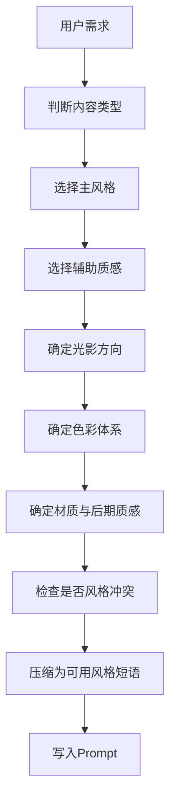

# KB-05｜风格魔咒与视觉风格库

> 用途：本知识库用于帮助「即梦导演 Prompt Studio」在生成即梦 / Dreamina / Seedance 视频 Prompt 时，选择、组合、压缩和稳定视觉风格。它负责定义画面气质、光影方向、色彩体系、材质质感、艺术流派、摄影风格与短视频常用风格包。

> 调用场景：当用户要求「电影感」「高级感」「港风」「赛博朋克」「邵氏武侠」「暗黑冥府」「国风水墨」「K-pop」「复古胶片」「VHS」「极简广告」「日系清新」「毛毡治愈」「更唯美」「更炸」「更像大片」「风格更统一」时，应优先调用本库。

> 本库只负责视觉风格与风格词选择，不负责平台规则、Prompt 基础结构、爆款创意、运镜分镜、人物稳定、热点话题。相关内容应分别调用 KB-01、KB-02、KB-03、KB-04、KB-06、KB-07。

## 1. 知识库定位

本库的核心作用是让 GPT 能够把用户模糊的审美要求，转化为稳定、统一、可生成的视觉风格。

它解决的问题包括：

1. 用户说「电影感」时，如何具体转化成光影、色彩、质感。
2. 用户说「高级」时，如何避免空泛形容词。
3. 用户想要多种风格时，如何判断主风格和辅助质感。
4. 用户 Prompt 风格太杂时，如何收敛。
5. 用户要爆款短视频时，如何选择更适合平台观看的视觉风格。
6. 用户要角色稳定时，如何避免强风格压过人物身份。

本库的核心原则：

```text
风格不是堆关键词，而是统一画面的光、色、材质、构图和情绪。
```

## 2. 风格调用总流程



正确顺序：

```text
内容类型 → 主风格 → 光色 → 质感 → 情绪 → Prompt表达
```

错误顺序：

```text
把所有好看的风格词全部堆进去
```

## 3. 风格使用总原则

### 3.1 一主一辅原则

一条短视频只允许一个主风格，可加一个辅助质感。

推荐结构：

```text
主风格 + 辅助质感 + 光色说明 + 情绪方向
```

示例：

```text
90年代港片胶片质感，暖黄灯笼光与冷蓝夜色对比，轻微颗粒，情绪紧张又荒诞。
```

不推荐：

```text
港风、赛博朋克、国风水墨、日系清新、迪士尼童话、暗黑冥府、VHS、IMAX、油画、写实摄影。
```

### 3.2 风格优先级

当多个风格冲突时，优先级如下：

| 优先级 | 内容 |
|---|---|
| 1 | 用户明确指定的主风格 |
| 2 | 视频类型最适合的风格 |
| 3 | 参考图的视觉风格 |
| 4 | 热点话题默认风格 |
| 5 | GPT 自动补充的辅助质感 |

### 3.3 风格稳定原则

1. 强人物视频：风格不要压过脸部。
2. 强动作视频：风格不要太复杂。
3. 强文字视频：背景要干净。
4. 强产品视频：风格要服务产品清晰度。
5. 强奇观视频：风格要服务变化过程可见性。
6. 强情绪视频：风格要服务情绪，而不是炫技。

## 4. 风格构成五要素

一个完整风格通常由五个部分组成。

```text
光影 + 色彩 + 材质 + 镜头质感 + 情绪
```

| 要素 | 作用 | 示例 |
|---|---|---|
| 光影 | 决定立体感和情绪 | 侧逆光、低调光、柔光、顶光 |
| 色彩 | 决定风格识别度 | 暖黄、青蓝、红黑、粉紫蓝 |
| 材质 | 决定触感和真实度 | 胶片颗粒、金属反光、毛毡、雾化 |
| 镜头质感 | 决定摄影语言 | 浅景深、中画幅、VHS、纪录片感 |
| 情绪 | 决定观众感受 | 压迫、治愈、荒诞、浪漫、史诗 |

## 5. 通用风格 Prompt 公式

### 5.1 标准公式

```text
{主风格}，{光影方向}，{色彩体系}，{材质/后期质感}，{情绪氛围}
```

示例：

```text
16mm暖黄胶片质感，侧逆光勾勒人物轮廓，暖黄高光与青蓝阴影对比，轻微颗粒和暗角，怀旧又戏剧化。
```

### 5.2 精简公式

```text
{主风格}，{主色调}，{关键质感}，{情绪}
```

示例：

```text
港风霓虹雨夜，黄高光青绿阴影，潮湿反光，压抑浪漫。
```

### 5.3 580字 Prompt 内的风格写法

在 580 字以内，应将风格压缩为一句，并避免风格词挤占主体、动作、参考图分工和稳定约束的字符预算。

```text
90年代港片胶片质感，暖黄灯笼光、冷蓝雨夜、轻微颗粒，气氛紧张荒诞。
```

### 5.4 图片素材的风格分配原则

当用户要求图片素材拆分时，风格不要平均塞进三张图，而要按素材用途分配：

| 素材图 | 风格重点 | 避坑 |
|---|---|---|
| 纯背景图 | 场景氛围、色调、光影、空间美术方向 | 不放完整人物和清晰人脸 |
| 造型展示图 | 服装材质、发型轮廓、配饰、分离式妆容色彩 | 不组成完整五官，不做肖像照 |
| 动作与运镜草图 | 简洁线稿、分镜框、动作方向、镜头路径 | 不追求写真质感，不画真实脸部 |

素材图可以共用同一主风格，但呈现形式要不同：背景图偏电影场景设计，造型图偏 fashion design sheet / makeup breakdown board，动作图偏 storyboard sketch / camera movement guide。

## 6. 核心风格包库

## 6.1 16mm 暖黄胶片风

### 适合内容

- 80年代劳动主题
- 怀旧剧情
- 家庭记忆
- 文艺短片
- 复古广告
- 青春回忆
- 温暖情绪片

### 视觉特征

| 维度 | 描述 |
|---|---|
| 光影 | 暖黄柔光、侧逆光、窗光、自然光 |
| 色彩 | 暖黄、焦糖色、低饱和绿、旧照片色 |
| 材质 | 16mm 胶片颗粒、轻微暗角、柔和反差 |
| 情绪 | 怀旧、温暖、朴素、真实、年代感 |

### 风格短语

```text
16mm暖黄胶片质感，柔和窗光，轻微颗粒和暗角，低饱和怀旧色调，真实温暖。
```

### 强化版短语

```text
80年代中国电影质感，16mm胶片颗粒，暖黄侧逆光穿过空气粉尘，画面低饱和、柔和反差，朴素真实又有时代温度。
```

### 适合搭配

- KB-03：身份穿越、劳动主题、情绪共鸣
- KB-04：慢推、拉远、侧面中景、窗光特写
- KB-02：艺术情绪类、剧情类、广告类模板

### 注意事项

- 不要和强霓虹、赛博朋克同时使用。
- 人物皮肤不要过度磨皮。
- 适合慢节奏，不适合极快剪辑。

## 6.2 港风霓虹市井风

### 适合内容

- 港片剧情
- 雨夜独白
- 情感反差
- 街头喜剧
- 黑帮撤退美学
- 复古城市故事
- 情绪 MV

### 视觉特征

| 维度 | 描述 |
|---|---|
| 光影 | 霓虹反光、硬光、侧光、招牌光 |
| 色彩 | 黄高光、青绿阴影、红蓝霓虹 |
| 材质 | 潮湿地面、雨雾、胶片颗粒、浅景深 |
| 情绪 | 市井、暧昧、压抑、浪漫、江湖气 |

### 风格短语

```text
港风霓虹雨夜，潮湿街道路面反光，黄高光与青绿阴影对比，轻微烟雾和胶片颗粒，市井电影感。
```

### 强化版短语

```text
90年代港片街头质感，霓虹招牌闪烁，雨夜地面潮湿反光，暖黄灯光与冷青阴影冲突，浅景深、轻微胶片颗粒，情绪压抑又浪漫。
```

### 适合搭配

- KB-03：情感反差、风格混搭、时间反转
- KB-04：慢推、越肩视角、街头跟拍、表情特写
- KB-02：剧情、搞笑反转、MV模板

### 注意事项

- 夜景不要写得太黑，避免主体不清。
- 霓虹色不要过多，保留主色关系。
- 人物脸部需要补光。

## 6.3 邵氏武侠 / 复古港片武侠风

### 适合内容

- 古风武侠
- 江湖对峙
- 邵氏疯格
- 古今反差喜剧
- 宗师出场
- 武馆挑战
- 古代英文梗

### 视觉特征

| 维度 | 描述 |
|---|---|
| 光影 | 暖黄硬光、冷蓝补光、灯笼光、舞台式布光 |
| 色彩 | 暖黄、暗红、青蓝、旧胶片色 |
| 材质 | 35mm/16mm粗颗粒、烟雾、尘土、布景感 |
| 情绪 | 江湖、夸张、戏剧化、荒诞、热血 |

### 风格短语

```text
70-80年代邵氏武侠电影质感，暖黄复古胶片色，硬光与烟雾，夸张江湖布景，戏剧化武侠氛围。
```

### 强化版短语

```text
复古邵氏武侠片风格，暖黄暗调胶片质感，硬光打在木质客栈和烟雾中，人物妆造夸张但认真，镜头带舞台感，气氛肃杀又荒诞。
```

### 适合搭配

- KB-03：风格混搭、反转剧情、身份穿越
- KB-04：低角度仰拍、固定全景、表情近景快切
- KB-02：古风武侠类、搞笑反转类模板

### 注意事项

- 不要直接复刻具体影视角色或台词。
- 动作要连贯，不要同时要求复杂打斗和多角色。
- 喜剧反差时，视觉越认真，笑点越强。

## 6.4 暗黑冥府东方幽冥风

### 适合内容

- 地府/冥府主题
- 东方女鬼/男鬼氛围
- 暗黑国风
- 冥界审判
- 鬼神战神
- 恐怖感但不血腥的视觉

### 视觉特征

| 维度 | 描述 |
|---|---|
| 光影 | 低调光、背光、冷色阴影、红光点睛 |
| 色彩 | 黑、冷青、暗红、灰白、金色微光 |
| 材质 | 黑雾、纸钱、烟尘、破败木纹、旧布料 |
| 情绪 | 压迫、神秘、阴冷、庄严、危险 |

### 风格短语

```text
暗黑东方冥府风，低调光，黑雾缭绕，冷青阴影与暗红点光，压迫神秘，画面庄严阴冷。
```

### 强化版短语

```text
东方幽冥冥府视觉，黑雾低伏，冷青阴影包围场景，暗红光从远处点亮人物轮廓，空气中有纸钱和尘埃漂浮，压迫、神秘、庄严。
```

### 适合搭配

- KB-03：身份穿越、视觉奇观、角色错位
- KB-04：低角度仰拍、慢推、拉远全景、背影镜头
- KB-02：视觉奇观、剧情、古风模板

### 注意事项

- 避免血腥暴力细节。
- 人物脸部不能完全被黑雾遮住。
- 红光只做点睛，不要全画面过红。

## 6.5 赛博朋克霓虹雨夜风

### 适合内容

- 未来城市
- 赛博末日
- 机械改造
- 都市大女主/大男主
- 科技广告
- AI觉醒
- 夜景 MV

### 视觉特征

| 维度 | 描述 |
|---|---|
| 光影 | 霓虹边缘光、屏幕光、体积雾、湿地反光 |
| 色彩 | 粉、紫、蓝、青、黑色基底 |
| 材质 | 金属、电路、玻璃、雨水、全息屏 |
| 情绪 | 未来、孤独、冷酷、科技、危险 |

### 风格短语

```text
赛博朋克霓虹雨夜，深色未来城市，粉紫蓝霓虹反光，潮湿地面，体积雾，冷酷科技感。
```

### 强化版短语

```text
未来都市赛博朋克风，黑色城市基底，粉紫蓝霓虹灯牌反射在雨夜地面，空气中有体积雾和全息光屏，人物被冷色边缘光勾勒，孤独而危险。
```

### 适合搭配

- KB-03：视觉奇观、身份穿越、世界失控
- KB-04：稳定器跟拍、低角度、慢推、全景拉远
- KB-02：MV、广告、视觉奇观模板

### 注意事项

- 霓虹过多会导致主体不清。
- 人物视频要补脸部主光。
- 不要与国风水墨、日系清新混用，除非明确做跨界主题。

## 6.6 国风水墨留白风

### 适合内容

- 东方美学
- 山水意境
- 古风舞蹈
- 诗意情绪
- 仙侠轻视觉
- 书法、茶、琴、剑、伞

### 视觉特征

| 维度 | 描述 |
|---|---|
| 光影 | 柔和散射光、雾气、轮廓微光 |
| 色彩 | 墨黑、宣纸白、浅灰、淡青、少量朱红 |
| 材质 | 宣纸、墨痕、雾、丝绸、水面 |
| 情绪 | 静谧、含蓄、东方、诗意、留白 |

### 风格短语

```text
国风水墨留白，宣纸质感，墨色晕染，淡青灰色调，空间安静，东方诗意。
```

### 强化版短语

```text
东方水墨视觉，宣纸肌理作为画面底色，远山和雾气以淡墨晕染，主体动作缓慢，少量朱红点睛，画面大量留白，静谧含蓄。
```

### 适合搭配

- KB-03：艺术情绪、身份穿越、视觉奇观
- KB-04：慢推、拉远、侧面中景、长镜头
- KB-02：艺术情绪、古风模板

### 注意事项

- 细节不宜太多，否则破坏留白。
- 不适合强快切。
- 人物动作要慢。

## 6.7 对称童话 / Wes Anderson 式精致构图

### 适合内容

- 精致日常
- 轻喜剧
- 童话感视频
- 情侣互动
- 产品广告
- 奇怪但可爱的世界

### 视觉特征

| 维度 | 描述 |
|---|---|
| 光影 | 均匀柔光、舞台式布景光 |
| 色彩 | 粉彩、奶油色、黄色、薄荷绿、柔和红 |
| 构图 | 对称置中、几何空间、正面机位 |
| 情绪 | 精致、冷幽默、童话、可爱、秩序感 |

### 风格短语

```text
对称置中构图，粉彩色调，复古布景，柔和均匀光，精致童话感和轻微冷幽默。
```

### 强化版短语

```text
Wes Anderson 式对称构图，角色站在画面正中央，背景呈几何分区，粉彩色调和复古道具，镜头稳定，舞台式调度，精致又有冷幽默。
```

### 适合搭配

- KB-03：风格混搭、角色错位、轻喜剧
- KB-04：固定机位、正面中景、轻微慢推
- KB-02：搞笑、广告、艺术情绪模板

### 注意事项

- 画面元素要整齐。
- 不适合混乱动作和强手持。
- 主体应居中。

## 6.8 极简商业广告风

### 适合内容

- 产品广告
- 高级品牌短片
- 科技产品
- 饮品、美妆、香水、电子设备
- 产品展示

### 视觉特征

| 维度 | 描述 |
|---|---|
| 光影 | 棚拍柔光、轮廓光、顶光、反射光 |
| 色彩 | 黑白灰、单一强调色、干净背景 |
| 材质 | 玻璃、金属、液体、水珠、柔和反射 |
| 情绪 | 高级、理性、干净、精致、克制 |

### 风格短语

```text
极简商业广告风，纯净背景，棚拍柔光，产品细节清晰，反射质感高级，画面克制干净。
```

### 强化版短语

```text
高端商业广告质感，黑色或白色极简背景，柔和棚拍光勾勒产品轮廓，微距特写展示材质和水珠，画面干净、精致、无杂物。
```

### 适合搭配

- KB-02：广告模板
- KB-04：产品特写、慢推、拉远、定格
- KB-03：解压材质、视觉奇观、场景种草

### 注意事项

- 产品必须清楚，不要让风格遮挡产品。
- 背景越简单越稳。
- 不要同时加入复杂剧情。

## 6.9 VHS 复古磁带风

### 适合内容

- 复古惊悚
- 伪纪录片
- 赛博末日
- 怀旧录像
- 老电视感
- 神秘档案

### 视觉特征

| 维度 | 描述 |
|---|---|
| 光影 | 低照度、屏幕光、监控感 |
| 色彩 | 色偏、冷青、低饱和、红蓝错位 |
| 材质 | 扫描线、噪点、磁带卡顿、时间码 |
| 情绪 | 怀旧、不安、诡异、档案感 |

### 风格短语

```text
VHS复古录像带质感，扫描线、色彩偏移、轻微噪点和画面卡顿，低饱和冷色，神秘档案感。
```

### 强化版短语

```text
老式VHS磁带画面，CRT扫描线明显，画面轻微色偏和跟踪抖动，低清录像质感，边缘暗角，像一段被找回的神秘录像。
```

### 适合搭配

- KB-03：时间循环、悬疑反转、赛博末日
- KB-04：固定机位、手持轻晃、监控视角
- KB-02：剧情、悬疑、视觉奇观模板

### 注意事项

- 不适合需要高清产品展示的广告。
- 人物脸部可能变模糊，需保留清晰度要求。
- 不要和 8K 超清同时强行混用。

## 6.10 日系清新暖光风

### 适合内容

- 治愈日常
- 恋爱 POV
- 校园青春
- 生活片段
- 清晨/午后情绪
- 温柔写真

### 视觉特征

| 维度 | 描述 |
|---|---|
| 光影 | 柔光散射、自然窗光、逆光微亮 |
| 色彩 | 浅色、低饱和、奶油白、浅绿、淡蓝 |
| 材质 | 干净空气感、柔焦、浅景深 |
| 情绪 | 清新、温柔、治愈、轻盈、安静 |

### 风格短语

```text
日系清新暖光，明亮通透，柔光散射，浅色低饱和调色，治愈安静，背景干净。
```

### 强化版短语

```text
日系青春电影感，午后自然窗光柔和洒入，浅色低饱和调色，空气通透，背景干净，人物表情温柔自然，治愈安静。
```

### 适合搭配

- KB-02：艺术情绪、POV、剧情模板
- KB-04：慢推、轻跟拍、侧面中近景
- KB-03：情绪共鸣、恋爱日常、温柔反差

### 注意事项

- 不适合强暗黑、赛博、暴力动作。
- 画面要简洁，不要堆太多道具。

## 6.11 K-pop / J-pop / C-pop 舞台 MV 风

### 适合内容

- MV
- 男女主对嘴
- 舞蹈卡点
- 团体舞台
- 回归预告
- 暗黑女团/男团概念

### 视觉特征

| 维度 | 描述 |
|---|---|
| 光影 | 追光、背光、舞台灯、频闪、轮廓光 |
| 色彩 | 红黑、银白、粉紫蓝、金属色、强对比 |
| 材质 | 镜面地板、烟雾、LED屏、金属服装 |
| 情绪 | 酷、魅惑、爆发、节奏感、舞台感 |

### 风格短语

```text
K-pop舞台MV质感，镜面舞台，强追光和轮廓光，红黑高对比色，烟雾和LED背景，节奏强烈。
```

### 强化版短语

```text
暗黑K-pop回归预告风，黑色镜面舞台，红色追光扫过人物眼神，背景LED闪烁，烟雾低伏，动作与电子鼓点卡点，冷酷魅惑。
```

### 适合搭配

- KB-02：MV模板
- KB-04：中景舞蹈、近景对嘴、快切、舞台全景
- KB-06：多人位置和动作同步

### 注意事项

- 舞蹈动作不要过多过快。
- 多人时要明确队形。
- 人脸稳定优先于复杂灯光。

## 6.12 软萌毛毡治愈风

### 适合内容

- 毛毡世界
- 真人进入玩具世界
- 治愈冒险
- 可爱动物
- 软萌广告
- 童话小场景

### 视觉特征

| 维度 | 描述 |
|---|---|
| 光影 | 明亮柔光、低对比、暖光 |
| 色彩 | 高饱和但柔和，草绿、粉色、奶黄 |
| 材质 | 毛毡、植绒、绒毛、棉花、圆润形体 |
| 情绪 | 可爱、治愈、轻松、童话、柔软 |

### 风格短语

```text
软萌毛毡世界，植绒草地和毛毡道具，颜色明亮柔和，圆润可爱，治愈童话感。
```

### 强化版短语

```text
真实人物进入毛毡玩具世界，周围草地、石头、动物和道具全部是蓬松毛毡质感，色彩明亮饱和，动作轻快可爱，强烈写实与玩具感反差。
```

### 适合搭配

- KB-03：角色错位、解压材质、身份穿越
- KB-04：微距特写、轻跟拍、慢动作
- KB-02：视觉奇观、艺术情绪、广告模板

### 注意事项

- 如果真人出现，要明确真人保持写实，其余环境毛毡化。
- 不要把人物脸也毛毡化，除非用户明确要求。

## 6.13 好莱坞预告片 / 史诗大片风

### 适合内容

- 战神出场
- 末日城市
- 英雄觉醒
- 史诗奇观
- 机甲变身
- 宏大预告片

### 视觉特征

| 维度 | 描述 |
|---|---|
| 光影 | 强背光、体积光、火光、电光、低调光 |
| 色彩 | 暗金、冷蓝、黑灰、红橙爆点 |
| 材质 | 烟尘、碎石、金属、火花、能量光 |
| 情绪 | 史诗、压迫、燃、紧张、宏大 |

### 风格短语

```text
好莱坞史诗预告片质感，强背光和体积雾，暗金冷蓝色调，烟尘与能量光，宏大压迫。
```

### 强化版短语

```text
电影级史诗预告片风，低角度仰拍主角，背后强光穿透烟尘，暗金与冷蓝对比，空气中有碎屑和火花，音乐厚重，气氛宏大燃爆。
```

### 适合搭配

- KB-03：视觉奇观、身份觉醒、世界失控
- KB-04：低角度仰拍、慢推、拉远全景
- KB-02：视觉奇观、古风武侠、变身模板

### 注意事项

- 不要让特效遮挡人物脸。
- 宏大场景要控制主体清晰。
- 适合高潮，不适合全程高强度。

## 7. 风格组合规则

## 7.1 安全组合

| 主风格 | 可搭配辅助质感 | 示例 |
|---|---|---|
| 港风霓虹 | 轻微胶片颗粒 | 港风雨夜 + 胶片感 |
| 邵氏武侠 | 喜剧反差 | 严肃武侠 + 现代笑点 |
| 赛博朋克 | VHS轻微噪点 | 未来城市 + 录像质感 |
| 国风水墨 | 少量金色光点 | 水墨留白 + 神性点睛 |
| 极简广告 | 微距解压材质 | 产品广告 + 材质快感 |
| 日系清新 | 轻微柔焦 | 清新日常 + 治愈柔光 |
| 毛毡治愈 | 写实真人反差 | 真人 + 毛毡世界 |
| 好莱坞史诗 | 暗金低调光 | 英雄出场 + 预告片感 |

## 7.2 高风险组合

| 组合 | 风险 |
|---|---|
| 水墨 + 赛博 + 毛毡 | 风格方向冲突严重 |
| VHS + 极简高清广告 | 清晰度目标冲突 |
| 日系清新 + 暗黑冥府 | 情绪方向冲突 |
| K-pop快切 + 角色近景强稳定 | 人脸稳定风险高 |
| 史诗大片 + 复杂多人舞蹈 | 画面负荷过重 |
| 强霓虹 + 文字字幕 | 字幕可读性下降 |

## 7.3 风格收敛方法

当用户给出多个风格时，应这样处理：

```text
先保留最符合主题的主风格，再把其他风格转化为局部辅助元素。
```

示例：

用户说：

```text
我要港风、赛博、国风、暗黑、K-pop感觉。
```

收敛为：

```text
主风格采用暗黑K-pop舞台，辅助加入港风霓虹雨夜色彩，保留红黑与青蓝霓虹对比，不再加入国风水墨。
```

## 8. 内容类型与风格匹配表

| 内容类型 | 首选风格 | 备选风格 |
|---|---|---|
| 搞笑反转 | 邵氏武侠、港风市井、对称童话 | 16mm复古 |
| 情绪剧情 | 港风霓虹、日系清新、16mm胶片 | 国风水墨 |
| 变装变身 | K-pop、史诗预告片、国风、赛博 | 暗黑冥府 |
| 广告产品 | 极简商业、赛博科技、日系清新 | 16mm生活感 |
| MV舞蹈 | K-pop、赛博朋克、暗黑舞台 | 港风霓虹 |
| 视觉奇观 | 史诗大片、赛博朋克、暗黑冥府 | 毛毡治愈 |
| POV恋爱 | 日系清新、16mm胶片、对称童话 | 港风夜景 |
| 古风武侠 | 邵氏武侠、国风水墨、暗黑冥府 | 史诗大片 |
| 直播搞怪 | 港风市井、邵氏喜剧、对称童话 | VHS |
| 解压材质 | 极简广告、毛毡治愈、微距摄影 | 赛博光效 |

## 9. 光影魔咒库

## 9.1 柔和治愈光

```text
柔和自然光，浅色低饱和，窗光散射，皮肤质感自然，画面安静通透。
```

适合：日常、恋爱、治愈、写真。

## 9.2 戏剧性侧逆光

```text
强侧逆光勾勒人物轮廓，背景轻微烟雾，光束穿过空气颗粒，画面具有戏剧张力。
```

适合：武侠、史诗、情绪、广告。

## 9.3 低调暗光

```text
低调光，主体半明半暗，冷色阴影包围画面，少量红光或金光点睛，压迫神秘。
```

适合：暗黑、悬疑、冥府、赛博。

## 9.4 棚拍柔光

```text
专业棚拍柔光，背景干净，主体边缘有轮廓光，细节清晰，商业广告质感。
```

适合：产品、口播、广告。

## 9.5 霓虹反光

```text
霓虹灯反射在潮湿地面，人物脸部有柔和补光，背景虚化，城市夜景层次丰富。
```

适合：港风、赛博、MV。

## 10. 色彩魔咒库

## 10.1 暖黄怀旧

```text
暖黄低饱和色调，轻微胶片颗粒，像旧照片和80年代电影，温暖怀旧。
```

## 10.2 青蓝冷调

```text
青蓝冷色调，低饱和阴影，空气中有轻微雾气，情绪冷静压抑。
```

## 10.3 红黑高对比

```text
红黑高对比色，暗背景中红色追光点亮人物，视觉强烈，危险又魅惑。
```

## 10.4 粉紫蓝霓虹

```text
粉紫蓝霓虹主调，深色城市基底，未来科技感强，画面冷酷华丽。
```

## 10.5 清新浅色

```text
浅色低饱和，奶油白与淡绿蓝为主，柔和明亮，治愈清新。
```

## 10.6 水墨淡青灰

```text
淡青灰与墨黑为主，宣纸白留白，少量朱红点睛，东方诗意。
```

## 11. 材质魔咒库

## 11.1 胶片颗粒

```text
轻微胶片颗粒，柔和反差，边缘轻暗角，复古电影质感。
```

## 11.2 潮湿反光

```text
雨后地面潮湿反光，霓虹和灯牌倒映在地面，空气有轻微水汽。
```

## 11.3 毛毡植绒

```text
蓬松毛毡质感，植绒草地，圆润柔软的玩具感，细小绒毛清晰可见。
```

## 11.4 金属科技

```text
冷硬金属反光，机械结构清晰，蓝色电弧和全息光效，未来科技质感。
```

## 11.5 宣纸水墨

```text
宣纸肌理，墨色自然晕染，边缘柔和扩散，东方水墨质感。
```

## 11.6 VHS噪点

```text
CRT扫描线，磁带噪点，轻微色彩偏移和画面卡顿，老录像质感。
```

## 11.7 高级玻璃反射

```text
透明玻璃反射，边缘高光清晰，表面细节干净，商业摄影质感。
```

## 12. 风格压缩模板

当 Prompt 需要控制在 580 字以内时，使用以下压缩结构。

### 12.1 风格一句话模板

```text
{主风格}，{主光影}，{主色调}，{关键材质}，{情绪}。
```

示例：

```text
港风霓虹雨夜，黄高光青绿阴影，潮湿反光和轻微胶片颗粒，压抑浪漫。
```

### 12.2 风格超短模板

```text
{风格名}，{主色}，{质感}。
```

示例：

```text
邵氏武侠，暖黄胶片，烟雾硬光。
```

```text
日系清新，浅色柔光，治愈通透。
```

```text
赛博雨夜，粉紫蓝霓虹，潮湿反光。
```

## 13. 风格优化与修正

## 13.1 问题：风格太杂

低效写法：

```text
赛博朋克、日系清新、国风水墨、暗黑冥府、迪士尼童话、VHS质感。
```

修正：

```text
主风格采用赛博朋克霓虹雨夜，辅助加入轻微VHS噪点，保留粉紫蓝霓虹和潮湿反光，删除日系清新、国风水墨和童话风。
```

## 13.2 问题：风格太空泛

低效写法：

```text
高级电影感，大片质感，非常好看。
```

修正：

```text
低角度中景，侧逆光勾勒人物轮廓，背景轻微烟雾，暗金与冷蓝对比，轻微胶片颗粒，电影级史诗质感。
```

## 13.3 问题：风格压过主体

低效写法：

```text
大量烟雾、强烈霓虹、闪烁灯光、快速特效覆盖人物。
```

修正：

```text
背景保留霓虹和轻微烟雾，人物脸部有柔和补光，主体清晰，特效不遮挡五官。
```

## 13.4 问题：广告产品不清

低效写法：

```text
炫酷赛博光效包围产品，大量粒子和光线爆发。
```

修正：

```text
产品居中清晰，背景使用低亮度赛博霓虹点缀，柔光勾勒轮廓，产品外观不被光效遮挡。
```

## 14. 风格质量检查清单

输出 Prompt 前必须检查：

```text
[ ] 是否只有一个主风格？
[ ] 是否最多只有一个辅助质感？
[ ] 光影是否明确？
[ ] 主色调是否明确？
[ ] 材质质感是否明确？
[ ] 情绪是否与主题一致？
[ ] 风格是否会影响人物稳定？
[ ] 风格是否会影响产品清晰？
[ ] 风格是否与参考图冲突？
[ ] 风格词是否过多？
[ ] 是否适合15秒短视频？
[ ] 是否可以压缩成一句话写入Prompt？
```

## 15. 本库给 GPT 的执行指令

当调用本库时，GPT 应遵守：

1. 用户说「风格」时，必须转化为光影、色彩、材质、情绪。
2. 用户说「电影感」时，不要只写电影感，要写具体光影和镜头质感。
3. 一条 Prompt 只保留一个主风格。
4. 可以加入一个辅助质感，但不能让辅助质感抢主风格。
5. 用户给多个风格时，必须主动收敛并说明取舍。
6. 人物视频要确保风格不遮挡脸部。
7. 产品视频要确保风格不影响产品清晰。
8. 暗黑风格要保持主体可见。
9. 霓虹风格要控制色彩数量。
10. 水墨、日系清新、极简广告类风格要减少画面杂物。
11. K-pop/MV 风格要配合 KB-04 的舞台镜头与节拍快切。
12. 邵氏武侠、港风等风格可与 KB-03 的反差喜剧结合。
13. 最终写入 Prompt 时，优先用一句高密度风格短语。
14. 用户要求 580 字以内时，风格描述不得超过两句，最终 Prompt 需要计算验证，字符数包含符号、空格和换行。

## 16. 总结

本库的核心价值是让 GPT 具备稳定的视觉统筹能力。

最重要的风格公式：

```text
风格 = 光影 + 色彩 + 材质 + 情绪
```

最重要的控制原则：

```text
一个主风格，一个辅助质感，画面才会稳定。
```

最终目标：

```text
让即梦 Prompt 的画面不是“词很多”，而是“风格统一、光色明确、质感稳定”。
```

