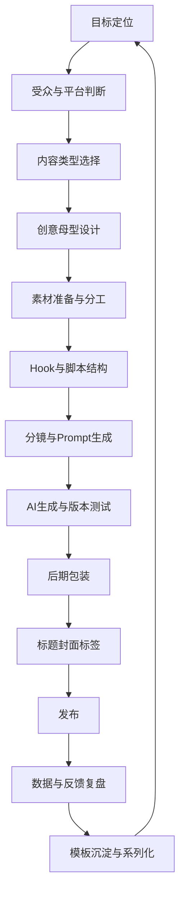

# KB-08｜短视频全链路方法论

> 用途：本知识库用于帮助「即梦导演 Prompt Studio」从单条 Prompt 生成升级为完整短视频创作系统，覆盖选题、目标定位、平台适配、脚本结构、Hook 设计、分镜执行、AI 生成、后期包装、标题标签、发布策略、数据复盘与系列化迭代。

> 调用场景：当用户要求「完整方案」「爆款流程」「从0到发布」「选题规划」「系列策划」「标题标签」「发布建议」「复盘优化」「A/B测试」「怎么提高完播率」「怎么做短视频账号内容系统」时，应优先调用本库。

> 本库负责完整创作链路，不替代单个模块。实际执行时应联动：KB-02 Prompt结构、KB-03 爆款创意、KB-04 运镜分镜、KB-05 风格库、KB-06 人物稳定、KB-07 热点话题。

## 1. 知识库定位

本库解决的问题不是「一条 Prompt 怎么写」，而是「一条短视频为什么会被看见、看完、记住，并能继续迭代」。

它的核心作用：

1. 帮 GPT 判断视频目标，而不是直接写画面。
2. 帮 GPT 把用户想法放进正确的内容容器。
3. 帮 GPT 构建从创意到发布的完整链路。
4. 帮 GPT 判断 Hook、中段、结尾是否符合短视频逻辑。
5. 帮 GPT 设计标题、标签、封面、评论点和续集点。
6. 帮 GPT 根据用户反馈或生成结果进行复盘优化。
7. 帮 GPT 把单条视频升级成系列化内容。

本库核心原则：

```text
短视频不是长视频的缩短版，而是目标、结构、视听、发布和反馈共同组成的注意力工程。
```

## 2. 短视频全链路总流程



执行顺序：

```text
目标 → 人群 → 平台 → 类型 → 素材准备 → 结构 → 画面 → Prompt → 包装 → 发布 → 复盘
```

错误顺序：

```text
先写一个好看的 Prompt，再临时想标题和发布
```

## 3. 第一层：目标定位

每条视频必须先有一个主目标。

### 3.1 六种常见目标

| 主目标 | 核心指标 | 内容重点 | 常用类型 |
|---|---|---|---|
| 流量获取 | 停留、完播、复播、分享 | 强钩子、强反差、强视觉 | 搞笑、变装、奇观、热点 |
| 情绪共鸣 | 评论、收藏、转发、关注 | 关系、情绪、金句、余味 | 恋爱、治愈、怀旧、剧情 |
| 品牌传播 | 记忆点、搜索、评论提及 | 场景、卖点、风格统一 | 广告、概念短片、产品展示 |
| 叙事表达 | 后段留存、续看、评论猜测 | 世界观、冲突、反转 | 微剧情、悬疑、系列短片 |
| 带货转化 | 点击、咨询、加购、成交 | 痛点、演示、证据、CTA | 种草、测评、教程、场景广告 |
| 个人IP | 关注、回访、评论称呼 | 人设、固定形式、系列感 | 口播、剧情、热点人格化 |

### 3.2 目标选择规则

一条视频只能有一个主目标。

如果用户同时想要：

```text
又要爆款，又要带货，又要剧情，又要情绪，又要高级
```

GPT 应帮助收敛为：

```text
主目标：流量获取
副目标：品牌记忆 / 情绪共鸣
```

### 3.3 目标判断句

```text
这条视频最终希望观众做什么？停下、看完、笑、哭、评论、收藏、转发、关注、购买，还是等下一集？
```

## 4. 第二层：受众与平台判断

### 4.1 受众判断

在设计视频前，需要判断观众是谁。

| 受众类型 | 更吃什么内容 |
|---|---|
| 路人观众 | 第一秒看懂、视觉强、反差强 |
| 粉丝观众 | 熟悉角色、系列延续、人物关系 |
| 同行业观众 | 职业梗、真实痛点、场景共鸣 |
| 情绪观众 | 代入感、关系、金句、余味 |
| 审美观众 | 风格、光影、造型、氛围 |
| 消费观众 | 痛点、效果、可信演示 |

### 4.2 平台适配

| 平台/场景 | 内容策略 |
|---|---|
| 即梦站内 | 话题参与、出镜玩法、跟拍、续写、AI视觉冲击 |
| 抖音/TikTok | 前2秒强钩子、强反差、快节奏、标签明确 |
| 小红书 | 审美、生活方式、标题种草、情绪共鸣 |
| B站 | 结构完整、观点明确、系列化、信息密度高 |
| Reels/Shorts | 视觉直接、节奏快、静音也能看懂 |
| 内部展示/汇报 | 逻辑清楚、专业、干净、不要过度娱乐化 |

### 4.3 平台默认规则

如果用户没有指定平台：

```text
默认按即梦 + 抖音式 9:16 短视频设计。
```

如果用户指定即梦站内活动，应同时调用 KB-07 热点话题库。

## 5. 第三层：内容类型选择

内容类型决定结构，不是题材决定结构。

### 5.1 常见类型表

| 类型 | 核心观看理由 | 结构关键词 | 适合时长 |
|---|---|---|---|
| 搞笑反转 | 想看包袱怎么落 | 铺垫、误导、反转、表情 | 8–15秒 |
| 变装变身 | 想看前后反差 | Before、触发、Reveal、定格 | 8–15秒 |
| 视觉奇观 | 想看变化完成 | 异常、扩散、高潮、全景 | 6–15秒 |
| 情绪剧情 | 想代入关系和情绪 | 情境、冲突、转折、余味 | 12–60秒 |
| 悬疑反转 | 想知道真相 | 异常、线索、误导、揭示 | 12–45秒 |
| 广告种草 | 想看效果和场景 | 痛点、产品、证据、记忆 | 8–30秒 |
| MV舞台 | 想看节奏和表演 | 亮相、对嘴、舞蹈、高光 | 8–15秒 |
| 口播演讲 | 想获得观点或表达 | 观点、解释、例子、金句 | 12–60秒 |
| POV沉浸 | 想代入角色视角 | 进入、互动、靠近、落点 | 8–20秒 |
| 系列短剧 | 想追人物后续 | 承接、升级、伏笔、续集 | 15–60秒 |

### 5.2 类型判断规则

```text
题材 = 讲什么
类型 = 怎么让人愿意看
```

同一个题材可以变成不同类型。

示例：

```text
主题：程序员
搞笑型：程序员穿越古代，用debug思维破案。
广告型：程序员深夜工作，用一款饮品恢复精神。
情绪型：程序员凌晨三点看着屏幕，想起自己为什么开始写代码。
奇观型：代码从屏幕飞出，整间办公室变成数字宇宙。
```

## 6. 第四层：创意结构设计

创意结构应调用 KB-03。

### 6.1 创意母型调用表

| 用户需求 | 推荐调用母型 |
|---|---|
| 要爆款 | 反差、错位、穿越、世界失控 |
| 要搞笑 | 情感反差、角色错位、反转剧情 |
| 要视觉冲击 | 视觉奇观、解压材质、世界失控 |
| 要情绪 | 情绪共鸣、怀旧、关系反转 |
| 要拍同款 | 拆结构，不复制表达 |
| 要热点 | 热点关键词 + 创意母型改编 |
| 要系列 | 固定角色 + 每集新冲突 |

### 6.2 通用创意公式

```text
熟悉场景 + 陌生变化 + 情绪反应 + 结尾记忆点
```

### 6.3 创意升级方式

| 普通想法 | 升级方式 |
|---|---|
| 主角上班 | 上班场景突然进入80年代电影世界 |
| 主角直播 | 把直播间放到古代战场或太空站 |
| 主角跳舞 | 每个鼓点切换一个平行世界 |
| 主角吃饭 | 食物突然变成毛毡或赛博能量体 |
| 主角演讲 | TED舞台变成即梦创作发布会 |

## 7. 第五层：素材准备

当用户提出图片素材、素材参考图、先处理素材、拆分素材等需求时，先进行素材准备，再生成视频 Prompt。素材准备的目标是把输入内容拆成即梦更容易理解的视觉参考，而不是生成可识别人物肖像。

### 7.1 图片素材拆分流程

```text
输入内容 → 提取主题与场景 → 提取造型与妆容 → 提取动作与镜头 → 输出最多三张素材参考图需求
```

### 7.2 三张素材图

| 素材图 | 作用 | 风险控制 |
|---|---|---|
| 纯背景图 | 让即梦理解场景、光影、空间和道具 | 无完整人物、无清晰人脸、无正面肖像 |
| 服装、发型、妆容与配饰展示图 | 让即梦理解造型、材质、发型轮廓和妆容色彩 | 用无脸人台、平铺、背影、假发、分离式妆容板；不组成完整脸 |
| 动作与运镜草图 | 让即梦理解站位、动作节奏、镜头路径和调度 | 用无脸轮廓、火柴人、剪影、箭头和分镜框 |

### 7.3 素材准备检查

```text
[ ] 是否识别输入属于图片素材需求？
[ ] 是否根据输入类型灵活拆分，而不是死板套模板？
[ ] 是否避免完整人脸和可识别身份？
[ ] 是否允许分离式妆容元素，但避免组合成完整五官？
[ ] 是否让三张素材分别服务场景、造型、动作/运镜？
```

## 8. 第六层：Hook 设计

Hook 是开头承诺，不是开场白。

### 7.1 Hook 的任务

前 2 秒必须让观众知道：

```text
这里有异常、有结果、有冲突、有美感、有情绪，或有继续看的理由。
```

### 7.2 Hook 类型库

| Hook类型 | 适合内容 | 公式 |
|---|---|---|
| 异常视觉 | 奇观、怪兽、变身 | 第一秒出现不可能画面 |
| 结果前置 | 剧情、教程、反转 | 先给结果，再解释过程 |
| 强反差 | 搞笑、穿越、热点 | 严肃场景出现离谱行为 |
| 高利害 | 悬疑、剧情 | 不解决马上出事 |
| 台词钩子 | 口播、喜剧 | 第一句话打破预期 |
| 情绪钩子 | 恋爱、治愈、怀旧 | 一句击中情绪的话 |
| 身份钩子 | 出镜、分身、IP | 主角身份一秒成立 |

### 7.3 Hook 模板

```text
前2秒直接出现{异常/反差/结果/危机}，不要先解释背景。
```

```text
开场第一句话直接给观众一个继续看的理由：“{短句}”。
```

### 7.4 Hook 检查句

```text
把后面内容全部遮住，只看前2秒，这条视频还值得继续看吗？
```

## 8. 第六层：中段推进

中段不是补背景，而是不断续签观看理由。

### 8.1 中段推进原则

```text
每2–3秒给一个新信息点，但主线不要变。
```

### 8.2 中段推进方式

| 方式 | 用途 | 示例 |
|---|---|---|
| 冲突升级 | 剧情、悬疑 | 对方逼近、时间减少、危险增加 |
| 反差升级 | 搞笑 | 越严肃越离谱 |
| 变化扩散 | 奇观 | 从手部到房间再到城市 |
| 证据递进 | 广告/知识 | 细节、对比、使用效果 |
| 节拍变化 | MV/变装 | 每个鼓点切换动作 |
| 表情承接 | 喜剧/剧情 | 用表情让观众理解情绪 |

### 8.3 中段模板

```text
3–7秒：主角开始行动，观众理解场景和目标。
7–15秒：冲突或变化升级，出现主要爆点。
```

## 9. 第七层：结尾记忆点

结尾不是结束，而是让观众产生动作。

### 9.1 结尾目标

| 目标 | 结尾设计 |
|---|---|
| 评论 | 留判断题、站队题、疑问 |
| 转发 | 给金句、情绪共鸣、关系代入 |
| 复播 | 给视觉细节、隐藏信息、反转 |
| 关注 | 给系列伏笔、固定角色期待 |
| 购买 | 给结果证明、产品定格、行动提示 |
| 记住 | 给台词、表情、海报感画面 |

### 9.2 结尾类型

```text
一句话封口
表情定格
道具特写
海报感画面
视觉高潮
下一集伏笔
评论问题
产品定格
```

### 9.3 结尾模板

```text
最后1秒定格在{表情/台词/道具/全景}，形成记忆点。
```

```text
结尾用一句短台词改写前文意义：“{短句}”。
```

```text
结尾留下一个未解答问题，为下一集埋伏笔。
```

## 10. 第八层：脚本与分镜

脚本和分镜应调用 KB-02 与 KB-04。

### 10.1 15秒分镜脚本

```text
0–3秒：Hook，直接给异常、冲突、结果或视觉吸引。
3–7秒：Setup，交代人物、场景和动作目标。
7–15秒：Escalation，冲突升级、变装完成或奇观扩散。
12–15秒：Payoff，反转、定格、台词或记忆点。
```

### 10.2 分镜表格式

```text
【0–3秒】
画面：
镜头：
声音：
作用：吸引停留

【3–7秒】
画面：
镜头：
声音：
作用：交代主线

【7–15秒】
画面：
镜头：
声音：
作用：制造爆点

【12–15秒】
画面：
镜头：
声音：
作用：留下记忆点
```

### 10.3 脚本质量标准

```text
一句话能讲清楚。
前2秒有看点。
中段有变化。
结尾有落点。
镜头能执行。
Prompt能生成。
```

## 11. 第九层：AI生成执行

### 11.1 生成前准备

生成前应确认：

```text
[ ] 是否有参考图？
[ ] 是否有图片素材准备需求？若有，是否已拆成纯背景图、造型展示图、动作与运镜草图？
[ ] 参考图用途是否明确？
[ ] 是否有@角色？
[ ] 人物身份和参考图是否分工清楚？
[ ] Prompt 是否控制在合适长度？
[ ] 最终可直接使用 Prompt 是否已计算验证 ≤580字，包含符号、空格与换行？
[ ] 风格是否统一？
[ ] 动作是否可生成？
[ ] 字幕是否建议后期添加？
```

### 11.2 版本测试策略

建议一次只测试一个变量。

| 测试变量 | 示例 |
|---|---|
| Hook A/B | 一个用视觉钩子，一个用台词钩子 |
| 风格 A/B | 港风 vs 16mm胶片 |
| 镜头 A/B | 固定机位 vs 慢推 |
| 结尾 A/B | 表情定格 vs 台词封口 |
| 动作 A/B | 转身变装 vs 遮挡变装 |

### 11.3 不建议一次改太多

错误：

```text
同时改主体、场景、风格、动作、镜头、音乐、结尾。
```

正确：

```text
本轮只改开场钩子，其余保持不变。
```

## 12. 第十层：后期包装

AI 生成不是最后一步，短视频还需要包装。

### 12.1 后期包装内容

| 项目 | 作用 |
|---|---|
| 剪辑 | 控制节奏，去掉废镜头 |
| 配乐 | 强化情绪与卡点 |
| 音效 | 强化动作、笑点、转场 |
| 字幕 | 提高静音可看性 |
| 调色 | 统一视觉风格 |
| 封面 | 让用户愿意点开 |
| 标题 | 提供观看理由 |
| 标签 | 接入平台分发和话题 |

### 12.2 字幕策略

```text
重要字幕建议后期添加。
AI画面内文字只用于短句、招牌、大屏、弹幕感元素。
```

### 12.3 音效策略

| 类型 | 音效建议 |
|---|---|
| 搞笑 | 音乐停顿、咻、砰、尴尬静音 |
| 变装 | 鼓点、闪白、whoosh |
| 悬疑 | 低频、呼吸、门轴、心跳 |
| 广告 | 开盖、液体、轻点击、高级环境声 |
| 奇观 | 生长、能量、风声、低频冲击 |

## 13. 第十一层：标题、封面、标签

标题、封面、标签应调用 KB-07。

### 13.1 标题功能

标题不是总结，而是让人产生观看理由。

标题公式：

```text
反差身份 + 场景 + 结果
```

```text
如果{普通人/职业}进入{异常世界}会怎样？
```

```text
当{严肃风格}遇上{离谱行为}
```

```text
我以为是{A}，结果竟然是{B}
```

### 13.2 标题类型

| 类型 | 示例结构 |
|---|---|
| 反差型 | 当程序员穿越进武侠世界 |
| 悬念型 | 他推开门后，整个办公室都变了 |
| 情绪型 | 原来你怀念的不是过去，是那时的自己 |
| 搞笑型 | 大侠决斗前先算AA制 |
| 奇观型 | 地铁晒到阳光后开始长森林 |
| 系列型 | 第3集：他终于发现任务面板是真的 |

### 13.3 封面原则

封面要一眼看出：

```text
主体是谁 + 场景异常 + 情绪/冲突
```

封面优先画面：

```text
主角表情最强的一帧
视觉变化最大的一帧
反差最明显的一帧
产品最清楚的一帧
```

### 13.4 标签原则

标签应包含：

```text
平台话题 + 内容类型 + 风格 + 主体身份 + 系列关键词
```

示例：

```text
#即梦AI #AI视频 #进入劳动光荣的世界 #80年代电影感 #打工人短片
```

## 14. 第十二层：发布策略

### 14.1 发布前检查

```text
[ ] 前2秒是否足够吸引？
[ ] 静音观看是否能看懂？
[ ] 标题是否给出观看理由？
[ ] 封面是否有冲突或视觉钩子？
[ ] 标签是否接入话题？
[ ] 是否避免默认文案？
[ ] 是否有评论引导？
[ ] 是否适合做续集？
```

### 14.2 评论引导方式

不要机械写：

```text
喜欢请点赞关注。
```

更适合写：

```text
如果你穿越进去，会先做什么？
```

```text
你觉得下一集他会遇到谁？
```

```text
这个职业还能怎么拍？
```

```text
哪一秒最像你上班的精神状态？
```

### 14.3 系列承接

发布时可以埋下：

```text
下一集主题
评论投票
角色后续命运
未解决的问题
同一世界观的新场景
```

## 15. 第十三层：数据复盘

### 15.1 复盘指标

| 指标 | 代表问题 |
|---|---|
| 播放量低 | 标题、封面、标签或选题不够吸引 |
| 前3秒掉人 | Hook 不够强或开头太慢 |
| 中段掉人 | 推进不足、节奏拖、信息重复 |
| 结尾前掉人 | 高潮太晚或预期已被满足 |
| 评论少 | 没有讨论点或情绪不够强 |
| 收藏少 | 信息价值或审美价值不够 |
| 转发少 | 共鸣、反差或视觉奇观不够强 |
| 关注少 | 人设、系列感或账号识别不足 |

### 15.2 复盘诊断模板

```text
【问题表现】
播放/完播/评论/转发/关注表现如何？

【可能原因】
Hook / 中段 / 结尾 / 标题 / 封面 / 标签 / 风格 / 角色 哪一环弱？

【修正方向】
下一版只修改一个变量：{变量}

【下一条建议】
基于本条表现，继续做{续集/同主题变体/换钩子/换风格/换结尾}
```

### 15.3 常见问题修正

| 问题 | 修正 |
|---|---|
| 开头平 | 前2秒直接给结果、异常或反差 |
| 中段散 | 只保留一个主线，每2–3秒一个新信息 |
| 结尾弱 | 加台词、定格、反转、道具特写 |
| 画面乱 | 减少人物、减少特效、简化背景 |
| 风格不统一 | 保留一个主风格 |
| 角色不稳 | 减少动作、用中景、强化身份一致 |
| 没系列感 | 固定角色、固定世界观、固定标题格式 |

## 16. 第十四层：模板沉淀与系列化

### 16.1 为什么要系列化

单条视频靠爆点，账号增长靠系列。

系列化可以带来：

```text
角色识别
世界观识别
固定期待
评论参与
续看动力
模板复用
生产效率
```

### 16.2 系列化结构

```text
固定角色 + 固定世界观 + 每集新冲突 + 结尾伏笔
```

### 16.3 系列模板

| 系列类型 | 固定元素 | 每集变化 |
|---|---|---|
| 进入XX世界 | 主角穿越机制 | 每集进入不同世界 |
| 职业反差 | 主角职业 | 每集换离谱场景 |
| 直播间系列 | 直播形式 | 每集换行业或商品 |
| 武侠喜剧 | 江湖风格 | 每集换现代梗 |
| 视觉奇观 | 世界异常规则 | 每集换触发场景 |
| 情侣POV | 双人关系 | 每集换互动场景 |
| AI创作教学 | 主角讲解 | 每集拆一个技巧 |

### 16.4 系列命名公式

```text
第X集：{固定世界观} + {本集冲突}
```

示例：

```text
第3集：当武林盟主开始直播带货
```

```text
第5集：地铁光合作用失控了
```

## 17. 小团队 / 单人创作 SOP

### 17.1 快速版 SOP

```text
D-1：确定选题、目标、Hook、结构。
D0：生成 Prompt，测试 2–3 个版本。
D0：选最稳版本，后期加字幕、音乐、标题。
D+1：发布，记录数据。
D+2：复盘，决定续集或改版。
```

### 17.2 完整版 SOP

| 阶段 | 动作 | 产出 |
|---|---|---|
| 选题 | 收集热点、评论、职业梗、参考视频 | 选题池 |
| 立项 | 明确主目标、受众、平台、类型 | 一句话核心 |
| 脚本 | 写 Hook、中段、结尾 | 15秒结构 |
| 分镜 | 拆镜头、动作、声音 | 分镜表 |
| Prompt | 调用 KB-02/04/05/06 | 生成用 Prompt |
| 生成 | 测试 2–3 版 | 初版视频 |
| 后期 | 剪辑、字幕、配乐、调色 | 发布版 |
| 包装 | 标题、封面、标签 | 发布包 |
| 发布 | 选择话题与评论引导 | 上线视频 |
| 复盘 | 看数据和评论 | 下一条方案 |

## 18. AI 在链路中的正确位置

AI 适合做：

```text
选题扩展
脚本初稿
Prompt生成
分镜草案
标题备选
标签备选
版本衍生
复盘建议
```

人必须决定：

```text
价值判断
人物关系
最终审美
真实情绪
合规边界
发布取舍
品牌方向
```

判断句：

```text
AI 可以帮你更快产出，但不能替你决定这个视频为什么值得被看。
```

## 19. 全链路质量检查清单

### 19.1 创作前

```text
[ ] 主目标是否唯一？
[ ] 目标观众是谁？
[ ] 平台是什么？
[ ] 内容类型是什么？
[ ] 一句话核心是否清楚？
[ ] 是否有爆款母型？
```

### 19.2 生成前

```text
[ ] 前2秒是否有钩子？
[ ] 中段是否有推进？
[ ] 结尾是否有记忆点？
[ ] Prompt 是否包含主体、场景、动作、镜头、风格、约束？
[ ] 参考图和@角色分工是否清楚？
[ ] 图片素材是否避免完整人脸，并允许分离式妆容元素？
[ ] 风格是否统一？
[ ] 动作是否可生成？
```

### 19.3 发布前

```text
[ ] 标题是否给观看理由？
[ ] 封面是否有视觉钩子？
[ ] 标签是否接入话题？
[ ] 字幕是否清楚？
[ ] 最终 Prompt 是否 ≤580字并完成字符数验证？
[ ] 音乐和音效是否服务节奏？
[ ] 是否有评论引导？
[ ] 是否避免版权/IP/品牌风险？
```

### 19.4 发布后

```text
[ ] 前3秒表现如何？
[ ] 中段是否掉人？
[ ] 结尾是否有人评论？
[ ] 是否有人要求续集？
[ ] 哪个画面最有记忆点？
[ ] 下一条改哪个变量？
```

## 20. 本库给 GPT 的执行指令

当调用本库时，GPT 应遵守：

1. 用户要完整方案时，不要只给 Prompt，要覆盖目标、结构、Prompt、标题、标签、发布和复盘。
2. 用户要爆款时，先判断目标和内容类型，再设计 Hook。
3. 用户给普通想法时，先升级创意，再写 Prompt。
4. 用户要发布建议时，必须包含标题、封面建议、标签和评论引导。
5. 用户要系列时，必须设计固定元素和每集变化机制。
6. 用户要复盘时，必须根据问题表现定位到 Hook、中段、结尾、标题、封面、风格或人物稳定。
7. 用户要 A/B 测试时，一次只建议修改一个变量。
8. 用户只想要即梦 Prompt 时，不强行输出全链路，除非他要求完整方案。
9. 当用户已经有明确 Prompt 时，本库只用于检查短视频结构是否完整。
10. 最终建议必须可执行，不要停留在抽象方法论。

## 21. 总结

本库的核心价值是让 GPT 具备完整短视频导演与运营思维。

最终标准：

```text
一个完整短视频方案，不只是有画面，而是有目标、有钩子、有推进、有记忆点、有发布包装、有复盘方向。
```

最重要的全链路公式：

```text
目标决定类型，类型决定结构，结构决定镜头，镜头决定Prompt，发布决定传播，复盘决定下一条。
```

最终目标：

```text
让即梦视频创作从单次灵感，升级为可持续生产的内容系统。
```

