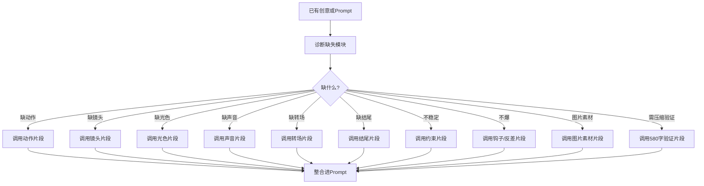

# KB-09｜原子片段库

> 用途：本知识库用于帮助「即梦导演 Prompt Studio」在生成、优化、压缩、扩写 Prompt 时，快速调用可插拔的短句片段。它不是完整模板库，而是一个「Prompt 零件库」，用于补足动作、镜头、光色、音效、转场、情绪、结尾、约束等细节。

> 调用场景：当用户要求「更有画面感」「更电影」「更稳定」「更炸」「更搞笑」「更唯美」「补充镜头」「补音效」「加转场」「加结尾记忆点」「压缩 Prompt 但保留重点」时，应调用本库。

> 本库只负责原子级片段，不负责完整 Prompt 结构、平台规则、爆款创意、运镜理论、风格体系、人物稳定细则和热点话题。相关内容应分别调用 KB-01、KB-02、KB-03、KB-04、KB-05、KB-06、KB-07、KB-08。

## 1. 知识库定位

原子片段是可以直接插入 Prompt 的短语、句子或微结构。

它解决的问题：

1. 用户想法太空，需要补画面细节。
2. Prompt 已经有结构，但缺少动作、镜头、声音或结尾。
3. Prompt 太长，需要用高密度短句替换长解释。
4. 用户要某种情绪，但不知道如何写成画面。
5. 用户要求更稳定，需要加入约束片段。
6. 用户要求更爆款，需要加入钩子、反转、结尾记忆点。

核心原则：

```text
原子片段不是越多越好，而是缺什么补什么。
```

## 2. 原子片段调用流程



调用顺序：

```text
先诊断缺失 → 再选择片段 → 最后自然融合进 Prompt
```

不要把原子片段机械堆叠成清单。

## 3. 原子片段分类总表

| 分类 | 用途 |
|---|---|
| 钩子片段 | 强化前3秒停留 |
| 动作片段 | 补充主体行为和动作链 |
| 情绪片段 | 让角色状态更明确 |
| 镜头片段 | 补充景别、机位、运镜 |
| 光色片段 | 补充光影、色调、质感 |
| 材质片段 | 补充可见触感和视觉质地 |
| 声音片段 | 补充BGM、音效、环境音 |
| 转场片段 | 连接镜头和场景变化 |
| 结尾片段 | 增强记忆点和传播点 |
| 字幕片段 | 处理画面文字和字幕安全区 |
| 人物稳定片段 | 提升角色一致性 |
| 画面稳定片段 | 降低生成失败风险 |
| 爆款增强片段 | 增强反差、笑点、爽点 |
| 压缩片段 | 用短句替代冗长说明 |
| 图片素材片段 | 拆分纯背景、造型展示、动作与运镜草图 |
| 580字验证片段 | 提醒压缩并计算字符数，包含符号、空格、换行 |

## 4. 钩子片段库

## 4.1 异常视觉钩子

适合：视觉奇观、怪兽、变身、穿越。

```text
开场第一秒直接出现不合常理的画面。
```

```text
前3秒画面中出现明显异常，观众立刻意识到世界不对劲。
```

```text
普通场景里突然出现一个强烈违和的视觉元素。
```

```text
镜头一开始就给出结果，再让中段解释发生了什么。
```

```text
开场就是视觉高潮的前一秒，制造强烈期待。
```

## 4.2 反差钩子

适合：搞笑、古今错位、热点改编。

```text
严肃场景中突然出现离谱的现代行为。
```

```text
所有人表情严肃，只有主角做出完全不合时宜的动作。
```

```text
画面看似史诗大片，下一秒被一句生活化台词打破。
```

```text
越正经的镜头语言，越离谱的剧情反转。
```

## 4.3 台词钩子

适合：口播、搞笑、剧情、直播。

```text
开场主角直视镜头说 “这件事不对劲”。
```

```text
第一句台词直接打破观众预期。
```

```text
开场字幕出现 “我以为只是普通的一天”。
```

```text
主角低声说 “别动，后面有人”。
```

```text
主播开场喊出 “家人们，今天这个真的离谱”。
```

## 4.4 情绪钩子

适合：恋爱、治愈、怀旧、剧情。

```text
开场先给一个让人代入的沉默瞬间。
```

```text
主角看着旧照片，表情从平静变得复杂。
```

```text
第一秒出现一束阳光照在主角手上，情绪安静展开。
```

```text
画面底部出现一句短字幕 “我终于不等了”。
```

## 5. 动作片段库

## 5.1 通用动作链

```text
主角先停顿半秒，随后缓慢抬头看向镜头。
```

```text
主角从画面边缘走入中央，动作自然稳定。
```

```text
主角缓慢转身，视线从远处移向镜头。
```

```text
主角伸手触碰眼前的物体，触碰瞬间画面发生变化。
```

```text
主角低头确认手中的道具，随后露出惊讶表情。
```

```text
主角向前一步，背景随之产生变化。
```

```text
主角抬手挡住镜头，手掌移开后场景已经改变。
```

```text
主角轻轻吸一口气，表情从紧张变得坚定。
```

## 5.2 搞笑动作片段

```text
主角原本气势十足，下一秒动作突然卡住。
```

```text
主角认真摆出高手姿势，却从口袋里掏出现代物品。
```

```text
所有人同时沉默，镜头切到主角尴尬表情。
```

```text
主角自信点头，结果立刻发现事情完全不对。
```

```text
旁边角色慢慢转头看向主角，表情写满无语。
```

```text
主角后退半步，假装什么都没发生。
```

```text
主角举起手示意冷静，但现场变得更混乱。
```

## 5.3 变装动作片段

```text
主角抬手整理衣领，手掌掠过镜头形成遮挡转场。
```

```text
纸张贴近镜头遮满画面，下一秒完成造型变化。
```

```text
主角缓慢转身，转到背光处时服装开始变化。
```

```text
灯光闪白瞬间，主角从普通造型变成高光造型。
```

```text
主角低头闭眼，鼓点落下时猛然抬眼，造型完成。
```

```text
布料从镜头前飘过，遮挡后主角完成变装。
```

## 5.4 情绪动作片段

```text
主角手指轻轻摩挲旧照片边缘。
```

```text
主角把没说出口的话慢慢咽回去。
```

```text
主角看向窗外，眼神逐渐柔和。
```

```text
主角低头笑了一下，又很快恢复平静。
```

```text
主角停在门口，迟迟没有推门。
```

```text
主角慢慢松开手中的物品，情绪落下。
```

## 5.5 广告动作片段

```text
手指轻轻推开产品盖子，细节清晰可见。
```

```text
产品被放到干净台面中央，镜头自然聚焦。
```

```text
主角拿起产品，动作干净利落，不遮挡主体。
```

```text
液体缓慢倒入杯中，表面形成细腻气泡。
```

```text
光线扫过产品边缘，突出材质和轮廓。
```

## 5.6 奇观动作片段

```text
藤蔓从主角指尖慢慢生长，沿着桌面扩散。
```

```text
能量光从地面裂缝中升起，围绕主角旋转。
```

```text
城市建筑表面逐渐浮现发光纹路。
```

```text
普通物体开始软化、膨胀，变成毛毡质感。
```

```text
天空出现裂缝，光从云层后方倾泻下来。
```

```text
镜面地板像水面一样泛起波纹。
```

## 6. 情绪片段库

## 6.1 紧张感

```text
空气突然安静下来，主角呼吸声变得清晰。
```

```text
主角表情僵住，视线慢慢移向画面外。
```

```text
灯光闪烁，背景传来细微脚步声。
```

```text
画面节奏放慢，观众能感到危险正在靠近。
```

## 6.2 喜剧感

```text
气氛严肃到极点，下一秒被荒诞行为打破。
```

```text
全场沉默半秒，随后镜头切到主角尴尬表情。
```

```text
音乐突然停止，只剩一个夸张的音效。
```

```text
角色表情从自信变成怀疑人生。
```

## 6.3 浪漫感

```text
两人对视时，周围声音短暂变轻。
```

```text
阳光落在人物侧脸，空气中有细小尘埃漂浮。
```

```text
主角靠近镜头，动作温柔克制。
```

```text
画面留出安静呼吸感，不急着切镜。
```

## 6.4 治愈感

```text
风吹起窗帘，光线慢慢铺进房间。
```

```text
主角把杯子放下，表情终于放松。
```

```text
画面节奏放慢，环境声清晰自然。
```

```text
结尾停在一个安静的微笑。
```

## 6.5 压迫感

```text
主角被巨大空间包围，显得渺小而孤立。
```

```text
低角度镜头强化对方的气场。
```

```text
冷色阴影压住画面，只有人物轮廓被光勾出。
```

```text
背景低频音逐渐增强，气氛越来越沉。
```

## 6.6 史诗感

```text
强背光穿透烟尘，主角站在光束中央。
```

```text
镜头缓慢拉远，展示宏大的场景尺度。
```

```text
空气中漂浮碎屑和尘埃，音乐逐渐升起。
```

```text
结尾定格成海报感英雄画面。
```

## 7. 镜头片段库

## 7.1 稳定镜头片段

```text
镜头稳定中景拍摄，主体始终居中。
```

```text
固定机位建立场景，让观众快速看懂空间关系。
```

```text
镜头缓慢推进，从中景过渡到近景。
```

```text
镜头缓慢拉远，逐渐揭示完整环境。
```

```text
轻微横移扫过前景，制造空间层次。
```

```text
镜头轻微环绕半圈，保持人物脸部清晰。
```

## 7.2 表情镜头片段

```text
关键笑点处切到脸部近景，捕捉表情变化。
```

```text
结尾停在主角震惊表情特写。
```

```text
镜头推近主角眼神，情绪逐渐加重。
```

```text
对方缓慢转头看向镜头，表情从平静变成疑惑。
```

## 7.3 道具镜头片段

```text
切到道具特写，画面清楚显示关键物件。
```

```text
镜头从道具特写拉回主角表情。
```

```text
焦点先落在桌面物品，再缓慢转移到主角眼神。
```

```text
道具进入画面中央，成为反转关键信息。
```

## 7.4 广告镜头片段

```text
产品居中，镜头缓慢推近，背景干净虚化。
```

```text
微距特写展示产品表面水珠和材质。
```

```text
柔光扫过产品边缘，突出轮廓和质感。
```

```text
结尾产品定格在画面中央，形成广告海报感。
```

## 7.5 MV镜头片段

```text
镜头跟随鼓点切换中景舞蹈和近景对嘴。
```

```text
红色追光扫过眼神特写，随后切到舞台全景。
```

```text
副歌处快切三组动作，全部对齐音乐重拍。
```

```text
结尾队形定格，镜头轻微推进到主角脸部。
```

## 7.6 POV镜头片段

```text
第一人称POV视角，镜头代表观众视线。
```

```text
画面中只看到自己的手伸向门把手。
```

```text
对方角色靠近镜头，像是在和观众互动。
```

```text
镜头轻微手持但稳定，保持真实代入感。
```

## 8. 光色片段库

## 8.1 暖光片段

```text
暖黄柔光从侧面照亮人物，画面温暖怀旧。
```

```text
窗外阳光斜射进来，空气中有细小尘埃漂浮。
```

```text
灯笼暖光映在人物脸上，背景略暗形成层次。
```

## 8.2 冷光片段

```text
冷蓝阴影包围画面，人物被微弱边缘光勾勒。
```

```text
室内只有屏幕光照亮主角脸部，气氛压抑安静。
```

```text
青蓝冷色调覆盖背景，强化孤独和悬疑感。
```

## 8.3 霓虹片段

```text
粉紫蓝霓虹反射在潮湿地面，城市夜色层次丰富。
```

```text
红蓝霓虹从两侧打在人物轮廓上，背景有轻微雨雾。
```

```text
霓虹招牌在背景虚化闪烁，人物脸部保持柔和补光。
```

## 8.4 暗黑片段

```text
低调光压暗背景，只有主角轮廓被冷光勾出。
```

```text
黑雾在地面缓慢流动，远处有暗红光点睛。
```

```text
画面半明半暗，主体处在压迫感强烈的负空间中。
```

## 8.5 广告光片段

```text
棚拍柔光均匀覆盖产品，边缘有精致轮廓光。
```

```text
白色背景干净无杂物，产品表面反射清晰。
```

```text
顶光照亮透明材质，形成高级商业摄影质感。
```

## 8.6 水墨光片段

```text
柔和散射光穿过薄雾，画面像宣纸上的淡墨晕染。
```

```text
远山与人物被淡灰雾气包围，少量朱红点睛。
```

```text
大面积留白，光线柔和，画面安静克制。
```

## 9. 材质片段库

## 9.1 胶片质感

```text
轻微胶片颗粒，柔和反差，边缘有淡淡暗角。
```

```text
16mm暖黄胶片质感，像旧电影片段。
```

```text
画面带自然颗粒和轻微色偏，年代感真实。
```

## 9.2 潮湿质感

```text
雨后地面潮湿反光，灯光倒映在水面。
```

```text
空气中有轻微水汽，背景霓虹被雨雾柔化。
```

```text
衣角和头发带有细微雨水质感。
```

## 9.3 毛毡质感

```text
环境全部呈现蓬松毛毡质感，细小绒毛清晰可见。
```

```text
草地像柔软植绒玩具，踩下去会轻微回弹。
```

```text
圆润毛绒动物在画面中轻轻晃动，质感柔软可爱。
```

## 9.4 金属质感

```text
金属表面有冷硬反光，边缘高光清晰。
```

```text
机械结构细节清楚，蓝色电弧在缝隙中闪烁。
```

```text
铠甲表面有细微划痕和暗金反光。
```

## 9.5 水墨质感

```text
墨色在宣纸肌理上自然晕开。
```

```text
人物边缘像水墨线条一样轻微扩散。
```

```text
背景山水以淡墨层次呈现，留白明显。
```

## 9.6 VHS质感

```text
画面有CRT扫描线和轻微色彩偏移。
```

```text
老式录像带噪点和轻微卡顿，像被找回的档案录像。
```

```text
边缘暗角和低清录像感增强神秘氛围。
```

## 10. 声音片段库

## 10.1 搞笑音效

```text
反转瞬间音乐突然停止，只剩尴尬静音。
```

```text
动作失败时加入夸张“砰”的轻喜剧音效。
```

```text
箭飞出时有夸张“咻——”音效，落点瞬间音乐停顿。
```

```text
表情定格时加入短促滑稽音效。
```

## 10.2 悬疑声音

```text
低频悬疑氛围音乐缓慢增强。
```

```text
背景只有脚步声、呼吸声和远处电流声。
```

```text
门打开瞬间音乐戛然而止。
```

```text
心跳声逐渐变清晰，气氛越来越紧张。
```

## 10.3 治愈声音

```text
轻柔钢琴和自然风声铺底。
```

```text
杯子轻放在桌面的声音清晰温柔。
```

```text
窗帘被风吹动，环境声自然安静。
```

```text
音乐在结尾慢慢收干净，留下余味。
```

## 10.4 MV声音

```text
强节拍电子鼓点，动作与重拍同步。
```

```text
副歌处加入舞台欢呼声和低频鼓点。
```

```text
对嘴歌词与角色表情同步。
```

```text
每个镜头切换都贴合音乐节奏。
```

## 10.5 广告声音

```text
开盖声清脆，液体流动声干净。
```

```text
产品放上桌面时有轻微高级点击声。
```

```text
背景音乐轻快克制，不压过产品音效。
```

```text
结尾音符干净落下，产品画面定格。
```

## 10.6 奇观声音

```text
植物生长声从细微到密集，逐渐铺满空间。
```

```text
能量聚合时有低频震动和电流声。
```

```text
空间裂开时传来深沉轰鸣。
```

```text
高潮处加入史诗鼓点和风声冲击。
```

## 11. 转场片段库

## 11.1 遮挡转场

```text
纸张贴近镜头遮满画面，下一秒完成场景切换。
```

```text
主角手掌靠近镜头形成遮挡，移开后画面已经变化。
```

```text
布料从镜头前飘过，遮挡后主角完成变装。
```

```text
路人经过镜头前形成短暂遮挡，遮挡后进入新场景。
```

## 11.2 闪白转场

```text
鼓点落下瞬间画面闪白，场景快速切换。
```

```text
强光从画面中心爆开，下一秒主角完成变身。
```

```text
能量光覆盖画面，白闪后进入高潮场景。
```

## 11.3 运动匹配转场

```text
主角转身动作保持一致，转身前后场景发生变化。
```

```text
同一个抬手动作连接两个不同时空。
```

```text
镜头跟随主角向前一步，脚落地时场景切换。
```

## 11.4 贴镜转场

```text
道具快速靠近镜头，占满画面后切入下一幕。
```

```text
主角把镜头前的卡片翻过来，翻面后变成新世界。
```

```text
镜头贴近眼睛特写，瞳孔倒影变成下一场景。
```

## 11.5 声音转场

```text
音效“砰”响起的瞬间切换画面。
```

```text
音乐重拍处完成变装转场。
```

```text
环境声突然消失，画面进入另一个空间。
```

## 12. 结尾片段库

## 12.1 台词封口

```text
结尾主角尴尬说 “我只是路过”。
```

```text
结尾主角低声说 “这不是第一次了”。
```

```text
结尾主角看向镜头说 “现在轮到你了”。
```

```text
结尾旁边角色冷冷补一句 “先把账结了”。
```

```text
结尾字幕出现 “事情开始不对劲了”。
```

## 12.2 表情定格

```text
最后1秒定格在主角震惊表情。
```

```text
结尾定格在全场沉默的尴尬表情。
```

```text
主角缓慢露出微笑，画面定格。
```

```text
对方角色无语看向镜头，音乐停顿。
```

## 12.3 道具记忆点

```text
结尾切到桌上的工牌特写，暗示主角身份错位。
```

```text
最后画面停在一张旧照片上，照片内容已经改变。
```

```text
镜头定格在账单、钥匙、任务卡或手机提示上。
```

```text
产品居中定格，画面干净像广告海报。
```

## 12.4 视觉高潮

```text
结尾拉远成全景，展示整个空间已经完全变化。
```

```text
主角站在变化中心，背后光芒爆发，画面海报感定格。
```

```text
城市、森林、舞台或战场完成最终形态，镜头定格。
```

## 12.5 续集伏笔

```text
结尾门后传来新的脚步声，画面停在主角回头瞬间。
```

```text
屏幕弹出新的任务提示，暗示下一集。
```

```text
主角刚松一口气，远处又出现新的异常。
```

```text
结尾只露出神秘角色的背影，不解释身份。
```

## 13. 字幕与文字片段库

## 13.1 字幕安全片段

```text
画面预留底部字幕安全区，字幕建议后期添加。
```

```text
文字固定在画面底部中央，白色清晰字体，背景干净。
```

```text
画面文字只出现短句，不遮挡人物脸部。
```

## 13.2 屏幕文字片段

```text
大屏显示 “SYSTEM START”。
```

```text
手机屏幕弹出 “任务已开启”。
```

```text
直播间弹幕出现 “上链接”。
```

```text
画面底部出现字幕 “我只是来打卡”。
```

## 13.3 文字风险修正片段

```text
长字幕改为后期添加，画面只预留干净字幕区。
```

```text
复杂文字减少为一句短字幕，避免乱码和抖动。
```

```text
文字不要跟随快速镜头移动，保持固定位置。
```

## 14. 人物稳定片段库

## 14.1 单人稳定

```text
主体始终清晰居中，面部无遮挡。
```

```text
保持人物面部、发型和服装一致。
```

```text
动作缓慢连贯，避免快速转头和大幅遮挡。
```

```text
镜头以中景为主，关键时刻再切近景。
```

```text
特效不覆盖人物五官。
```

## 14.2 双人稳定

```text
两人左右位置明确，动作不重叠。
```

```text
镜头稳定中景拍摄，优先保持两人脸部清晰。
```

```text
主角在画面中央，另一人作为互动对象，不抢视觉中心。
```

```text
两人轮流动作，避免同时做复杂动作。
```

## 14.3 多人稳定

```text
主角明确站在画面中心，其他人作为背景或陪衬。
```

```text
多人场景保持固定队形，不做复杂交叉走位。
```

```text
背景人物略微虚化，不抢主体。
```

```text
镜头优先跟随主角，其他角色只做简单反应。
```

## 15. 画面稳定约束库

## 15.1 通用稳定约束

```text
画面稳定，主体清晰，动作连贯，无多余人物，无杂物，无AI畸变，无穿模。
```

```text
背景简洁，主体突出，镜头运动缓慢自然。
```

```text
不要出现随机文字、水印、变形手指或多余肢体。
```

```text
光影统一，色彩不跳变，风格保持一致。
```

## 15.2 动作稳定约束

```text
一镜一动作，动作从开始到结束连贯完整。
```

```text
避免同时发生多件事，主线动作保持清楚。
```

```text
快速动作改为慢动作展示，保持物理逻辑自然。
```

```text
人物移动幅度适中，镜头不要快速绕动。
```

## 15.3 风格稳定约束

```text
只保留一个主风格，光色和质感统一。
```

```text
背景风格统一，不要混入无关元素。
```

```text
强风格不遮挡人物脸部和关键动作。
```

## 15.4 产品稳定约束

```text
产品外观清晰稳定，主体不变形。
```

```text
产品始终处于画面视觉中心，背景干净。
```

```text
光效不遮挡产品轮廓和细节。
```

## 16. 爆款增强片段库

## 16.1 反差增强

```text
画面越严肃，行为越离谱，形成强烈反差。
```

```text
古代场景中突然出现现代职场话术。
```

```text
高端广告镜头拍摄一个非常日常的小动作。
```

```text
角色身份和所处场景完全不匹配，但本人非常认真。
```

## 16.2 笑点增强

```text
结尾用一句短台词打破所有铺垫。
```

```text
音乐在笑点瞬间突然停止。
```

```text
表情反应比动作本身更夸张。
```

```text
镜头停顿半秒，让尴尬感自然放大。
```

## 16.3 视觉冲击增强

```text
变化从一个小细节开始，迅速扩散到整个空间。
```

```text
高潮处给出完整全景，让观众看清变化规模。
```

```text
强光、烟雾和低频音效同时出现，但不遮挡主体。
```

```text
结尾定格成海报感画面。
```

## 16.4 情绪增强

```text
不要急着切镜，留出半秒沉默。
```

```text
用手部动作表现角色没说出口的情绪。
```

```text
环境声比台词更先进入画面。
```

```text
结尾留一句可以被转述的短句。
```

## 17. 压缩片段库

当 Prompt 太长时，可用以下短句替代冗长描述。

## 17.1 镜头压缩

冗长：

```text
镜头慢慢地从比较远的地方一点一点向人物靠近，最后停在人物的脸部附近。
```

压缩：

```text
镜头从中景缓慢推进到近景。
```

冗长：

```text
摄影机跟着主角一起往前走，保持画面比较稳定。
```

压缩：

```text
稳定器中景跟拍。
```

## 17.2 风格压缩

冗长：

```text
画面有一种很复古、很像旧电影、颜色偏黄色、带一点颗粒感和年代感的感觉。
```

压缩：

```text
16mm暖黄胶片质感。
```

冗长：

```text
画面像夜晚城市里很多霓虹灯照在下雨后的地面上。
```

压缩：

```text
港风霓虹雨夜，潮湿反光。
```

## 17.3 动作压缩

冗长：

```text
主角先看了一下手里的东西，然后慢慢抬起头，表情变得很惊讶。
```

压缩：

```text
主角低头看道具，随后抬头震惊。
```

## 17.4 约束压缩

冗长：

```text
希望画面不要乱，不要有奇怪的人，也不要出现变形和错误的手脚。
```

压缩：

```text
画面干净，无多余人物，无AI畸变。
```

## 18. 图片素材原子片段库

## 18.1 纯背景图片段

```text
纯背景设计图，保留场景风格、色调、光影、空间层次和关键道具，无完整人物，无清晰人脸，无正面肖像。
```

```text
电影感场景参考图，背景干净但细节丰富，建筑、道具、雾气和装饰元素清晰，适合作为即梦场景参考。
```

## 18.2 服装、发型、妆容与配饰展示片段

```text
服装造型展示图，无脸人台或平铺设计稿，展示服装剪裁、布料纹理、鞋子、手套、饰品和配件。
```

```text
妆容拆解板，分离式眼影色块、单眼眼妆、眉形线稿、唇色卡、腮红位置示意和高光材质，不组合成完整脸。
```

```text
发型参考图，以背影、假发展示或发丝材质特写呈现，强调轮廓、长度、层次和质感，不出现正面头部特写。
```

## 18.3 动作与运镜草图片段

```text
动作与运镜草图，使用无脸轮廓、火柴人、剪影和分镜框，标出站位、移动方向、镜头路径和景别变化。
```

```text
storyboard sketch，清晰箭头标记推、拉、摇、移、跟拍路径，人物无五官、无肖像身份。
```

## 18.4 580字验证片段

```text
最终可直接使用 Prompt 必须≤580字，字符数包含符号、空格和换行；超过则先压缩再输出。
```

```text
优先压缩风格词、重复形容词和弱约束，保留主体、参考图用途、动作、镜头、声音、字幕和稳定约束。
```

## 19. 原子片段组合规则

## 19.1 标准组合公式

```text
钩子片段 + 动作片段 + 镜头片段 + 光色片段 + 声音片段 + 结尾片段 + 约束片段
```

示例：

```text
开场第一秒普通办公室里突然长出藤蔓，主角低头看见指尖发芽，镜头从手部特写拉远到中景，暖黄阳光穿过窗户，植物生长声逐渐增强，结尾拉远展示整间办公室变成森林，画面稳定，主体清晰，无多余人物。
```

## 19.2 搞笑组合公式

```text
严肃钩子 + 认真动作 + 离谱反转 + 表情特写 + 音乐停顿 + 短台词封口
```

示例：

```text
古代客栈气氛肃杀，主角缓慢拔剑，下一秒掏出账单，全场沉默，镜头切到众人无语表情，音乐突然停止，结尾掌柜说 “先结账”。
```

## 19.3 变装组合公式

```text
普通状态 + 遮挡动作 + 闪白/卡点 + 高光造型 + 慢推/环绕 + 海报定格
```

示例：

```text
主角普通造型站在走廊，抬手把纸张贴近镜头，鼓点落下闪白转场，变成古风长发造型，镜头低角度慢推，结尾眼神特写定格。
```

## 19.4 广告组合公式

```text
干净场景 + 产品特写 + 使用动作 + 材质细节 + 轻音乐 + 产品定格
```

示例：

```text
白色桌面上产品居中，镜头微距展示水珠，手指轻轻开盖，液体倒入杯中，清脆开盖声和轻音乐配合，结尾产品居中定格。
```

## 20. 质量检查清单

使用原子片段后必须检查：

```text
[ ] 是否只补了缺失部分？
[ ] 是否没有堆太多片段？
[ ] 主体是否仍然清楚？
[ ] 动作是否仍然连贯？
[ ] 镜头是否可执行？
[ ] 风格是否统一？
[ ] 声音是否服务节奏？
[ ] 结尾是否有记忆点？
[ ] 是否适合15秒短视频？
[ ] 若是图片素材需求，是否拆成背景、造型、动作运镜三类？
[ ] 若是最终 Prompt，是否已验证≤580字，包含符号、空格和换行？
[ ] 是否增加了生成风险？
```

## 21. 本库给 GPT 的执行指令

当调用本库时，GPT 应遵守：

1. 原子片段只能用于补强，不要替代完整结构。
2. 每次优先判断 Prompt 缺少哪一类片段。
3. 不要一次性塞入所有片段类型。
4. 用户要更稳定时，优先调用约束片段、稳定镜头片段、动作稳定片段。
5. 用户要更爆款时，优先调用钩子、反差、结尾、声音落点片段。
6. 用户要更电影时，优先调用镜头、光色、材质片段。
7. 用户要更搞笑时，优先调用反差、表情、音乐停顿、台词封口片段。
8. 用户要更唯美时，优先调用柔光、情绪、慢动作、留白片段。
9. 用户要压缩时，使用压缩片段替换冗长表达，并确保最终可用 Prompt ≤580字。
10. 用户要图片素材时，优先调用图片素材片段，避免完整人脸和可识别肖像。
11. 所有片段最终必须自然融合成一句或一段 Prompt，不要机械罗列。

## 22. 总结

本库的核心价值是让 GPT 拥有可快速调用的 Prompt 零件。

最终判断标准：

```text
缺动作，补动作；缺镜头，补镜头；缺风格，补光色；缺爆点，补钩子和结尾；不稳定，补约束。
```

最重要的使用原则：

```text
原子片段不是越多越好，而是刚好补到 Prompt 缺的那一块。
```

最终目标：

```text
让每个 Prompt 都能在不变复杂的情况下，变得更具体、更稳定、更有画面感。
```

