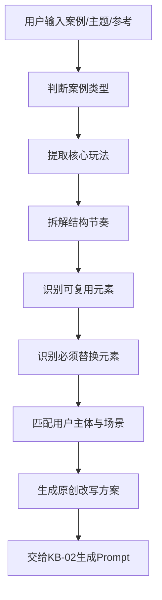

# KB-10｜案例母版库

> 用途：本知识库用于帮助「即梦导演 Prompt Studio」在面对拍同款、拍续集、热点改编、创意变体、系列化内容、案例复盘时，快速调用成熟案例母版，并从中提取可复用的结构、节奏、镜头、风格、爆点和改写方式。

> 调用场景：当用户说「拍同款」「类似这个」「还原这个」「参考这个」「这个主题换个版本」「续集」「下一集」「给我几个案例」「根据往期话题做创意」「把这个案例改成我的角色」「帮我拆解这个视频」时，应优先调用本库。

> 本库负责案例母版、案例拆解和结构复用，不直接替代 Prompt 生成。最终 Prompt 应联动 KB-02；创意升级应联动 KB-03；镜头设计应联动 KB-04；风格表达应联动 KB-05；人物稳定应联动 KB-06；热点话题应联动 KB-07；发布复盘应联动 KB-08。

## 1. 知识库定位

案例母版不是用来照抄，而是用来拆解和复用结构。

本库解决的问题：

1. 用户看到一个视频或话题，不知道如何拆解。
2. 用户想拍同款，但需要避免复制具体表达。
3. 用户想做续集，需要延续世界观和升级冲突。
4. 用户想做系列，需要固定母版和变化规则。
5. 用户想找爆款参考，需要从案例中提炼可复用玩法。
6. GPT 需要根据案例快速生成不同主题版本。

核心原则：

```text
案例母版 = 可复用结构，不是可复制画面。
```

拍同款时保留：

```text
节奏结构、镜头逻辑、情绪曲线、爆点位置、反转方式
```

必须替换：

```text
具体人物、具体台词、具体场景、品牌/IP、原音乐、原画面表达
```

## 2. 案例调用总流程



正确流程：

```text
看案例 → 拆结构 → 提炼母版 → 替换主体 → 重写场景 → 输出原创 Prompt
```

错误流程：

```text
看案例 → 直接复刻画面和台词
```

## 3. 案例拆解标准表

每个案例都应从 8 个维度拆解。

| 维度 | 要回答的问题 |
|---|---|
| 核心玩法 | 这个视频最吸引人的机制是什么？ |
| 开场钩子 | 前3秒为什么让人停下？ |
| 中段推进 | 中间靠什么持续吸引？ |
| 高潮爆点 | 最大变化或笑点在哪里？ |
| 结尾记忆点 | 最后留下什么画面/台词/反转？ |
| 镜头逻辑 | 用了固定机位、推镜、快切、POV还是转场？ |
| 风格气质 | 用什么光色、质感、时代感或视觉风格？ |
| 可改写变量 | 哪些元素可以替换成用户自己的版本？ |
| 素材准备 | 是否需要拆成背景、造型、动作运镜三张参考图？ |

标准拆解模板：

```text
【案例类型】
{剧情/搞笑/变装/广告/MV/奇观/POV/直播/古风/热点}

【核心玩法】
{一句话说明}

【结构拆解】
0–3秒：{开场钩子}
3–6秒：{中段推进}
6–10秒：{高潮爆点}
10–12秒：{结尾记忆点}

【镜头逻辑】
{景别/机位/运镜/转场}

【风格气质】
{主风格/光色/质感}

【可复用结构】
{节奏、反差、转场、情绪曲线}

【必须替换内容】
{人物、台词、品牌、具体画面、音乐、IP}

【原创改写方向】
{替换后的主体、场景、动作、结尾}
```


当用户要求图片素材或先处理素材时，案例拆解后不要直接输出视频 Prompt，而是先输出：

```text
【参考图1：纯背景图】
{案例中的场景、光影、空间和道具转化为无人物背景参考}

【参考图2：服装、发型、妆容与配饰展示图】
{案例中的造型、材质、发型轮廓、配饰和分离式妆容元素，不组成完整脸}

【参考图3：动作与运镜草图】
{案例中的动作节奏、站位关系、镜头路径、分镜箭头，用无脸轮廓或火柴人呈现}
```

## 4. 案例母版分类总表

| 母版类型 | 核心机制 | 适合用途 |
|---|---|---|
| 拍同款母版 | 拆结构，换主体和场景 | 用户提供参考视频/图片 |
| 拍续集母版 | 延续世界观，升级冲突 | 系列剧情、连续创作 |
| 搞笑反转母版 | 严肃铺垫 + 离谱落点 | 沙雕、古今错位、直播梗 |
| 变装变身母版 | 普通状态 + 遮挡/卡点 + 高光造型 | 形象反差、古风、舞台 |
| MV舞台母版 | 对嘴 + 舞蹈 + 灯光 + 节拍 | K-pop/J-pop/C-pop |
| 广告产品母版 | 场景痛点 + 产品出现 + 细节定格 | 品牌、产品、种草 |
| 视觉奇观母版 | 小异常 + 扩散 + 全景高潮 | 怪兽、植物、能量、世界失控 |
| POV沉浸母版 | 第一人称进入 + 互动 + 情绪落点 | 恋爱、游戏、恐怖、Vlog |
| 热点改编母版 | 热点关键词 + 创意母型 | 站内话题、平台挑战 |
| 系列化母版 | 固定角色 + 每集新冲突 | IP化、账号长期内容 |

## 5. 拍同款母版

## 5.1 定义

拍同款是复用案例的结构和节奏，不复制具体表达。

可以复用：

```text
开场方式、镜头节奏、转场逻辑、情绪曲线、反转位置、结尾机制
```

不能复制：

```text
具体台词、具体画面、原人物、原品牌、原IP、原音乐、原素材
```

## 5.2 拍同款拆解模板

```text
【原视频核心】
它真正吸引人的地方是：{核心机制}

【可复用结构】
0–3秒：{钩子}
3–6秒：{推进}
6–10秒：{高潮}
10–12秒：{记忆点}

【原创替换】
原人物 → {新人物}
原场景 → {新场景}
原动作 → {新动作}
原台词 → {新台词}
原风格 → {可保留/可替换风格}

【新版本一句话】
{新创意核心}
```

## 5.3 拍同款输出格式

```text
【结构拆解】
{拆解内容}

【原创改写方向】
{改写说明}

【最终Prompt】
调用 KB-02 生成。
```

## 5.4 拍同款安全句

```text
参考原视频的节奏结构与镜头逻辑，但替换为原创角色、原创场景、原创台词和原创动作。
```

```text
保留玩法，不复刻原画面。
```

## 6. 拍续集母版

## 6.1 定义

拍续集是在已有视频世界观上继续发展，而不是重新开一个完全不同的设定。

续集必须保留：

```text
核心角色、主风格、世界规则、上一集状态、观众记忆点
```

续集可以升级：

```text
冲突强度、场景规模、角色关系、反转难度、视觉奇观、伏笔
```

## 6.2 续集结构

```text
承接上一集 → 新问题出现 → 冲突升级 → 情绪/反转落点 → 下一集伏笔
```

## 6.3 续集模板

```text
【上一集承接】
{角色刚经历了什么 / 世界规则是什么}

【本集新冲突】
{出现一个新问题，但不推翻旧设定}

【升级点】
{视觉更大 / 情绪更强 / 笑点更离谱 / 危机更高}

【结尾伏笔】
{留下下一集问题}
```

## 6.4 续集注意事项

1. 新元素不超过 2 个。
2. 不推翻上一集设定。
3. 不让角色关系突然断裂。
4. 视觉风格保持统一。
5. 结尾必须比上一集多一个新期待。

## 7. 搞笑反转案例母版

## 7.1 核心机制

```text
认真铺垫 + 预期误导 + 离谱反转 + 表情/台词封口
```

## 7.2 适合场景

- 古代客栈
- 武林大会
- 直播间
- 办公室
- 课堂
- 工厂
- 会议室
- 战场
- 颁奖台

## 7.3 结构母版

```text
0–3秒：用严肃镜头建立正经气氛。
3–6秒：主角认真执行一个看似重要的动作。
6–10秒：突然出现违和元素或现代梗。
10–12秒：表情特写 + 音乐停顿 + 一句短台词。
```

## 7.4 可替换变量

| 变量 | 可替换方向 |
|---|---|
| 严肃场景 | 武侠、宫廷、TED、发布会、会议、战场 |
| 离谱元素 | 工牌、账单、二维码、直播话术、KPI、外卖、Debug |
| 结尾台词 | “我只是来打卡”“先结账”“家人们上链接”“再改一版” |
| 风格 | 邵氏武侠、港风、80年代电影、极简演讲 |

## 7.5 示例母版

```text
古代武林大会气氛肃杀，主角缓慢拔剑，所有人屏息等待。下一秒他从袖子里拿出工牌刷卡，全场沉默，镜头切到众人无语表情，结尾主角说 “不好意思，我只是来打卡”。
```

## 8. 变装变身案例母版

## 8.1 核心机制

```text
低状态开场 + 触发动作 + 遮挡/卡点转场 + 高光造型展示
```

## 8.2 适合场景

- 教室走廊
- 办公室
- 街头
- 舞台后台
- 古代庭院
- 雨夜街道
- 镜子前
- 电梯门口

## 8.3 结构母版

```text
0–3秒：普通、疲惫、邋遢或低调状态。
2–5秒：主角做触发动作，如转笔、贴纸、挥手、转身。
5–8秒：遮挡、闪白或卡点完成变装。
8–12秒：高光造型出现，镜头慢推或轻环绕，结尾眼神定格。
```

## 8.4 可替换变量

| 变量 | 可替换方向 |
|---|---|
| 变身前 | 普通打工人、学生、宅家状态、雨夜路人 |
| 触发动作 | 纸张贴镜、转笔、甩外套、关灯、推门、转身 |
| 变身后 | 古风侠客、K-pop舞台、赛博战士、复古港星、国风美人 |
| 转场 | 遮挡、闪白、布料掠过、镜头贴近、运动匹配 |
| 结尾 | 眼神特写、全身定格、海报构图、风吹发丝 |

## 8.5 示例母版

```text
主角普通造型站在走廊，表情疲惫。中段他把纸张贴近镜头遮满画面，鼓点落下瞬间闪白，下一秒变成古代长发侠客，发丝和衣摆随风飘动，镜头低角度慢推，结尾眼神特写定格。
```

## 9. MV舞台案例母版

## 9.1 核心机制

```text
视觉亮相 + 对嘴/舞蹈 + 场景变化 + 副歌高光定格
```

## 9.2 适合场景

- 黑色镜面舞台
- 霓虹雨夜街头
- 巨型LED空间
- 废墟舞台
- 白色极简摄影棚
- 暗黑红光舞台
- 复古歌舞厅

## 9.3 结构母版

```text
0–3秒：眼神、灯光或造型强钩子。
3–6秒：主角对嘴演唱一句歌词。
6–10秒：舞蹈动作或双人互动卡点。
10–12秒：灯光爆发、队形定格或近景高光。
```

## 9.4 可替换变量

| 变量 | 可替换方向 |
|---|---|
| 曲风 | K-pop、J-pop、C-pop、摇滚、电子、复古迪斯科 |
| 场景 | 舞台、街头、雨夜、太空、废墟、宫殿 |
| 人数 | 单人、双人、三人小队、群舞 |
| 风格 | 暗黑、甜酷、复古、赛博、国风、校园 |
| 结尾 | 眼神特写、队形定格、灯光剪影、歌词落点 |

## 9.5 示例母版

```text
黑色镜面舞台上，主角在红色追光中抬眼看向镜头。中段对嘴演唱一句歌词，动作简洁有力。副歌处灯光切换为红黑高对比，镜头快切舞蹈中景和眼神近景，结尾队形定格，烟雾低伏。
```

## 10. 广告产品案例母版

## 10.1 核心机制

```text
场景需求 + 产品出现 + 细节证明 + 品牌感定格
```

## 10.2 适合产品

- 饮品
- 香水
- 美妆
- 电子产品
- 服饰
- 鞋子
- 工具
- 食物
- 虚构产品

## 10.3 结构母版

```text
0–3秒：建立需求或氛围。
3–6秒：产品自然出现。
6–10秒：细节特写、使用动作或效果展示。
10–12秒：产品居中定格，广告语或视觉记忆点。
```

## 10.4 可替换变量

| 变量 | 可替换方向 |
|---|---|
| 场景 | 厨房、办公桌、街头、运动场、摄影棚、车内 |
| 痛点 | 疲惫、炎热、混乱、无聊、需要仪式感 |
| 产品卖点 | 清爽、提神、科技、柔软、耐用、高级 |
| 风格 | 极简商业、日系清新、赛博科技、16mm生活感 |
| 结尾 | 产品定格、手部使用、主角表情、短广告语 |

## 10.5 示例母版

```text
清晨白色厨房，主角疲惫坐在桌前，阳光照到空杯。中段一瓶无品牌高端饮品被放到桌面中央，镜头切到瓶身水珠和开盖特写。主角喝下一口后表情放松，结尾产品居中定格，画面干净高级。
```

## 11. 视觉奇观案例母版

## 11.1 核心机制

```text
普通场景 + 小异常 + 扩散失控 + 全景高潮
```

## 11.2 适合主题

- 植物生长
- 怪兽进入城市
- 办公室变森林
- 地铁变游戏世界
- 天空裂开
- 城市赛博化
- 万物毛毡化
- 能量觉醒

## 11.3 结构母版

```text
0–3秒：普通场景出现明显异常。
3–6秒：异常从局部扩散。
6–10秒：整个空间被变化影响。
10–12秒：全景定格，展示完成后的奇观。
```

## 11.4 可替换变量

| 变量 | 可替换方向 |
|---|---|
| 普通场景 | 地铁、办公室、教室、街道、厨房、商场 |
| 异常源 | 阳光、手机、植物、怪兽、能量、系统提示 |
| 扩散方式 | 生长、融化、像素化、毛毡化、机械化、漂浮 |
| 高潮 | 全空间变化、巨物出现、主角站在中心 |
| 风格 | 春日奇观、赛博末日、软萌毛毡、史诗大片 |

## 11.5 示例母版

```text
普通办公室里，一束阳光照到主角工位，桌上的小绿植突然疯狂生长。中段藤蔓爬满电脑和隔板，文件夹变成花丛。高潮处整间办公室变成森林会议室，结尾主角坐在藤蔓椅上继续开会。
```

## 12. POV沉浸案例母版

## 12.1 核心机制

```text
第一人称进入 + 对方靠近互动 + 情绪变化 + 亲密/反转落点
```

## 12.2 适合主题

- 男友视角
- 女友视角
- 游戏第一人称
- 恐怖探索
- Vlog沉浸
- 互动剧情
- 手部ASMR

## 12.3 结构母版

```text
0–3秒：第一人称进入场景，对方或物体吸引注意。
3–6秒：对方靠近镜头，产生互动。
6–10秒：递物、牵手、靠近、反转或惊吓。
10–12秒：眼神特写、手部互动、温柔定格或反转结束。
```

## 12.4 可替换变量

| 变量 | 可替换方向 |
|---|---|
| 视角身份 | 男友、女友、玩家、观众、访客、探险者 |
| 场景 | 家中、校园、街头、古代客栈、游戏世界、雨夜 |
| 互动 | 递咖啡、牵手、递信、靠近、拍镜头、开门 |
| 情绪 | 甜蜜、悬疑、搞笑、惊喜、治愈 |
| 结尾 | 眼神特写、手部特写、台词、反转画面 |

## 12.5 示例母版

```text
第一人称视角坐在沙发上，对方从厨房端来咖啡。前3秒对方回头微笑，中段走近镜头把咖啡递来，轻声提醒小心烫。阳光照在侧脸，结尾停在温柔看向镜头的近景。
```

## 13. 直播间案例母版

## 13.1 核心机制

```text
职业身份 + 直播话术 + 离谱场景 + 反差笑点
```

## 13.2 适合主题

- 各行各业主播
- 古代直播
- 太空直播
- 深海直播
- 怪兽直播
- 职业反差
- 直播翻车

## 13.3 结构母版

```text
0–3秒：主角以某个职业身份出现在直播间。
3–6秒：主角认真说直播话术。
6–10秒：场景或商品变得离谱。
10–12秒：弹幕/表情/台词形成笑点。
```

## 13.4 可替换变量

| 变量 | 可替换方向 |
|---|---|
| 职业 | 程序员、教练、厨师、侠客、宇航员、老师、考古学家 |
| 场景 | 办公室、战场、太空、古代朝堂、海底、工厂 |
| 商品 | 工具、盔甲、零食、课程、虚构道具、怪兽用品 |
| 话术 | 家人们、上链接、今天必囤、再来一次 |
| 结尾 | 翻车、弹幕爆炸、主角尴尬、商品失控 |

## 13.5 示例母版

```text
程序员凌晨三点坐在复古直播间，黑眼圈明显，屏幕上全是代码。他认真对镜头说 “家人们这个 bug 已经陪我三天了”，中段把键盘当作今日推荐商品，结尾弹幕刷满 “上链接”。
```

## 14. 热点改编案例母版

## 14.1 核心机制

```text
热点关键词 + 用户主体 + 创意母型 + 原创记忆点
```

## 14.2 热点改编流程

```text
1. 提取热点主题关键词。
2. 判断适合的创意母型。
3. 替换成用户角色或职业。
4. 设计12秒结构；若是图片素材需求，先拆成三张素材参考图。
5. 加入标题、标签和发布点。
```

## 14.3 热点适配案例

| 热点方向 | 适合母版 | 改编方式 |
|---|---|---|
| 进入XX世界 | 身份穿越 | 用户进入游戏、武侠、电影、怪兽世界 |
| 劳动主题 | 16mm怀旧 / 职业反差 | 当代职业用80年代电影质感表现 |
| 主播主题 | 直播间母版 | 职业 + 直播话术 + 离谱场景 |
| 怪兽主题 | 视觉奇观 / 角色错位 | 怪兽进入城市日常生活 |
| 游戏主题 | POV / 身份穿越 | 真人进入RPG、FPS、格斗界面 |
| 武侠主题 | 搞笑反转 / 邵氏武侠 | 严肃江湖 + 现代梗 |
| 春天主题 | 世界失控 | 阳光触发生长系统 |
| 人格主题 | 视觉化人格 | 抽象标签变成角色形象 |

## 14.4 热点改编模板

```text
基于话题「{热点名}」，采用{母版类型}。主角为{用户主体}，场景设定为{新场景}，前3秒用{钩子}吸引，中段{变化/反差/冲突}，结尾用{记忆点}收束。
```

## 15. 系列化案例母版

## 15.1 核心机制

```text
固定角色 + 固定世界规则 + 每集新场景/新冲突 + 结尾伏笔
```

## 15.2 系列结构

```text
第1集：建立世界规则。
第2集：规则第一次失控。
第3集：加入新角色或新场景。
第4集：反转原本规则。
第5集：扩大世界观。
```

## 15.3 系列类型

| 系列类型 | 固定元素 | 每集变化 |
|---|---|---|
| 穿越系列 | 主角会进入不同世界 | 每集换世界 |
| 武侠喜剧系列 | 邵氏武侠风 + 现代梗 | 每集换江湖场景 |
| 直播系列 | 固定主播身份 | 每集换行业/商品 |
| 怪兽城市系列 | 怪兽正常生活 | 每集换城市日常 |
| 情侣POV系列 | 双人关系 | 每集换互动场景 |
| AI创作教学系列 | 主角讲即梦经验 | 每集讲一个技巧 |
| 视觉失控系列 | 某规则触发世界变化 | 每集换触发物 |

## 15.4 系列续集模板

```text
上一集：{发生了什么}
本集承接：{从上一集结尾继续}
新冲突：{增加一个新问题}
升级点：{视觉/情绪/笑点更强}
结尾伏笔：{下一集的引子}
```

## 16. 案例母版改写方法

## 16.1 替换主体

```text
原主角 → 用户指定角色 / @角色 / 职业 / 动物 / 怪兽 / 产品
```

示例：

```text
原本是学生穿越 → 改成程序员穿越。
原本是主播带货 → 改成古代侠客带货。
原本是普通情侣POV → 改成赛博城市情侣POV。
```

## 16.2 替换场景

```text
原场景 → 用户更熟悉或更有反差的新场景
```

示例：

```text
客栈 → 办公室
办公室 → 古代朝堂
地铁 → 像素RPG村庄
直播间 → 太空站
厨房 → 极简广告摄影棚
```

## 16.3 替换动作

```text
原动作 → 与新身份更匹配的动作
```

示例：

```text
拔剑 → 刷工牌
唱歌 → 直播带货
喝咖啡 → 接收任务提示
推门 → 进入新世界
抬头 → 觉醒身份
```

## 16.4 替换结尾

```text
原结尾 → 更符合新主题的记忆点
```

示例：

```text
表情定格 → 工牌特写
产品定格 → 广告语
惊吓反转 → 弹幕爆炸
视觉高潮 → 全景海报
温柔对视 → 一句金句
```

## 17. 案例输出格式

## 17.1 案例拆解输出

```text
【案例母版】
{母版名称}

【核心玩法】
{一句话}

【结构拆解】
0–3秒：{钩子}
3–6秒：{推进}
6–10秒：{高潮}
10–12秒：{记忆点}

【可复用点】
{结构、节奏、镜头、转场、情绪曲线}

【必须替换点】
{人物、台词、IP、品牌、音乐、具体画面}
```

## 17.2 案例改写输出

```text
【原创改写版】
主体：{新主体}
场景：{新场景}
动作：{新动作}
风格：{新风格}
结尾：{新记忆点}

【一句话核心】
{新创意}

【最终Prompt】
调用 KB-02 输出。
```

## 17.3 系列规划输出

```text
【系列名】
{名称}

【固定设定】
主角：
世界规则：
视觉风格：
固定笑点/情绪：

【单集结构】
开场：
推进：
高潮：
结尾：

【后续集数】
第1集：
第2集：
第3集：
第4集：
第5集：
```

## 18. 案例质量检查清单

调用案例母版后必须检查：

```text
[ ] 是否只复用结构，没有复制具体表达？
[ ] 是否替换了人物和场景？
[ ] 是否有新的原创记忆点？
[ ] 是否适合用户指定角色？
[ ] 是否适合12秒表达？
[ ] 是否需要先拆图片素材？若需要，是否分清背景、造型、动作运镜？
[ ] 是否有前3秒钩子？
[ ] 是否有中段推进？
[ ] 是否有结尾落点？
[ ] 是否没有侵权风险？
[ ] 是否能交给 KB-02 生成 Prompt？
[ ] 是否能延展成系列？
```

## 19. 本库给 GPT 的执行指令

当调用本库时，GPT 应遵守：

1. 用户要拍同款时，必须先拆解结构，再输出改写版。
2. 不要直接复刻用户参考案例的具体画面、台词、角色、品牌或音乐。
3. 案例母版只保留节奏、结构、镜头逻辑、情绪曲线和爆点位置。
4. 用户要续集时，必须承接上一集，不推翻已有设定。
5. 用户要系列时，必须设计固定元素和每集变化。
6. 用户要热点改编时，先提取热点关键词，再匹配母版。
7. 用户要多个创意时，每个创意都要说明母版类型和爆点。
8. 用户给图片或视频参考时，先判断它属于哪种母版。
9. 输出 Prompt 前，应先给案例拆解或改写方向，除非用户明确只要最终 Prompt。
10. 最终 Prompt 应交给 KB-02 生成，镜头调用 KB-04，风格调用 KB-05。

## 20. 总结

本库的核心价值是让 GPT 能从案例中提炼方法，而不是停留在表面模仿。

最重要的判断句：

```text
这个案例真正可复用的，不是它拍了什么，而是它为什么让人想看。
```

最重要的拍同款公式：

```text
拆结构，换主体；保节奏，换表达；留爆点，做原创。
```

最终目标：

```text
让每个参考案例都能变成一个可改写、可续集、可系列化的创作母版。
```

