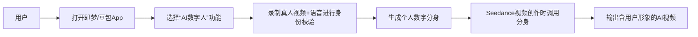
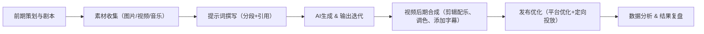

# 执行摘要  
Seedance 2.0（即梦AI）是一款字节跳动推出的多模态视频生成工具，支持同时输入文字、图片、视频、音频等素材【8†L61-L68】【22†L264-L272】，一次最多可用12个文件生成4–15秒短视频【8†L61-L68】【22†L264-L272】。免费用户可获得初始约800秒生成时长＋每日登录260秒积分，生成视频自带浮水印；付费订阅（约69元/月）则无限生成并可去除水印【6†L57-L61】【6†L64-L69】。视频输出为竖屏短视频（9:16比例），官方范围为480p–720p【22†L275-L278】（模型理论可达2K分辨率【24†L25-L29】【24†L40-L45】）。提示词输入不限字数（自然语言描述）【22†L269-L272】，但通常推荐80–200字覆盖“主体+场景+动作+运镜+分段+过渡+风格”等维度【22†L330-L338】【8†L61-L68】。平台禁止直接上传真实人脸素材【22†L279-L282】，但提供“AI数字人”功能：用户经摄像头录音录像完成本人身份校验后，可生成本人“数字分身”用于视频创作【38†L16-L23】（禁止使用他人或知名IP形象以防侵权）。用户可以通过@符号引用上传的图片/视频/音频来指定其用途和位置【22†L289-L297】。例如，示例X推文显示Seedance 2.0生成了一段1670年新阿姆斯特丹场景的视频，埃隆·马斯克称赞其“速度太快”【24†L40-L45】【48†】（下图）。本报告从“规则→操作→高阶技巧→底层逻辑”四层展开：全面列出平台和付费权限下的各种限制差异（表格比较），提示词撰写规范与示例，文字生成定位技术、AI分身创建流程、拍同款内容方法论，以及可执行的创作流程框架（含时间线图）和KPI质量检查清单。

【48†】Seedance 2.0示例：生成纽约殖民地城市场景，埃隆·马斯克评价“快到难以置信”【24†L40-L45】  

# 规则  
- **输入输出限制**：Seedance 2.0 支持最多9张图片、3段视频、3段音频和文本提示的混合输入【8†L61-L68】【22†L264-L272】（总文件数≤12）。生成视频时长可自由选择在4–15秒之间【8†L65-L69】【22†L275-L278】；输出视频格式为短视频竖屏（9:16）。根据官方文档，输出分辨率在480p（约640×640）至720p（约834×1112）范围【22†L275-L278】（模型理论上可生成2K画质【24†L25-L29】【24†L40-L45】）。提示词为自然语言描述，无严格字数上限【22†L269-L272】，但通常推荐80–200字覆盖主题、动作、场景、运镜、氛围等要素，以保证信息充分而不杂乱【22†L330-L338】【8†L61-L68】。  
- **内容合规要求**：平台**禁止**上传或直接生成写实真人面部素材（图片或视频），否则系统会自动拦截【22†L279-L282】。AI数字人/分身功能仅允许用户使用**本人**素材：必须在App内通过录音录像进行真人身份校验后生成数字头像【38†L16-L23】（不能上传他人照片或IP角色形象，否则可能违反肖像权/版权）。因此，需注意隐私和法律合规，确保使用自己的授权素材。  
- **功能模式区分**：Seedance 2.0提供“文生视频”和“图生视频”两种模式（即文字生成和图片生成），如上表选择。如仅靠文字描述生成则选“文生”，如有首帧图或想锁定角色形象则用“图生”【52†L710-L718】。在图生模式下，首帧图片质量决定输出效果，需满足大分辨率、无遮挡、面部清晰等要求【52†L775-L783】。  
- **会员与免费差异**：如下表所示，不同方案在可用秒数、解锁功能和水印等方面有显著差别【6†L57-L61】【6†L64-L69】。免费用户初始约800秒生成额度（仅限Seedance）、每日登录可得260秒积分，使用时带水印；1元7天体验可用付费功能一次；69元/月会员无限生成且去除水印。国际版 Dreamina 平台每日提供225共享代币（免费）、\$18起的订阅方案提高配额并去水印【6†L77-L81】。付费用户还可享优先/加速生成队列等特权。  

| 参数 / 功能          | 即梦免费（含登录积分）      | 即梦付费订阅（¥69/月） | Dreamina 免费           | Dreamina 标准（$18/月） |
| ----------------- | ----------------------- | ----------------- | ------------------ | ----------------- |
| **视频最长时长**    | 15秒【22†L275-L278】        | 15秒               | 15秒               | 15秒              |
| **输出分辨率**      | 480–720p（竖屏）【22†L275-L278】 | ≤720p（可上限1080p） | 720p               | 1080p（9:16）   |
| **提示词长度**      | 无硬性上限【22†L269-L272】  | 无限制             | 无限制             | 无限制            |
| **生成额度 / 次数**  | 初始约800秒＋每日260秒积分【6†L57-L61】 | 按需无限（无积分限制） | 每日225代币（1–2条视频）【6†L77-L81】 | 增加代币配额（快速通道） |
| **水印**           | 有（免费/体验版带水印）【6†L64-L69】 | 无（去除水印）       | 有（水印）         | 无（水印去除）    |
| **生成优先级**      | 普通队列                  | 优先队列           | 标准队列           | 优先/加速队列      |

# 操作  
- **@引用用法**：Seedance 2.0核心通过`@`符号指定素材用途【22†L289-L297】。例如，上传了图片和视频素材后，可在提示词中使用`@图片1`、`@视频1`指向它们，并明确说明用途：如“@图片1作为首帧”可固定整体画风，【22†L289-L297】【22†L301-L308】。常见用法包括指定首尾帧、角色形象、场景参考、运镜风格、配乐同步等【22†L301-L314】。在提示词中**务必明确每个引用的作用**，避免模型“乱用”素材。  
- **提示词撰写**：优质提示词一般遵循**固定结构**：**主体/人物设定 + 场景/环境 + 动作/运动描述 + 运镜术语 + 分段描述 + 转场/特效 + 音频设计 + 风格氛围**【22†L330-L338】【8†L61-L68】。例如，“一位穿白裙的少女在雨中奔跑”加上“近景跟随镜头”、“柔和冷色调”、“4K超高清”、“画面稳定无抖动”等限制，可获得清晰流畅的效果。负面提示（negative prompts）可用于剔除不需要的元素，例如显式写出“无水印、无杂乱文字覆盖”以避免输出中包含水印或随机文字【34†L130-L137】。  
- **文本生成稳定定位**：如果需要在视频中叠加静态文字，可将文字内容直接写入提示词（Seedance 支持直接生成汉字并渲染到画面【31†L100-L104】）。**步骤清单**：1) 在提示词中明确文字内容和位置（如“画面底部中央显示白色字幕‘示例文本’”）；2) 若可用，可上传带目标文字的参考图，并在提示词中使用`@图片`引用来锁定字体和位置；3) 选择较为静态的背景和缓慢镜头，以减少文字抖动；4) 生成后如有轻微抖动，可后期使用视频编辑软件（如AE）对文字区域进行跟踪和稳定。**常见问题与解决**：  
  - *问题：文字模糊或扭曲？* 可能是字体未明确或提示词过长，建议精简文字长度、在提示词中明确“清晰字幕”。  
  - *问题：文字被遮挡？* 确保提示词说明文字前景，不要在文字位置安排物体运动，或手动遮盖。  
  - *问题：字体样式不对？* 模型默认常见字体，可在提示词中加上“黑体”、“等线字体”等描述尝试，但最终效果仍受限，必要时可在后期重新渲染文字。  
  - *问题：文字跟随镜头失稳？* Seedance本身不提供文字跟踪功能，可在多镜头提示中保持文字在连续镜头中的**一致布局**，或在后期软件中对文字轨迹进行修正。  
- **AI数字人（分身）创建与使用**：在即梦/豆包App中，用户可通过“AI数字人”功能创建自己的虚拟分身【38†L16-L23】。**创建流程**：首先打开App并进入“AI数字人”模块，按提示**录制一段本人视频和语音**进行真人校验；通过验证后，系统会生成你的人脸模型和声音克隆，从而形成个人数字分身。以下Mermaid流程图说明了该过程及后续使用：  

分身生成后，可在Seedance提示词中调用。例如在提示词里写“参考@分身人物 的形象作为主角”，模型就会将你的数字头像融入视频【22†L301-L308】。**素材要求**：分身一般需要本人清晰正脸照片/视频，且需获得用户授权。**可控性与限制**：数字人提供多种模式（如“大师模式”、“生动模式”、“标准模式”）控制口型同步与动作【33†L163-L172】。大师模式下口型与面部表情较自然、身体同步度高；普通模式仅唇部运动。当前版本分身生成多用于中景特写，背景通常不会同步模拟【33†L163-L172】。请注意保持动作缓慢（过快动作易导致面部扭曲）【54†L828-L836】【54†L858-L861】。此外，上传语言文字时需注意不能使用含敏感或不当内容的语言，避免触发平台审查。  

- **“拍同款/改编”创作逻辑**：即梦AI可以用于**模仿或改编热门视频风格**。核心在于**匹配动作/运镜/节奏/语义**：通常先选定目标视频或主题，分析其关键动作段落和镜头切换，再在提示词中用相似的动作描述（如“转身”、“跳跃”）和相机运镜（如“推镜”、“旋转跟随”）来重现情节。同时，可在提示词中加入参考图片或关键帧来锁定场景风格【54†L820-L829】【54†L830-L839】。例如，“参考@图片1的光影风格…少女缓慢抬手转身”【54†L836-L839】。**底层原理**：Seedance 2.0经过训练能识别动作与语义，将视觉元素融合成连贯镜头；并依靠模板和多模态提示自动规划分镜【8†L61-L69】【22†L330-L338】。尽管模型具备高度拟合能力，但从著作权角度看，仅使用创意点（思想）通常不侵权，但抄袭原视频的表达（具体镜头、台词、独创场景）可能侵犯版权【44†L32-L35】【54†L858-L861】。**规避策略**：尽量进行创意转换——改变角色服装、背景场景或剧情走向；或者加入原创元素（如字幕、特效）使输出具有新颖表达。避免直接复制他人作品原画面或台词。下表总结了“同款”操作的注意要点：

| 关键要素        | 模仿要点                         | 版权考量与规避                                  |
| ------------- | ------------------------------ | ------------------------------------------- |
| **动作/情节**   | 描述相似的角色动作（可适当变慢或变形）  | 重现创意本身可行，但若完整复制核心剧情可能侵权               |
| **运镜/镜头**   | 使用类似的拍摄手法（推镜、摇镜等）     | 学习风格可，但避免直接使用受版权保护的电影镜头               |
| **节奏/配乐**   | 提示词中对齐画面切换节奏，与音乐卡点   | 不要未经授权使用原视频的音乐/旁白；使用免版权音效            |
| **语义/氛围**   | 保持主题概念（如“浪漫”、“惊悚”色调）   | 创意主题可借鉴，具体表现需创新，如换用不同的背景或角色         |
| **模型引用**    | 上传相似风格的图片/视频参考以锁定样式   | 仅限版权允许的素材。使用开源/自行创作的参考图更安全。         |

# 高阶技巧  
- **提示词深度优化**：Seedance提示词可分段书写。15秒以上视频建议按时间段细分提示（如“0–3秒…，3–6秒…，…”）【22†L332-L338】。这样可更精确地控制不同片段内容。例如，在中间阶段可写“主人公缓慢侧身看向窗外，光线透过窗帘柔和照射”，末尾阶段写“最终屏幕定格在产品LOGO上”。此外，可使用多组引用和修饰词增强一致性：如在提示词中反复强调“保持服装和面部一致”可以提高角色统一度【9†L65-L72】。常用正向关键词包括“电影质感、高级感、超清、自然光、治愈暖色”等；负向词如“无偏色、无杂物、无文字遮挡”可排除干扰。  
- **文字稳定生成**：为了让文字稳定出现，可尝试“先图生再文生”策略：先用即梦AI绘图生成高质量带文字的图像，再在Seedance中引用该图使文字保持清晰。也可在提示词中明确“字幕”“牌匾文字”等关键词，并指定位置（如“白色字幕居中下方”），同时强调“画面稳定、无抖动”。输出后若出现抖动或模糊，通常需要后期“后制校正”——将文字区域导出为跟踪层，在视频编辑软件中手动锁定其坐标，以保证稳定。  
- **AI分身进阶**：在创作AI分身视频时，可组合使用“口型同步”和“动作模仿”。**口型同步**：输入想说的话文本和选定声音（可克隆自己声音），分为“标准”、“大师”模式。大师模式下口型同步效果最佳，适合正式演讲；标准模式效果较一般，多用于简单应用。**动作模仿**：可上传动作参考视频，让分身执行慢动作或高能动作。建议描述“蓄力瞬间”“慢速出招”等有节奏感的动作，避免描述“连续快拳”造成面部变形【54†L828-L836】【54†L858-L861】。分身表现优劣很大程度依赖上传图像质量（如面部清晰度、光照均匀度）【52†L775-L783】。  
- **拍同款高效法则**：针对热门题材，通常“快动作+慢节奏”叙事更具吸引力【54†L800-L809】。如一些出圈视频会给出一个张力大的瞬间（爆炸、落水等），Seedance 2.0则可将其转为慢镜头特写，制造视觉冲击。实践中，常见做法是在提示词中加入关键词“慢动作”、“特写”并配合参考图锁定风格。例如在“机甲大战”场景提示词中加入“慢动作史诗感”“闪电同步”可显著提升效果【54†L851-L861】。通过复用高质量模板（见前述10个场景示例）并在此基础上修改关键词，可以显著提高出片效率与一致性【52†L720-L728】【54†L820-L828】。  
- **创作流程框架**：高质量视频生产需要系统化流程：从前期策划到后期复盘，形成闭环。以下流程图展示了推荐的执行步骤：

每个环节对应关键KPI与质量检查：  
  - **前期策划**：明确目标受众和内容定位（剧本脚本、分镜头设计完整）。KPI：创意可行性、脚本字数完整度。  
  - **素材收集**：准备高质量参考图/视频与配乐。质检：素材版权确认、分辨率符合模型要求【52†L775-L783】。  
  - **提示词撰写**：符合公式结构，覆盖剧情要素无歧义。检查项：是否分时段、是否包含所有多模态引用、是否使用了否定词排除杂物。  
  - **生成迭代**：输出画面清晰无明显畸变，人物连贯自然。KPI：首轮输出成功率、复试次数。质量表：无断帧、镜头连贯、主体清晰度。  
  - **后期合成**：所有镜头拼接连贯、有节奏感；音画同步准确；有无水印或瑕疵。检查列表：统一色调、无突兀跳帧、音效音量正常。  
  - **发布与复盘**：视频上线后监测播放量、点赞、完播率等指标；根据数据反馈调整标签/封面等。KPI示例：播放量≥目标值、完播率>70%、互动率提升等。  

以上各环节均应及时复盘总结，不断优化提示词和操作策略，以实现稳定高效产出。  

**参考资料**：即梦AI官方文档与使用说明【22†L264-L272】【22†L330-L338】【38†L16-L23】，以及权威社区教程【8†L61-L68】【31†L100-L104】等。各功能限制与策略均以官方渠道信息为准（信息来源可信度高）。