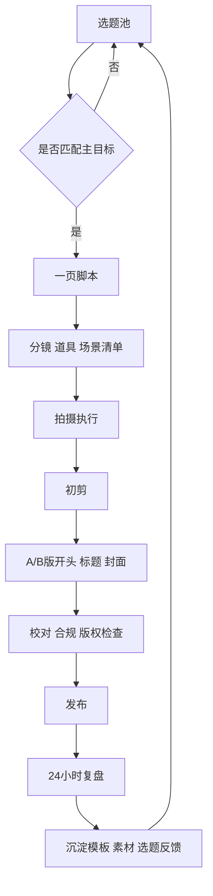

# 短视频影视内容创作全链路方法论报告

## 执行摘要

短视频已经不是“长视频的缩短版”，而是一种由推荐分发、秒级停留决策、连续反馈回路共同塑造的独立影视语言。根据entity["organization","中国网络视听节目服务协会","industry association, china"]发布的《中国网络视听发展研究报告（2026）》，截至 2025 年底，我国网络视听用户规模达到 10.99 亿；短视频是新网民“第一次上网”最重要的入口，44.6% 的新入网网民第一次上网使用的就是短视频应用；网络视听用户人均单日使用时长达到 201 分钟，其中微短剧达到 129 分钟。与此同时，entity["organization","中国互联网络信息中心","internet agency, china"]第 56 次统计报告显示，截至 2025 年 6 月，我国短视频用户规模已达 10.68 亿，占网民整体的 95.1%。这意味着创作者面对的不是“有没有观众”的问题，而是“如何在高度饱和的注意力市场里，被陌生人立刻看懂、看完、记住并继续跟看”的问题。citeturn22search4turn21search7turn7view3

当下跨平台的共性逻辑非常清晰：平台越来越看重开头停留、观看持续、互动传播、内容原创性与真实感。entity["company","Meta","technology company"]旗下 Instagram 官方明确把 Reels 的 watch time、retention、shares、likes 等信号作为推荐判断的一部分，并持续强调“持续发布原创内容”；YouTube Shorts 官方则把“stayed to watch”“engaged views”和前段留存作为核心观察指标，同时建议创作者在最初几秒就抓住观众；TikTok 的近年官方趋势报告则进一步强调：真实的创作者表达、评论区反馈、社区共创正在从“创意风格”变成“商业与传播效率”的基础设施。citeturn17search1turn14search3turn13search0turn13search2turn15search0turn23search0

因此，本报告的核心观点可以概括为一句话：**短视频创作应当以“目标先行、类型匹配、结构驱动、视听服务叙事、数据反哺迭代”为总方法，而不是以灵感、运气或单次爆梗替代系统设计。** 你真正需要建立的，不是一条视频的“偶发爆发力”，而是一套从选题、脚本、拍摄、剪辑到发布、复盘、系列化生产的稳定机制。这个机制既要适配平台信号，也要保护创作者表达，使“被推荐”和“被记住”能够同时成立。citeturn13search12turn17search1turn7view2turn30search20

**要点总结：** 短视频创作的成败，不先取决于设备，不先取决于预算，而先取决于你是否在创作开始前就明确“这条视频是为了流量、情绪、品牌、叙事、成交，还是为了积累 IP”。不同目标，会直接改写类型、时长、镜头、节奏与结尾设计。citeturn13search2turn17search1turn22search2

**可操作清单：**
- 立项前只允许写一个**主目标**，其余目标只能做副目标。
- 每条视频都要明确一个**陌生人进入理由**和一个**看完之后记住你的理由**。
- 把 0–3 分钟视为跨平台主战场；其中 0–60 秒最适合做强测试、强反馈、强迭代的内容单元。后者是结合当前 Reels 与 Shorts 的产品能力、留存指标与分发机制给出的实操建议。citeturn14search6turn13search3turn13search2

## 整体框架

短视频完整构思的底层，不是“先想一个故事”，而是先完成六个问题：**为了什么做、给谁看、在哪个平台分发、用什么类型承载、如何用结构压缩注意力、如何用生产机制保证稳定输出。** 只有这六个问题从创意初期就被同时回答，后面的脚本、拍摄和剪辑才不会彼此打架。平台官方文档越更新，越能看到这一点：从抖音侧巨量学的课程体系，到 B 站创作学院，再到 Instagram Reels、YouTube Shorts 的官方创作者教育，几乎都在围绕“目标—内容—分发—复盘”做系统化训练，而不是围绕单条“爆款玄学”。citeturn11search0turn1search2turn10search1turn14search2turn13search0

### 核心目标与创作取向矩阵

| 核心目标 | 第一评价指标 | 第二评价指标 | 更适配的内容容器 | 结构优先级 |
|---|---|---|---|---|
| 流量获取 | 开头停留、完播、复播 | 分享、关注转化 | 视觉奇观、搞笑、变装、信息浓缩 | Hook > 节奏 > 结尾 |
| 情绪共鸣 | 评论深度、收藏、复播 | 关注、私信讨论 | 情绪、恋爱、治愈、微剧情 | 人物/关系 > 情境 > 余味 |
| 品牌传播 | 评论提及、记忆点、搜索提升 | 分享、品牌联想 | 情景植入、知识解释、原生合作 | 痛点/场景 > 证据 > 品牌归因 |
| 叙事表达 | 后段留存、连看下一集 | 评论猜测、系列回访 | 剧情、悬疑、微短剧、系列人物内容 | 世界观 > 冲突 > 反转 |
| 带货转化 | 点击、加购、成交 | 收藏、咨询、评论问价 | 带货、测评、教程、场景种草 | 痛点 > 演示 > 证明 > CTA |
| 个人 IP | 回访率、关注率、评论称呼 | 社区互动、系列识别度 | 全部类型，但需统一人格与表达习惯 | 稳定人设 > 固定形式 > 系列感 |

表中指标综合了 YouTube Shorts 的“stayed to watch / engaged views”、Instagram Reels 的 watch time / retention / shares 等官方创作者指标，以及当前网络视听内容对消费与传播的带动特征。尤其在消费端，中国最新行业报告显示，58% 的受访者过去半年因收看网络视听内容而购买了此前从未尝试过的产品或服务。citeturn13search2turn13search5turn17search1turn22search2

### 平台共性与差异

| 平台 | 当前更突出的官方/生态信号 | 创作上应优先做什么 | 更适合的创作取向 |
|---|---|---|---|
| 抖音 | 巨量学课程体系明显围绕账号运营、视频创意、短视频创作、直播带货与商业经营展开，说明“内容—经营—转化”是高度一体化的工具逻辑 | 开头直接给价值承诺；单条视频尽量具备清晰的“看点/痛点/爽点/结果” | 高频测试、场景化表达、交易导向内容 |
| 快手 | 官方投资者资料显示其仍然具备高互动密度、强关系链和强电商承接能力，短视频与直播联动特征明显 | 做“人格持续出现”的系列，而不是只有概念没有关系的单次创意 | 人设经营、直播承接、社区粘性内容 |
| B站 | 官方资料强调“围绕兴趣发现和互动的社区”“PUGV 核心”，创作学院又持续强调封面、标题、标签和内容结构 | 重视选题精度、标题/封面/标签与内容一致性，允许信息更完整、观点更成体系 | 兴趣圈层、知识讲解、系列专题、观点型内容 |
| Instagram Reels | 官方强调原创内容、watch time、retention、shares；Trial Reels 让非粉测试成为常规动作 | 先做“被陌生人愿意看”的版本，再做“粉丝熟悉的表达”版本 | 美学一致、情绪识别强、分享性强的内容 |
| YouTube Shorts | 官方明确 9:16、最长 3 分钟、最初几秒抓人、看“stayed to watch / engaged views / retention” | 先把最好看的部分前置，再用留存图里的 spikes / dips 找出结构问题 | 教程、观点精简、可复播、可系列化内容 |

这个表格不是在说平台“只能发什么”，而是在提醒创作者：**同一创意，在不同平台的最优包装并不相同。** 快手更看重“你是谁”和“观众愿不愿意跟你继续互动”，B 站更看重“你讲得是否有价值且包装清楚”，Instagram Reels 与 YouTube Shorts 则更看重“陌生人会不会停下来并继续看”。抖音则特别强调“内容价值、经营工具和转化路径”的衔接。citeturn11search0turn12search0turn12search1turn31search10turn10search1turn14search3turn30search20turn13search0turn13search2

**要点总结：** “整体框架”的本质，是把创作从“想到什么拍什么”升级成“目标驱动的叙事工程”。先定目标，再选平台；先定类型，再写脚本；先定节拍，再拍镜头。这样做，创意不会被生产流程磨损，生产流程也不会把创意拖死。citeturn13search0turn17search1turn11search0

**可操作清单：**
- 用一页立项单，强制写清：主目标、目标受众、平台、类型、核心句、结尾动作。
- 每条视频只允许有一个“主叙事任务”，不要同时承担讲故事、讲知识、带货、抒情四件事。
- 发布前检查：这条视频如果静音看、只看前 3 秒、只看结尾 2 秒，是否仍然成立。

## 类型拆解

类型不是题材。**题材是你讲“什么”，类型是你“怎么让人愿意看”。** 同样是“恋爱”，可以做成剧情，也可以做成情绪抒发、搞笑反差、穿搭带货，甚至做成知识型“恋爱误区解释”；同样是“知识”，也可以用剧情误会、实测结果、人物闯关去承载。换言之，短视频真正的类型划分，优先看的是“目标—结构—节奏—视听”组合，而不是表面题材。citeturn24search0turn24search2turn23search0

### 不同类型的关键指标对比

| 类型 | 主目标 | 典型结构 | 镜头 / 剪辑 / 音乐要点 | 典型时长 | 典型变现路径 |
|---|---|---|---|---|---|
| 剧情 | 情绪、叙事、IP | 异常事件 → 关系/目标建立 → 冲突升级 → 反转/余味 | 中近景和特写承载表演；剪辑服从戏；音乐做情绪抬升而非抢戏 | 45–180 秒 | 广告植入、品牌合作、微短剧分账、长线 IP 商业化 |
| 变装 | 流量、审美展示、人格标签 | Before 提示 → 节拍准备 → Reveal → 补一层身份/情绪落点 | 前后反差镜头；强卡点；音乐节拍与动作同步 | 10–30 秒 | 品牌联名、服饰美妆推广、个人 IP 商单 |
| 信息 | 流量、信任、知识转化 | 问题/误区 → 三点拆解 → 例证/对比 → 结论/行动 | 画面服务理解；字幕层级清楚；背景音乐弱化 | 20–120 秒 | 知识付费、线索收集、课程/咨询、品牌科普合作 |
| 情绪 | 共鸣、关注、收藏 | 一句共鸣 → 场景递进 → 情绪释放 → 余味/安慰 | 特写、停顿、环境声重要；剪辑不宜过碎；音乐重气氛 | 15–60 秒 | 情绪品牌共创、IP 社群、直播陪伴、内容激励 |
| 视觉奇观 | 流量、复播、分享 | 视觉异常 → 过程揭示 → 高潮展示 → 锁帧记忆点 | 高画面可读性；强烈反差；节奏跟着画面刺激走 | 8–45 秒 | 品牌曝光、视觉定制、广告创作、素材版权延展 |
| 带货 | 转化、品牌传播 | 痛点 → 演示/对比 → 使用场景 → 证据 → CTA | 多用中近景与特写证据镜头；节奏偏快；音乐不压口播 | 15–90 秒 | 佣金、品牌合作、直播成交、店铺引流 |

下表是结合平台官方创作与商业说明、短视频商业研究和近年微短剧/社交电商趋势做出的综合归纳。TikTok 2026 白皮书显示，真实的 creator-led storytelling 已经成为可量化的商业驱动因素；中国网络视听报告也显示，网络视听已进入“内容引流—消费转化”闭环阶段。citeturn23search0turn22search2turn20search0turn24search1turn24search19

### 各类型的结构特点与创作路径

**剧情型内容**的核心，不是把长剧情压缩，而是把“冲突”做成进入门槛，把“关系”做成留存理由，把“反转或余味”做成记忆点。当前短视频平台对微系列和短剧情的支持正在升高，TikTok 甚至已经把 micro-series 当作正式内容形态推进，并与entity["known_celebrity","Issa Rae","actor producer"]旗下公司合作推出新微剧项目。这说明剧情型内容的机会不是消失了，而是更强调“短结构里的高度密度”。实操上，剧情短视频优先做“单场景、单目标、单冲突、单反转”，不要一开始就贪图世界观过大。citeturn23search8turn30search4turn30search19turn24search0

**变装型内容**的本质不是“换衣服”，而是“在极短时长里制造可感知的身份跃迁”。它最适合承接流量，因为观众对前后反差的判断极快，但它也最容易空心化。正确做法是：把变装从“结果展示”升级成“人格展示”，也就是让 reveal 之后再多一层身份信息、态度信息或场景信息。这样，变装才会从一次性卡点素材，升级为个人 IP 的审美符号。YouTube Shorts 近年的 beat sync 与模板工具更新，本质上也在降低这一类内容的制作门槛。citeturn26search4turn28search2turn17search1

**信息型内容**不要理解为“把 PPT 说一遍”，而应该理解为“把一个复杂问题压缩成一个可立即获得的认知收益”。YouTube 官方明确把教程、喜剧、幕后、趋势挑战和音乐片段作为常见 Shorts 方向；数字叙事研究则表明，讲故事式的视频相较于讲授式口播，更有助于提升知识保留和迁移。实操上，信息型短视频最强的公式不是“知识越多越好”，而是“一个问题—三个步骤—一个例证—一个结论”。citeturn13search0turn24search2turn24search5

**情绪型内容**要理解的是“共鸣不是慢，是真”。短视频用户虽然做秒级滑动判断，但对真实情绪的识别极快。TikTok 的真实性研究显示，四分之三消费者会跳过过度 polished 的内容，76% 的 APAC 消费者希望品牌出现得更真实；相关学术研究也显示，情绪传染与 narrative transportation 会显著影响短视频中的观看与转化意愿。对创作者来说，这意味着：强情绪不是一定要大喊大叫，而是要**立刻进入那个让人觉得“这就是我”的瞬间**。citeturn23search0turn24search0turn24search3

**视觉奇观型内容**靠的是“先让观众眼睛停住，再让大脑找解释”。相关研究表明，短视频中的 cadence、colorfulness、visual prominence 等视听特征，与 engagement 有显著相关性。它的创作路径不是先解释再展示，而是先展示异常现象，再在中段给少量过程，最后用一个足够完整的高潮画面制造复播。最常见失误是：过程太多、高潮太晚、画面信息太乱。citeturn24search1turn24search16

**带货型内容**已经不能只理解为“卖货视频”，而要理解为“以可信内容驱动行动”。TikTok 的官方真实性研究指出，九成 APAC 用户认为真实内容会直接影响购买决策；中国网络视听报告则显示，近六成受访者会因为视听内容去尝试新产品或服务。换言之，带货内容不应该先喊“买”，而要先回答“为什么值得相信”。最稳的路径是：**痛点明确—场景演示—对比证据—结果展示—行动提示**。citeturn23search0turn22search2turn20search2

**要点总结：** 类型决定内容骨架。先选类型，再选题材，效率会大幅提升。短视频的成功，不在于题材本身是否“新”，而在于它是否被装进了正确的内容容器。citeturn24search0turn24search1turn23search0

**可操作清单：**
- 立项时先写“这条内容属于哪一类容器”，再写题材。
- 一条视频只做一个主类型；混合类型时，必须有主有辅。
- 如果你不能用一句话讲清这条视频的结构骨架，说明类型还没定准。

## 爆款机制

“爆款”在短视频里从来不是一个神秘结果，而是一组可以被拆解的结构反应：**陌生人愿意停、过程中不想走、看完后有动作。** 平台官方指标也基本围绕这三个阶段展开：Instagram Reels 会看 watch time、retention、shares；YouTube Shorts 会看前段停留、engaged views 和 stayed to watch；YouTube 的 Audience Retention 还会明确提示 intro、top moments、spikes、dips 分别意味着什么。citeturn17search1turn13search2turn13search12

### 开头三秒的 Hook 设计

Instagram 官方创作者教育已明确给出建议：用前 3 秒做一个足够有吸引力的 opening hook；YouTube Shorts 官方同样强调最开始几秒必须抓住观众，否则用户会迅速滑走。这里最重要的认知是：**Hook 不是开场白，而是承诺。** 它要在极短时间里告诉观众——“继续看下去，你会得到什么”。citeturn25search0turn25search1

| Hook 类型 | 原理说明 | 可直接套用的公式 |
|---|---|---|
| 结果前置 | 先给收益，再解释过程 | “我只改了这一步，结果完全变了。” |
| 认知冲突 | 打破常识，激发想验证的冲动 | “你以为这是优点，其实正是视频起不来的原因。” |
| 高利害 | 让后果被立刻感知 | “如果开头还这样写，你后面拍再好也没用。” |
| 异常视觉 | 让眼睛先停住 | “先别划走，最后一秒你才会看懂画面里哪不对。” |
| 强情绪 | 先命中情绪，再承接内容 | “成年人最难开口的，不是对不起，而是这句话。” |
| 人物危机 | 让叙事任务一秒成立 | “她删掉他之前，发现了一件更糟的事。” |

**实操建议：**
- 开头第一句优先写成字幕也成立、静音也成立、单看也成立。
- 开头不要解释背景，先交付可感知异常、情绪或收益。
- 如果 Hook 不能单独切出来当封面文案，它通常还不够硬。citeturn25search0turn25search1turn13search2

### 中段节奏推进

中段不是“把内容补全”的地方，而是“不断续签观看理由”的地方。YouTube 留存工具把 spikes、dips、top moments 直接可视化，本质上是在告诉创作者：观众会对某些片段重看、对某些片段流失，说明中段必须通过冲突、信息密度、证据推进、节拍变化不断给新刺激。Instagram 对 watch time / retention / shares 的强调，也指向同一件事：中段必须维持价值密度。citeturn13search12turn17search1

| 中段推进方式 | 原理说明 | 适合类型 | 实操建议 |
|---|---|---|---|
| 冲突升级 | 每一段都抬高代价或压力 | 剧情、悬疑、情绪 | 每 1 个段落只升级 1 个变量，不要同段同时升级三件事 |
| 反转推进 | 用预期落差制造继续观看 | 剧情、搞笑、带货 | 先铺简单预期，再给反差；不要硬拗 |
| 信息三连 | 用 3 个快速新知支撑持续停留 | 信息、知识、带货 | 最稳结构是“误区—正解—例证” |
| 证据递进 | 逐步展示真实可信的证明 | 带货、测评、教程 | 实拍对比优先于口头评价 |
| 节拍变化 | 通过镜头长短、音乐、停顿变化提神 | 视觉奇观、变装、搞笑 | 快内容不等于全程快，要有抬—落—再抬 |

**建议的节奏单位：**
- 10–30 秒内容：每 2–4 秒给一次新刺激。
- 30–90 秒内容：以 3 个节拍段落完成推进。
- 90–180 秒内容：按“起—承—压—转—落”五拍结构写。  
这些区间不是平台硬性规则，而是结合当前短视频留存逻辑给出的创作建议。citeturn13search12turn17search1

### 结尾记忆点

结尾不是简单说“谢谢观看”，而是完成一个明确动作：让用户**记住、评论、分享、转化，或等下一集**。TikTok 官方趋势报告已经把评论区视为新的 focus group，Instagram 则把 shares 作为重要信号之一；因此，在短视频时代，结尾的好坏很大程度上取决于它是否能带出“我想说一句”“我想转给别人”“我想继续看”的后续行为。citeturn7view2turn17search1turn23search0

| 结尾类型 | 适合目标 | 设计方式 |
|---|---|---|
| 反转封口 | 流量、剧情 | 用一句话或一个画面把前文全部改写 |
| 金句余味 | 情绪、IP | 把情绪凝固成可以被转述的句子 |
| 证据定锤 | 带货、知识 | 用结果镜头、前后对比、数据截图完成证明 |
| 评论诱因 | 互动、社群 | 结尾留出判断题、站队题、经验题 |
| 下一集钩子 | 系列化、叙事 | 用未解答问题或新冲突引导续看 |

### 短视频通用脚本公式

**通用公式：**  
**Hook** = [反常识 / 高利害 / 强情绪 / 异常视觉]  
**Setup** = [角色 / 场景 / 目标]  
**Escalation** = [第一个推进点] + [第二个证据/冲突] + [第三个反转/升级]  
**Payoff** = [高潮 / 证明 / 结论]  
**Aftertaste** = [金句 / 评论问题 / 下一集钩子 / CTA]

再压缩成一句：  
**“如果 [角色] 在 [强场景] 中遇到 [高压问题]，TA 必须在 [时间限制] 内通过 [非常规方法] 达成 [目标]，否则 [代价]；结尾用 [反转 / 结论 / 金句 / 下一集问题] 封口。”**

### 类型化脚本示例

#### 恋爱剧情示例

| 时间 | 画面 / 台词 | 结构功能 | 视听建议 |
|---|---|---|---|
| 0–3s | 女主删掉聊天框，字幕：“我决定不等他回复了。” | Hook | 特写；环境声先出，音乐延后 |
| 3–10s | 她说：“可我刚准备放下，才发现他昨天根本没看见消息。” | Setup | 中近景口播；一句话交代关系与误会 |
| 10–28s | 闪回三个小片段：地铁、加班、没电关机 | 推进 | 节奏稍快；画面信息各只给一笔 |
| 28–45s | 她本想原谅，却看到朋友提醒：“那你为什么一直替他解释？” | 冲突升级 | 音乐压低，停顿拉长 |
| 45–60s | 她回头把“已编辑”信息彻底删除：“我不等的不是他，是那个总替别人委屈自己的我。” | Payoff | 近景表演；给情绪封口 |
| 60–68s | 黑底字幕：“你放不下的是人，还是想象中的结果？” | 记忆点 | 留评论空间 |

#### 悬疑微反转示例

| 时间 | 画面 / 台词 | 结构功能 | 视听建议 |
|---|---|---|---|
| 0–2s | 电梯门开，地上有一只湿脚印 | Hook | 第一秒给异常视觉；无解释 |
| 2–8s | 男主旁白：“我家住 12 楼，但这串脚印只到 11 楼。” | Setup | 俯拍 + 旁白，建立谜题 |
| 8–20s | 他沿楼梯往下看，楼道灯一闪一灭 | 推进 | 手持轻晃；加环境噪音 |
| 20–32s | 他在 11 楼门口发现自己早上丢的钥匙 | 反转前提示 | 特写道具；剪辑放慢半拍 |
| 32–42s | 门忽然打开，里面住的是搬来三天的新邻居：“这是你上午掉的吧？你一直在我门口找。” | 反转 | 音乐戛然而止，改成生活声 |
| 42–48s | 字幕：“真正吓人的，常常是你自己补出来的故事。” | 记忆点 | 金句封口 |

#### 搞笑变装示例

| 时间 | 画面 / 台词 | 结构功能 | 视听建议 |
|---|---|---|---|
| 0–2s | 字幕：“说好只是下楼取快递。” | Hook | 大白字直接给笑点方向 |
| 2–6s | 主角穿睡衣、拖鞋、素颜冲出门 | Before | 广角略夸张 |
| 6–12s | 音乐起，镜头跟随拿快递、拆箱、试戴、站镜前 | 准备 | 连续节拍切 |
| 12–17s | Reveal：全套精致穿搭，姿态巨变 | 高潮 | 硬卡点；正面全身镜 |
| 17–24s | 朋友字幕弹出：“你不是去取快递吗？” 主角回：“是啊，顺便换了个人生。” | 封口 | 表情近景，笑点落地 |

#### 治愈视觉示例

| 时间 | 画面 / 台词 | 结构功能 | 视听建议 |
|---|---|---|---|
| 0–3s | 清晨窗帘被风吹起，字幕：“今天别急着证明自己。” | Hook | 慢速镜头；自然环境声先行 |
| 3–12s | 倒水、蒸汽、阳台植物、猫伸懒腰 | 递进 | 多个细节镜头；剪辑留呼吸 |
| 12–23s | 旁白：“先把早晨过好，很多焦虑会自己退潮。” | 价值句 | 真人轻声旁白优先 |
| 23–32s | 拉开窗户，光线铺进来 | 高潮 | 从中景推近景 |
| 32–38s | 字幕：“你不用每一天都锋利。” | 记忆点 | 音乐在尾音处收干净 |

#### 知识科普示例

| 时间 | 画面 / 台词 | 结构功能 | 视听建议 |
|---|---|---|---|
| 0–3s | 开门见山：“你的短视频不火，往往不是拍得差，是前 3 秒没有立约。” | Hook | 直视镜头；粗体字幕 |
| 3–12s | “先看一个错误示范。”展示普通自我介绍式开头 | Setup | 分屏对比更清楚 |
| 12–25s | “正确做法第一步：先给结果。” | 推进一 | 用例句演示 |
| 25–40s | “第二步：只讲一个核心问题。” | 推进二 | 删掉杂信息，字幕分层 |
| 40–55s | “第三步：结尾必须有动作。” | 推进三 | 加评论/收藏/下一集示例 |
| 55–70s | “记住这个公式：Hook—问题—三点拆解—结论—动作。” | 结论封口 | 最后 5 秒重复公式，方便截图 |

这些示例的底层逻辑，综合来自当前平台对开头吸引、留存推进和互动信号的要求，以及叙事与情绪研究中关于 narrative transportation、情绪传染与数字故事学习效果的发现。citeturn25search0turn25search1turn13search12turn17search1turn24search0turn24search2

**要点总结：** 爆款机制的关键不在“堆梗”，而在“结构持续兑现承诺”。开头要立约，中段要续约，结尾要促成动作。citeturn13search2turn17search1turn7view2

**可操作清单：**
- 每个脚本先单独写 Hook，不写 Hook 不准写正文。
- 中段至少安排 3 个推进点，每个推进点只承担一种功能。
- 结尾一定要回答：观众看完是想评论、收藏、转发、点击，还是等下一集？

## 视听语言

短视频的视听语言有一个最重要的原则：**镜头不是为了好看而存在，而是为了更快地被理解。** 从 YouTube Shorts 对 9:16 竖屏和前几秒抓人的强调，到学术研究中对 cadence、visual prominence、colorfulness、auditory features 与 engagement 的研究，都在指向同一件事：短视频不是“镜头越多越专业”，而是“信息越清楚、节奏越合拍、情绪越可感，越有效”。citeturn13search0turn24search1turn24search19

image_group{"layout":"carousel","aspect_ratio":"1:1","query":["storyboard shot list filmmaking close up medium wide","smartphone gimbal tracking shot vertical filming","cinematic close up portrait composition filmmaking","video editing timeline beat markers music sync"],"num_per_query":1}

### 镜头语言、剪辑节奏与音乐匹配

| 元素 | 原理说明 | 实操建议 | 常见误区 |
|---|---|---|---|
| 运镜 | 运镜应服务叙事与信息，而不是替代叙事 | 讲情绪用轻推拉；讲行动用跟拍；讲知识多用稳定机位 | 无意义地全程移动，导致信息难读 |
| 构图 | 竖屏下主体识别速度比“电影感”更重要 | 把关键信息放在中轴或上三分之一；字幕区提前预留 | 人物脸和字幕抢位置，信息层打架 |
| 景别 | 景别决定观众先接收情绪还是空间 | Hook 多用特写或中近景；建立场景才用全景；证据镜头给特写 | 全程中景，导致无重点；全程特写，导致没有空间关系 |
| 剪辑快慢 | 快不等于乱，慢不等于拖 | 节拍快的视频也要有“落点”；情绪视频也要有“抓手” | 全程同速，观众会疲劳；频繁花哨转场分散注意 |
| 卡点 | 卡点是让“动作/画面/音乐”同频，不是机械切拍 | 变装、奇观、搞笑适合强卡点；剧情与知识多做弱卡点 | 把每一剪都卡鼓点，反而失去重点 |
| 音乐匹配 | 音乐决定情绪导向和节奏期待 | 先定音乐是“节拍主导”还是“情绪铺底”；口播时保证人声优先 | 选了强节拍音乐却不跟拍，或音乐情绪和画面冲突 |

关于声音，现有研究还提醒了一个经常被创作者忽略的问题：在短视频广告语境里，相比 AI voice-over，人声配音更能降低认知负荷、提升购买意愿；另有对短视频听觉特征的研究显示，语速、音高、响度和情绪唤起与 viewer engagement 呈显著关系，而且并不是越极端越好。因此，对知识、带货、情绪内容来说，**清晰可信的人声**通常比“炫技配乐”更重要；配乐应该为理解与情绪服务，而不是抢掉语义中心。citeturn24search13turn24search19

YouTube 近年已把 beat sync、时间线编辑、AI stickers 等工具直接做进 Shorts 创作工具，这说明平台正在鼓励创作者把“节拍剪辑、画面同步、低门槛编辑”变成日常能力，而不是专业剪辑师专属技能。对内容团队来说，这会直接改变工作方式：脚本阶段就要想到节拍点和视觉高潮，而不是留到后期“碰运气”。citeturn26search4turn30search6turn25news17

### 分镜示例

下面给出一个 45 秒悬疑短视频的示意分镜，用来展示短视频分镜应该如何把**景别、镜头目的、声音**同时写清。

| 镜头号 | 时长 | 景别 / 机位 | 画面动作 | 声音设计 | 目的 |
|---|---|---|---|---|---|
| 1 | 0–2s | 特写 / 俯拍 | 地上湿脚印进入画面 | 无音乐，只有空楼道环境声 | 视觉 Hook |
| 2 | 2–5s | 中近景 / 手持 | 主角低头、停住 | 呼吸声放大 | 建立即时反应 |
| 3 | 5–10s | 跟拍 / 手持 | 主角沿脚印往前走 | 轻微低频悬疑氛围 | 建立任务 |
| 4 | 10–18s | 特写 / 静止 | 钥匙出现在门口 | 环境声断一下 | 给证据点 |
| 5 | 18–30s | 中景 / 侧拍 | 门慢慢打开，人物出现 | 音乐停，改成门轴声 | 制造反转前停顿 |
| 6 | 30–45s | 双人中近景 / 稳定机位 | 邻居解释真相，主角表情变化 | 回归自然声 + 很轻的尾奏 | 完成反转与余味 |

这个分镜示例体现的不是“镜头复杂”，而是“每个镜头都知道自己为什么存在”。这正是短视频视听语言与传统影视分镜最大的差异：它必须在更短时长里让每个镜头承担更明确的功能。citeturn24search1turn13search0

**要点总结：** 短视频视听语言的优先级应该是：先清楚，再好看；先可感，再华丽；先叙事，再技巧。真正专业的短视频，不是镜头多，而是每个镜头都能快速兑现内容价值。citeturn24search1turn24search19

**可操作清单：**
- 分镜表必须写“镜头目的”，只写景别不写目的没有意义。
- 口播类视频先做“静音可看”测试；剧情类视频再做“闭眼只听”测试。
- 每条视频只选一种主声音策略：节拍驱动、情绪铺底、环境真实感，三者不要平均用力。

## 内容策略

“内容策略”解决的是另一个更难的问题：**同样是短视频，为什么恋爱、悬疑、搞笑、治愈、视觉冲击、知识科普的拍法完全不同？** 因为观众在不同主题下寻求的不是同一种心理回报。有人要代入，有人要猜谜，有人要宣泄，有人要松弛，有人要被震到，有人要立刻学会一个方法。内容策略的任务，就是把“主题承诺”翻译成“视觉风格 + 节奏 + 结尾动作”。citeturn24search0turn24search2turn24search12

### 不同主题对应的创作策略与视觉风格

| 主题 | 观众真正想得到什么 | 视觉风格 | 节奏策略 | 结尾建议 |
|---|---|---|---|---|
| 恋爱 | 关系代入、情绪确认、投射自我 | 中近景、特写、暖色或自然光，表情清晰 | 留停顿，允许沉默，重点在关系推进 | 金句、站队问题、情绪余味 |
| 悬疑 | 信息缺口、猜测快感、反转满足 | 冷色、局部特写、遮挡、留白、环境声强化 | 先快后慢再快，用停顿制造压迫 | 反转或开放问题 |
| 搞笑 | 预期错位、身份反差、节奏打击 | 明亮、夸张构图、表情清楚，画面信息集中 | 高密度短打，3–4 个有效笑点足够 | 最后一击补笑点 |
| 治愈 | 松弛、陪伴、被理解、日常感 | 自然光、慢动作、细节特写、低饱和或柔和色温 | 节奏缓，但前 3 秒仍要有情绪钩子 | 留一句轻柔但可转述的话 |
| 视觉冲击 | 感官刺激、复播冲动、分享冲动 | 高对比、高色彩、宏观细节、运动画面 | 以画面刺激和节拍同步驱动 | 锁帧高潮或“你看清了吗” |
| 知识科普 | 立刻解决问题、降低理解成本、建立信任 | 干净背景、重点字幕、演示或对比画面 | 先结论，再拆解；每段只讲一件事 | 一句话公式、行动建议、下一题预告 |

这张表是对 narrative transportation、情绪共鸣、数字叙事学习效果、微剧情情绪参与和平台推荐指标的综合翻译。简单说：**主题=观众想获得的心理收益，风格=让这种收益发生的手段。** 主题不同，镜头与节奏就不能同质化。citeturn24search0turn24search2turn24search12turn17search1

### 平衡算法推荐与创作者表达

这是今天最关键的进阶问题之一。许多创作者只做两种极端：要么完全追着算法跑，最终每条都像别人；要么完全不管分发逻辑，最终没人看见。真正可持续的做法，是建立一套**双层内容结构**：

- **外层包装**：标题、封面、开头 3 秒、字幕、节奏、长度、评论问题。这一层负责“被看见”。
- **内层作者性**：世界观、情绪态度、人物关系、表达方式、审美偏好、价值边界。这一层负责“被记住”。

Instagram 已经把原创内容、watch time、retention、shares 与非粉测试（Trial Reels）纳入常规创作者工具；TikTok 强调评论区是反馈场；YouTube 则让 spikes / dips 帮助你看清观众真实反应。因此，平衡算法与表达最实际的方法，不是对着“算法”幻想，而是把它拆成三个可以执行的动作：**用 Hook 适配分发、用稳定风格建立识别、用数据与评论校准下一条。**citeturn14search3turn17search1turn30search20turn7view2turn13search12

一个非常实用的配置是：  
**70% 稳定形式 + 20% 主题变化 + 10% 高风险试验。**  
稳定形式负责识别度，主题变化负责新鲜感，高风险试验负责发现下一阶段增长点。Instagram Trial Reels 尤其适合承担这 10% 的试验内容。citeturn14search4turn30search20

### 原创性、合规与边界控制

短视频时代，“原创”不只是道德问题，还是分发和变现问题。Instagram 官方已明确强调对原创内容的保护，并打击简单聚合与重复搬运；YouTube 的 monetization policies 明确指出，非原创 Shorts、未经明显再创作的重传内容以及 reused content 都会影响 Shorts 变现；B 站投稿规范同样强调对独创性的识别；与此同时，中国微短剧监管在 2025 年之后进一步加强，出现了更明确的清理、备案码和标签体系。简单说，**搬运、模仿、拼接、强行借热门二创**，现在不仅可能影响口碑，更可能直接影响分发与收入。citeturn14search5turn4search3turn19search0turn19search3turn2search4turn20search6

**要点总结：** 内容策略不是“选一个主题拍”，而是“先判断观众究竟在这个主题里要什么，再用适合的视觉和结构给他”。同时，所有增长都应建立在原创与合规基础上，否则规模越大，风险越大。citeturn24search0turn17search1turn19search3turn20search6

**可操作清单：**
- 每个主题先写一句“观众真正想获得什么”，再写脚本。
- 用“外层包装—内层作者性”双层模型检查每条内容。
- 发布前做原创与合规四查：版权来源、素材出处、广告标识、题材边界。

## 进阶方法

当创作者从“单条内容”走向“持续产出”，真正决定天花板的已经不是灵感，而是**模板库、流水线、系列化和 IP 化能力**。这一点在多个平台的官方动作中都越来越明显：Instagram 把 Trial Reels 做成测试工具，YouTube 把 retention、beat sync 和 Edit with AI 做成流程工具，TikTok 把评论区、真实性和 micro-series 当作增长基础设施，中国网络视听行业则显示 AI 生成内容与人机协同正在迅速成为常态。citeturn30search20turn13search12turn26search4turn30search1turn7view2turn23search0turn22search2

### 短视频叙事模板库设计

| 模板名 | 核心骨架 | 适合类型 | 使用要点 |
|---|---|---|---|
| 单点反转 | 异常 → 调查/推进 → 真相反转 | 悬疑、搞笑、剧情 | 反转必须能回扣前文细节 |
| 三段递进 | 开头结论 → 三个支撑点 → 收束 | 信息、知识、带货 | 三点最好层级递增，不要平铺 |
| Before / After | 原始状态 → 变化过程 → 新状态 | 变装、功效、治愈、奇观 | 变化必须清晰，一眼可感 |
| 限时任务 | 目标 → 限制 → 尝试 → 结果 | 剧情、挑战、教程 | 时间压力会天然提升观看张力 |
| 误会—澄清 | 误判 → 证据 → 改写理解 | 恋爱、剧情、知识 | 非常适合情绪与叙事混合 |
| 测试—结果 | 提问 → 实验 → 对比 → 结论 | 测评、带货、科普 | 结果镜头必须可证 |
| 评论驱动 | 评论截屏 → 回应/实拍 → 结论 | IP、知识、带货 | 把评论区变成选题池和素材池 |
| 系列人物日常 | 固定角色 → 固定情境 → 新矛盾 | IP、剧情、情绪 | 关键在于观众熟悉“这个人会怎么反应” |

模板库的意义，不是让内容变标准件，而是让创意不必每次从零开始。你越早把“高频成功结构”抽象成模板，团队就越有可能形成稳定产能，并把更多精力放回人物、质感和差异化表达。TikTok 正在推动 micro-series，Instagram 和 YouTube 又都在强化测试与留存分析工具，这使“模板化生产 + 作者性表达”成为当前最实际的中间道路。citeturn30search4turn30search19turn30search20turn13search12

### 可复用内容生产流水线

### 一页式生产 SOP

| 时间节点 | 关键动作 | 产出物 | 责任角色 | 质检重点 |
|---|---|---|---|---|
| D-3 | 收集评论、热点、案例、业务需求 | 选题池 10–20 条 | 主创 / 运营 / 数据 | 是否服务主目标；是否有受众真实需求 |
| D-2 上午 | 选题评审、确定平台与类型 | 立项单 1 页 | 主创 / 编导 / 运营 | 主目标是否唯一；平台适配是否明确 |
| D-2 下午 | 完成 Hook、结构节拍和结尾动作 | 口播稿 / 剧本初版 | 编导 / 主创 | 前 3 秒是否立约；结尾是否有动作 |
| D-1 上午 | 出分镜、场景单、道具单 | 分镜表 / 拍摄单 | 导演 / 摄影 / 编导 | 每个镜头是否写明“镜头目的” |
| D-1 下午 | 预演、机位测试、音乐方向确认 | 试拍素材 / 风格参考 | 主创 / 摄影 / 后期 | 画面是否适合竖屏；字幕区是否安全 |
| D0 | 正式拍摄 | 原始素材 | 导演 / 摄影 / 主演 | 有无多拍 Hook、结尾、补证据镜头 |
| D0 晚上 | 初剪与声音整理 | 初剪版 V1 | 后期 | 节奏是否清晰；信息是否可读 |
| D+1 上午 | 做 A/B 版开头、标题、封面 | V2A / V2B / 标题组 | 后期 / 运营 | 前 3 秒、标题、封面是否同一承诺 |
| D+1 下午 | 合规、版权、发布设置、标签文案 | 发布包 | 运营 / 法务或合规负责人 | 素材来源、广告标识、平台规则 |
| D+2–D+3 | 首轮复盘 | 留存图、评论摘要、转化数据 | 运营 / 数据 / 主创 | dips/spikes、评论意图、是否适合做续集 |
| D+7 | 模板沉淀与系列计划 | 模板卡 / 续题清单 | 主创 / 编导 / 数据 | 哪些结构可复用，哪些表达形成作者性 |

如果是小团队甚至单人团队，这张 SOP 不是要求“增加流程”，而是要求“固定动作”。很多账号停更或质量不稳，问题并不是不会拍，而是**没有形成稳定的流程颗粒度**。citeturn13search12turn17search1turn11search0

### 平衡算法推荐与创作者表达的长期方法

进阶阶段最重要的，不是做更多，而是做更可识别。你需要至少建立四个重复要素：

1. **固定开场习惯**：比如一句总是会出现的开头、一个稳定的镜头动作、一个固定的字幕逻辑。  
2. **固定人格反应**：观众要知道“遇到这种事，你会怎么想、怎么说、怎么拍”。  
3. **固定内容单元**：比如“误会反转”“一分钟拆解”“评论实测”“固定角色日常”。  
4. **固定续看机制**：让评论区、下一集、直播或专栏有承接关系。  

Kuaishou 与 B 站的高互动、强社区特征尤其提醒创作者：系列化的价值不在于单条播放上限，而在于**重复识别、关系沉淀和回访习惯**。B 站官方资料长期强调兴趣社区与高互动，快手的官方投资者资料也持续展示其高互动密度与社交关系优势；TikTok 把评论区视为新的 feedback mechanism，则进一步说明“社区反馈驱动选题”是高度有效的创作方式。citeturn31search1turn31search10turn12search0turn12search1turn7view2

### AI 在短视频生产中的正确位置

2026 年的现实是：AI 已经进入短视频生产主流程。中国网络视听行业报告显示，2025 年由 AI 生成的视频/音频累计已超过 20 亿条，且“人机协同”正从探索走向常态；YouTube 也已把 Veo、Edit with AI 等能力引入 Shorts 工具链。但这并不意味着创作者应把表达外包给 AI。更准确的分工是：

- **AI 适合**：选题扩展、脚本初稿、标题备选、镜头清单、粗剪、版本衍生、字幕整理。  
- **人必须掌控**：世界观、情绪判断、人物关系、镜头取舍、声音可信度、伦理边界、最终节奏。  

尤其在带货、情绪、知识类内容中，“被相信”比“被生成”更重要。真实表达与清晰人声，仍然是当前最重要的信任来源。citeturn22search2turn30search1turn24search13turn23search0

**要点总结：** 进阶不是“拍得更复杂”，而是“建立可以稳定产出好作品的系统”。模板库解决复用，SOP 解决效率，系列化解决回访，IP 解决长期识别，AI 解决低价值重复劳动。citeturn30search20turn13search12turn22search2

**可操作清单：**
- 先做 3 个模板，不要一开始做 30 个模板。
- 每周至少做一次“评论驱动选题”，把反馈真正接入创作。
- 把最成功的 5 条视频拆成模板卡：Hook 句式、推进方式、结尾动作、镜头组合、音乐策略。
- 用 AI 辅助“快”，但保留人工决定“准”与“真”。

可参考近期平台变化，以便把创作方法与新工具、商业化入口和用户注意力变化一起校准。  
navlist近期平台产品与分发动向turn25news17,turn27news36,turn30news32