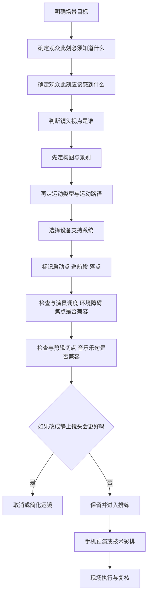

# 视频与影视运镜的设计逻辑与表达能力

## 执行摘要

运镜不是“让画面动起来”的装饰工序，而是一次关于**谁在看、观众何时知道、情绪如何变化、节奏何时落地**的综合决定。多个权威来源对这一点给出了高度一致的结论：镜头只有在能更有效地讲故事时才应该移动；节奏不仅来自剪辑，也来自镜头运动、构图、光线和演员调度；而新手最常见的问题，并不是“设备不够高级”，而是“运动没有戏剧任务”。citeturn18view2turn19view0turn8view7turn25search0turn4search12

这份报告将把“运镜”拆成一个可学习、可复用、可验证的系统：先从运镜的四个核心目的和基础语法说起，再建立“类型—场景—主题—构图—剪辑—音乐”的互相映射关系；随后进入进阶层的“镜头叙事逻辑链”和“信息隐藏/强化”方法；最后落到手机与专业设备的实战策略，并用三组详尽案例做拆解，帮助你把“会拍”推进到“会设计”。citeturn17view0turn23view0turn30view3turn29view1turn31view2

## 目录

1. 基础理解：运镜到底在解决什么问题  
2. 类型总表与速查：不同运镜的技术特征与表达边界  
3. 进阶设计：镜头叙事逻辑链、信息控制、节奏与音乐  
4. 实战执行：手机与专业设备的可行策略  
5. 案例拆解：三种高价值运镜范式  
6. 可复用模板：从脚本到落地的设计流程

## 基础理解

这一章按“概念解释—应用场景—设计思路—常见误区—示例”展开。先给核心结论：**运镜的价值，不在于运动本身，而在于运动带来的信息增量、情绪增量和节奏增量。**如果镜头动了，但角色关系没更清楚、情绪没更强、节奏没更准确，那它大概率就是可删的。citeturn18view2turn17view0turn19view0turn23view0

**一、概念解释**  
从创作者视角看，运镜有四个核心目的。第一是**叙事**：帮助观众理解空间、人物关系和动作路径；第二是**情绪**：推进、后撤、横移、晃动都会改变观众与角色的心理距离；第三是**节奏**：镜头启动、巡航、停顿、落点，本身就是节奏句法；第四是**信息传达**：你可以用运动来揭示信息，也可以用运动来延迟揭示，让观众“刚好知道”而不是“立刻知道”。citeturn17view2turn17view1turn18view2turn19view0turn34view0

**二、应用场景**  
在剧情片里，运镜最常服务于角色视点和戏剧节拍；在广告里，常服务于产品展示、注意力收束和视觉流动；在短视频里，常承担“第一秒建立观看理由”的任务；在 MV 或音乐片里，镜头常被当成节奏器，去匹配拍点、乐句和身体动作；在纪录片里，运镜往往更强调观察、跟随和临场性，而不是展示技巧。纪录片摄影经验里反复出现的观点是：你需要“听”现场，知道什么时候移动，好的移动往往来自对人物和空间的持续感知，而不是预设动作表。citeturn8view2turn28view0turn32view0turn19view2

**三、设计思路**  
一个实用的方法，是在每个镜头设计前先问四个问题：现在是谁的时刻；观众此刻必须知道什么；我希望观众更靠近角色还是更靠近空间；如果这个镜头不动，损失会是什么。北京电影学院相关访谈里，一个很值得记住的经验是：分镜阶段应该按照你**实际拥有的焦距**去思考，而不是把镜头先画得很炫、再去想设备能不能实现；另一个经验是，多人物调度时不能因为灯具和运动复杂就丢失视觉中心与整体感。citeturn25search10turn25search0turn23view0

**四、常见误区**  
最常见的误区有五类。其一，**无意义移动**：为了“有电影感”而动；其二，**过度复杂**：明明推镜就够，却叠加环绕、俯仰、前景遮挡和变焦；其三，**运动与表演脱节**：演员情绪停住了，镜头还在表演；其四，**只顾设备，不顾视点**：稳定器、航拍、FPV 都能拍出“很会拍”的质感，但也很容易拍出“谁在看”完全不清楚的镜头；其五，**镜头参与感失控**：有些段落需要镜头退后、冷静、降低参与感，而不是每场戏都“贴进人物”。公开教学访谈中，既有创作者强调镜头运动的“气质”更多来自表演与调度，也有摄影指导明确提出在某些段落要尽可能降低镜头的参与感。citeturn4search5turn4search12turn18view2turn33view1

**五、示例**  
假设一场两人对话戏，人物 A 先冷静，后崩溃。如果一开始就用近景加手持，情绪会被提前透支。更有效的做法可能是：先用相对中性的构图建立关系，再在情绪节拍发生改变时，缓慢推进或改成更贴身的跟拍；如果人物离开座位、情绪爆发，继续跟住而不是立刻切回大全，会更容易保住情绪连续性。这个原则与希区柯克对移动镜头的理解是一致的：当角色的情绪还在延续时，镜头就不该轻易退回更冷静、更远的观看位置。citeturn18view2turn33view2

## 类型总表与速查

先看一张“运镜类型—表达任务—适用场景”的总表。它不是绝对规则，而是一张创作时的快速判断表：你不是先问“我会不会这个运镜”，而是先问“这个场景更需要哪一种观看关系”。citeturn17view2turn17view1turn26search0turn28view1turn28view2turn29view0

| 运镜类型 | 技术/运动特征 | 表达强项 | 典型适用场景 | 常见误区 |
|---|---|---|---|---|
| 推镜 / 拉镜 | 摄影机物理前后移动；与变焦不同，透视会真实变化 | 推镜适合聚焦、逼近心理；拉镜适合揭露环境、制造孤立 | 剧情片情绪转折、广告产品聚焦、悬疑发现时刻 | 把“任何意识到镜头”的时刻都用推镜解决 |
| 变焦 / 反向变焦 | 焦距变化，空间压缩/拉伸明显 | 更适合“知觉异常”“信息突变”与风格化表达 | 悬疑、惊悚、喜剧夸张、短视频强提示 | 把变焦误当成推拉；视觉语义完全不同 |
| 摇镜 / 俯仰 | 固定机位水平或垂直转动 | 渐进揭示信息、建立空间、强调尺度与权力 | 建立环境、揭示目标、从脚到脸/从天到地的提示性运动 | 摇得太快或太慢，节奏与信息量不匹配 |
| 横移 / 轨道移 / Truck | 摄影机横向平移，层次感强 | 展示空间关系、利用遮挡做 reveal、让人物与环境同步“说话” | 群戏、空间介绍、广告陈列、剧情中的关系变化 | 只有位移，没有层次与前后景设计 |
| 跟拍 / 前导 / 侧跟 | 紧贴主体运动，可前后左右变化 | 临场感、陪伴感、动势连续 | 动作戏、人物行进、短视频日常、纪录片观察 | 跟得太近导致信息单一，或太远导致失去情绪 |
| 手持 | 人体承载，存在自然微抖与响应滞后 | 紧张、脆弱、危险、现场感 | 纪录片、战争/追逐、人物崩溃段落 | 手持不等于乱晃；没有身体节奏就只剩噪音 |
| 稳定器 / Steadicam / TRINITY / Gimbal | 平滑移动，支持长距离跟进与复杂过人动作 | 流动、沉浸、空间穿梭、音乐性 | 长镜头、商业片、广告、MV、城市/室内漫游 | 全片都“浮”，导致情绪单一、缺乏重量 |
| 航拍 / Drone / FPV | 高位、远距、空中轨迹；FPV 更具冲击力 | 空间规模、路径揭示、速度感、地理信息 | 开场建立、宏大场景、运动项目、旅行/城市短片 | 把航拍当万能片头；移动镜头会默认暗示 POV |
| 长镜头 / Sequence Shot | 较长时值内不切或少切，常结合复杂调度 | 沉浸、真实时间感、表演完整性 | 剧情高潮、音乐段落、动作调度、现场感 | 只追求“不断”，忽略内部信息层次 |
| 主观镜头 / POV | 视点明确对齐角色，常配合手持或稳定移动 | 代入、沉浸、心理化经验 | 恐怖、动作、游戏感短片、Vlog、体验类视频 | 主观与客观混用无边界，观众会失去方位感 |

这张表综合了通用摄影语法、运镜教程、纪录片经验与设备特性：Adobe 的教程强调不同景别、角度与运动对叙事、空间和情绪的影响；DJI 的官方文章则清楚区分了云台、航拍和行动机在“控制运动”“空中尺度”“高动态环境”中的不同优势；纪录片与手持摄影的经验则强调“连续移动”与“倾听现场”的价值。citeturn17view0turn17view1turn17view2turn28view1turn28view2turn8view2turn29view0

接着看“主题—镜头语言”的选择原则。这里最重要的一点是：**主题不是先决定某个固定运镜，而是决定“观众与人物/空间的关系应该长什么样”。**citeturn31view2turn19view2turn18view2turn29view1

| 主题 | 首选镜头语言 | 构图与景别互动 | 剪辑/节奏建议 | 应避免的做法 |
|---|---|---|---|---|
| 浪漫 | 缓慢推进、流动跟拍、轻度环绕、长句式镜头 | 从中景向近景收缩，保留空气感与前景层次 | 让镜头落点对在乐句尾，不必拍点全对齐 | 为了“甜”而频繁环绕，反而显得造作 |
| 紧张 | 克制推进、延迟揭示的摇镜、受控手持 | 留出压迫性负空间，必要时让主体被边缘化 | 镜头略长于舒适值，制造等待 | 一味快切；节奏快不等于紧张 |
| 悬疑 | 遮挡 reveal、延时 pan、局部 POV、视线误导 | 用门框、走廊、柱体、反射面切割视野 | 先吊胃口再释放信息，切口要服务“知道的瞬间” | 过早给全景，谜面提前泄露 |
| 宏大 | 航拍、起重、长距离轨道、低角仰拍 | 先给尺度，再给人物；人物不应被空间吞没到失焦点 | 大镜头少而准，作为段落句号更有效 | 每段都空镜开头，宏大很快就失效 |
| 日常 | 眼平、轻跟拍、轻手持、适度锁定 | 景别不过度夸张，动作与构图更自然 | 让切点服从动作完成与生活节拍 | 把所有日常都拍成广告式“浮动镜头” |

在这里，构图不是运镜的附属物，而是运镜的“发音部位”。Adobe 的构图与景别教程强调，负空间、引导线、对称和前后景会直接改变观众的视线；一些摄影师在快切动作场面中会故意把关键动作收拢在画面中央，以避免观众在快速剪辑中失焦；北京电影学院的教学访谈也强调，多人物调度时必须照顾视觉中心和观众视觉方向。换句话说，**运动负责把观众带到哪里，构图负责让观众到场后先看见什么。**citeturn17view0turn23view2turn25search0

## 进阶设计

这一章解决三个更专业的问题：怎么设计“镜头叙事逻辑链”；怎么通过运镜隐藏或强化信息；怎么把运镜与剪辑、音乐、角色和环境组织成一个真正可执行的系统。citeturn23view0turn34view0turn19view0turn20view0

**一、概念解释：什么是镜头叙事逻辑链**  
一个成熟镜头通常不是“想到一个帅动作”，而是沿着一条逻辑链在工作：**建立视点 → 标定空间 → 分配信息 → 推进情绪 → 兑现节奏 → 为切换或收束做准备**。ASC 的脚本分析方法强调按照场景的“beats and measures”去找节拍变化；当角色目标、策略或情绪阶段发生变化时，镜头也应随之改变运动方式、景别或镜头支持系统。citeturn23view0

你可以把这条逻辑链拆成六个具体问题来做分镜：  
其一，观众此刻站在哪一边；其二，观众目前知道多少；其三，这个镜头结束前必须新增什么信息；其四，情绪是在扩张、收缩、卡住还是爆裂；其五，下一个镜头是接动作、接情绪还是接信息；其六，如果这个镜头删掉移动，戏会不会更强。最后这个问题尤其重要，因为它会把大量“炫技但无效”的镜头筛掉。这个思路与希区柯克“镜头必须有明确戏剧目的”的原则是同一条线。citeturn18view2turn23view0

**二、通过运镜隐藏或强化信息**  
隐藏信息，不等于遮住信息；强化信息，也不等于直接怼近景。更专业的做法，是通过“时机”和“路径”来管理观众获得信息的先后顺序。常见的有效方法有四种。第一，**延迟 reveal**：先给空间边缘、空位或前景遮挡，再通过 pan、track 或走位显露真正目标；第二，**非同步观看**：角色在动，但镜头暂时不追，留下一个信息余波，让观众意识到环境中的另一件更重要的事；第三，**限制视点**：只给局部、只给主观、不给全貌，让悬念依赖“观众看不全”；第四，**用运动替代切换**：不直接切下一信息点，而是通过 pan/dolly 让信息在同一个镜头里被观众主动“发现”。经典摄影实践里，导演和摄影师曾刻意减少直切，转而用 pan 或 dolly 在一个较长镜头里连接两个信息点；而在另一部现代作品中，摄影机故意在角色冲回车后留在原地，停看两具尸体，以此告诉观众“这不只是剧情推进，环境本身也有道德重量”。citeturn34view0turn29view1

强化信息也同样需要克制。快切动作场面里，如果画面边缘信息过多、主体位置变化过大，观众会丢失重点，所以很多成熟摄影会在快节奏场面中把关键动作与人物尽量收束在画面中心或偏中心；相反，在悬疑、孤独、压迫主题里，适度让主体偏离中心、落入负空间，反而能强化情绪含义。citeturn23view2turn17view0

**三、镜头运动与角色/环境互动**  
运镜不是独立表演，它永远在回应“人”和“空间”。从功能上看，摄影机通常扮演五种角色：**记录者、陪伴者、追逐者、对抗者、空间叙述者**。例如，纪录片式手持更像记录者；贴身跟拍更像陪伴者；前导压迫、逆向靠近更像对抗者；航拍、起重与横移更像空间叙述者。优秀的设计通常只让一个角色占主导，避免在同一镜头里既想陪伴角色、又想展示空间、又想炫耀设备。citeturn8view2turn29view0turn28view2

很多创作者会把“镜头运动要被角色动作 motivated”当成绝对规则，但现代电影里并不总是这样。公开访谈显示，有些导演会故意让手持摄影“自成路径”，不完全跟随演员动作，甚至允许演员从画面里暂时走开，以此让镜头本身成为一个带态度的观看主体；但这类做法只有在你清楚它在表达什么时才有效，否则很容易变成无谓的失焦和混乱。citeturn29view1

**四、剪辑节奏、镜头长度与转场逻辑**  
一个强镜头不只考虑“现在怎么动”，还要考虑“动完以后怎么剪”。Adobe 的后期教程明确指出，编辑节奏和音乐、演员表演、人物动作甚至镜头运动一样，都有内在节奏；而很多经典摄影实践证明，运镜本身就可以成为转场逻辑。换句话说，镜头运动不是剪辑的前戏，它有时就是剪辑。citeturn8view7turn34view0

实操上，建议把每个复杂运镜拆成三个阶段：**启动、巡航、落点**。启动回答“为什么现在开始动”；巡航回答“中间新带来了什么”；落点回答“停在这里的意义是什么，以及这里是否是切点”。如果一个镜头只有启动没有落点，观众会感觉它在“飘”；如果只有落点没有启动动机，观众会感觉它在“演”。隐藏切最常用的不是“技术多复杂”，而是“转场点是否顺着一个合理的视觉冲击”——比如 whip pan、黑场遮挡、人物/物体贴镜掠过、光比骤变等。citeturn32view0turn32view1turn34view0

**五、音乐节奏与运镜匹配方法**  
音乐匹配最容易被误解成“每一下鼓点都做动作”。真正成熟的做法往往相反：先找**乐句**，再找**重拍**，最后才考虑个别小拍。多个摄影师访谈都把镜头节奏直接类比为音乐，认为一个镜头的 tempo 不只在剪辑里，也在 dolly、crane、演员移动、构图和光线里。citeturn19view0turn20view0turn32view0

可执行的方法是这样的：先把音乐或情绪段落切成“起—承—转—落”；大镜头动作对齐乐句尾或戏剧句尾，而不是对齐每一拍；小动作，如 whip、视线转移、对焦变化，可以对在重拍或歌词落字处；如果你已经有复杂运镜，就减少剪辑频率，让运动自己完成“句读”；如果你要快切，就尽量让镜头本身更简洁，把节奏交给剪辑和声音。音乐片和音乐型段落里，这一点尤其重要——镜头应该像乐器那样“演奏”，而不是像 metronome 那样机械报码。citeturn31view2turn31view0turn8view7turn19view0turn20view0

## 实战执行

这一章按“设备策略—执行方法—案例拆解”展开。核心原则很简单：**设备决定你能多精准地实现一个设计，但不决定这个设计本身是否成立。**citeturn8view6turn28view1turn37view0turn30view3

**一、手机与专业设备的可执行策略**  
手机最强的地方不是画质“接近专业机”，而是**体积小、进入空间快、排练成本低、能把摄影机真正贴到人物和环境之间**。Apple 的说明指出，手机的 Cinematic 模式不仅可以在拍摄时调节焦点、光圈和曝光，也可以在拍后重新修改焦点点位；这意味着手机在“焦点作为叙事工具”这件事上，已经足够承担很多短视频、轻广告、采访和轻剧情段落。再加上智能手机降低了高质量影像创作门槛，它非常适合做窄空间跟拍、POV、生活流观察和高频试拍。citeturn8view6turn2search1turn17view0

但手机的策略应当更“简”：用广角端拍行进，尽量缩短单条镜头时长，用身体做缓冲，用环境做转场，不要试图用很小的传感器和很不稳的姿态硬模仿大画幅电影机。若使用手机云台，则把它当成“单兵版顺滑跟拍工具”，而不是“所有镜头都得飘起来”的理由。DJI 的官方材料很明确：云台特别适合一人团队做 push-in / pull-out、tracking、parallax、低角度与 long-take 式运动，也能显著节约轨道与支撑系统的时间预算；但它的副作用就是很容易把所有内容拍成同一种“漂浮风格”。citeturn28view1turn37view0

专业设备更适合那些对**重复性、精确性、负载能力和焦点控制**要求高的镜头。轨道、摇臂、Steadicam、TRINITY、重型云台、航拍和特制 rig 的价值，不在于更贵，而在于它们能把“复杂调度”和“可重复控制”同时成立。尤其当镜头要和演员走位、焦点、灯光、场景机关、现场声音以及后期隐藏切同步时，专业设备的优势会迅速拉开。citeturn30view0turn30view1turn29view1turn32view0

一个实用判断表如下：

| 创作任务 | 手机裸机 | 手机+云台 | 专业设备更优的情况 |
|---|---|---|---|
| 日常观察、Vlog、轻纪录 | 很适合 | 适合 | 只有当收声、重复性或长焦画质要求升高时 |
| 窄空间跟人、走廊、车内近身 | 适合 | 适合 | 复杂对焦、多角色穿插时专业 rig 更稳 |
| 短视频/广告产品小运动 | 可做 | 很适合 | 需要多次精确重复或微动极平滑时 |
| MV / 舞蹈 / 节奏型镜头 | 勉强可做 | 适合 | 长距离复杂调度、多人 choreography、长焦精确对焦时 |
| 长镜头 / 情节推进 | 风险较高 | 适合小型版本 | 复杂表演、灯光配合、隐藏切、机位交接时 |
| 宏大空间建立 / 航拍 | 不适合 | 不适合 | 航拍、FPV、摇臂、轨道等更可靠 |

这张表综合了手机拍摄、云台与专业系统的公开说明，以及多个实际制作案例里的经验：手机在灵活与进入速度上强，云台在单兵机动和稳定上强，专业系统则在重复性、复杂调度和支持重量上强。citeturn8view6turn17view0turn28view1turn28view2turn37view0

image_group{"layout":"carousel","aspect_ratio":"16:9","query":["1917 behind the scenes trinity camera rig", "Children of Men behind the scenes car rig cinematography", "La La Land freeway opening behind the scenes crane steadicam"],"num_per_query":1}

**案例拆解：《entity["movie","1917","2019 war film"]》**  
这是一种“长镜头沉浸式叙事”的高阶范式。摄影指导 **entity["people","罗杰·狄金斯","cinematographer"]** 在公开采访中解释得很直白：这部片子的目标不是炫技术，而是让观众在几乎不中断的跟随中“无法移开目光”，形成一种近乎幽闭的沉浸感。citeturn30view3

| 维度 | 拆解 |
|---|---|
| 场景任务 | 让观众与两名角色持续处于同一时间流里，体验“不断被拖着前进”的战场推进感 |
| 公开参数 | ARRI ALEXA Mini LF；ARRI Signature Prime；约 99% 镜头使用 40mm，河流段部分用 47mm，地下室用 35mm；前期花两个月测试，多种 rig 中 TRINITY 是关键方案之一 |
| 运动轨迹 | 镜头像“第三个同行者”一样，持续黏在角色路径上，穿越战壕、废墟、壕沟和野地；重点不是炫位移，而是不断维持同在场 |
| 剪辑节奏 | 成片追求看似不切的连续感，因此镜头内部必须自行完成空间交代、情绪推进和动作承接 |
| 音乐配合 | 这类镜头更适合让运动节奏服从脚步、呼吸、地形与危险临近，而不是“卡拍式”运动；若要复刻，优先把步幅和镜头速度统一 |
| 表达意图 | 把“实时性”变成叙事压力，让观众在时间上没有喘息 |
| 效果评估 | 优势是沉浸、压迫、表演连续；代价是排练极重，任何一个环节失误都会牵连全镜头 |

这组公开制作信息主要来自 ARRI 的制作访谈：项目为了实现真实时间感，前期花了两个月测试机动方案，最终形成四套主要移动方法；ALEXA Mini LF 的小型化机身与 40mm 为主的镜头策略，是这类持续跟随能够成立的关键。你真正该学到的不是“必须一镜到底”，而是**当你希望观众感到时间无法被切断时，镜头也不该轻易把时间切断。**citeturn30view0turn30view1turn30view2turn10view2

如果把它转译成中小成本可执行版本，建议这样做：只设计一条 20—40 秒的明确路径，不追求伪一镜到底；镜头等效焦段优先放在 35—50mm；先用手机拍 rehearsal 版，确认人物速度、转角、遮挡和焦点落点；只有当同一条路径在“叙事、情绪、节奏”三项都明显优于切镜方案时，才保留长镜头。这个方法论本身，与“镜头必须具备明确戏剧理由”的老原则是一致的。citeturn18view2turn30view3

**案例拆解：《entity["movie","人类之子","2006 sci fi film"]》**  
这是一种“客观视点 + 手持压力 + 少切强化现实”的高强度范式。摄影指导 **entity["people","艾曼努尔·卢贝兹基","cinematographer"]** 的策略非常值得创作者研究：为了避免把暴力拍得过于“好看”，影片大量避免花哨 coverage，更多借鉴纪录片和战地影像的观察方式。citeturn29view1

| 维度 | 拆解 |
|---|---|
| 场景任务 | 让观众像在事故现场中被迫观看，而不是像在动作片里“欣赏设计” |
| 公开参数 | Super 35 / 1.85:1；Arricam Lite 与 Arri 235；Arri/Zeiss Master Primes；Kodak Vision2 Expression 500T 5229；全片多数镜头使用 18mm；车内长镜头使用 Two-Axis Dolly + Sparrow Head rig |
| 运动轨迹 | 以广角、相对距离感更强的观看方式为主；手持不总是被演员动作驱动，镜头会自己决定何时停留、何时转开 |
| 剪辑节奏 | 少 coverage、少特写、少切；车内名场面在长时值里完成多人物空间交代，只在必要处藏切 |
| 音乐配合 | 这类风格更适合把声音焦点交给环境声、喘息、冲击和空间混响，而非抒情配乐；你越减少“美化性配乐”，镜头越显得残酷而真实 |
| 信息控制 | 镜头在关键时刻不追主角而留在原地，等于在告诉观众：环境、尸体、余波也同样重要 |
| 表达意图 | 去浪漫化暴力，让观众感到混乱、真实和道德重量 |
| 效果评估 | 优势是强现实感与压迫感；风险是如果调度和焦点控制不稳，手持会迅速从“真实”滑向“失控” |

ASC 的公开文章给出了大量关键细节：全片大多使用 18mm、尽量减少 POV 和 close-up；暴力段落参考纪录片，不追求“漂亮 framing”；车内长镜头靠 Two-Axis Dolly 和特制车顶 rig 完成；导演与摄影指导甚至讨论过“手持是否应该拥有自己的路径”。这说明一个非常重要的专业原则：**不是所有运动都要服务主角，有时镜头对“旁边发生的事”保持兴趣，反而会让作品更有立场。**citeturn15view0turn29view1

如果你要把这套方法降维到自己的项目里，最有效的做法不是去复制它的车载 rig，而是复制它的“观看伦理”：少一点英雄化角度，少一点美化性慢动作，少一点过度近景，多一点空间与余波；手持不要只是抖，而要像一个人在现场里**努力看清楚**。citeturn29view1turn8view2

**案例拆解：《entity["movie","爱乐之城","2016 musical film"]》**  
这是一种“镜头与音乐、舞蹈、表演共同演奏”的范式。摄影指导 **entity["people","林纳斯·桑德格伦","cinematographer"]** 在多篇公开访谈里都反复提到：这个项目的关键不是做很多华丽运动，而是让镜头拥有持续一致的“人格”，像一段不断流动的音乐。citeturn31view2turn31view0turn32view0

| 维度 | 拆解 |
|---|---|
| 场景任务 | 让城市、人物、舞蹈与音乐在同一条视觉节奏线上运行 |
| 公开参数 | Panavision Panaflex Millennium XL2；Super 35 4-perf 2x anamorphic，最终近似 2.55:1；主要使用 40mm，通常 T2.8；Kodak 500T 5219 与 250D 5207；500T 以 E.I. 200、250D 以 E.I. 100 暴光，并整体 pull-process 一档 |
| 运动轨迹 | 高速公路开场由 crane + process trailer + Steadicam + 隐藏 whip-pan 切组成三段；很多段落在排练期就把相机与 crane 走位一起写入 choreography |
| 剪辑节奏 | 许多音乐段落只用一机，尽量不补 coverage；隐藏切放在 180 度 whip pan 等自然视觉冲击处 |
| 音乐配合 | 这是教科书式的“乐句优先”案例：镜头不是逐拍报码，而是跟随段落起伏、旋律句尾和舞步完成点落位 |
| 表达意图 | 让摄影机像角色一样“参与”场景，而不仅仅是记录 |
| 效果评估 | 优势是镜头、表演、音乐、灯光的高度一体化；风险是排练、焦点和时间窗要求极高 |

公开资料中最值得学习的细节非常多：影片追求“像一整段连续音乐一样流动”的整体摄影人格；排练不仅排舞，也排 camera 与 crane 的走位；高速公路开场实际上通过技术性隐藏切完成三段运动；为保证节奏，现场会把音乐播放给演员；一次山路舞段甚至要在 magic hour 的狭窄时间窗里完成 27 个 mark 的 crane move。更重要的是，影片明确把 camera 当成“像角色一样参与场景”的存在。citeturn31view2turn31view3turn31view4turn32view0turn32view1turn9view3turn9view1

如果你把这个案例转成自己的拍法，最重要的不是模仿复古色彩，而是学会三件事：**先排节奏，再排相机；先定落点，再定花活；先让镜头服务表演，再让镜头展示自己。**对于 MV、舞蹈短片、品牌 short film 甚至婚礼片段，这条规则都极其耐用。citeturn32view0turn31view0turn20view0

## 可复用模板

下面给出一个可直接套用的“运镜设计思考流程”。它把前文的方法压缩成一个真正可以在脚本会、分镜会、现场排练时使用的判断链。这个流程综合了脚本分 beat 的方法、镜头必须有戏剧目的的原则、构图/焦距与运动联合设计的方法，以及“节奏来自镜头、表演、剪辑和音乐共同协作”的观点。citeturn23view0turn18view2turn25search10turn19view0turn8view7

接着是一张可直接拷贝到 Notion、Excel 或拍摄单里的模板表。它的重点是：**把“为什么动”写在“怎么动”前面。**

| 模块 | 你要回答的问题 | 可填写示例 |
|---|---|---|
| 场景目标 | 这场戏最核心的叙事任务是什么 | 告诉观众角色第一次意识到自己被骗 |
| 信息状态 | 镜头开始前观众知道什么，结束后要多知道什么 | 开始前只知对话不对劲；结束后知道门外有人偷听 |
| 情绪目标 | 我希望观众更紧、更多疑、更浪漫还是更疏离 | 从平静转为不安 |
| 视点归属 | 这个镜头更偏角色主观、客观观察，还是空间叙述 | 客观观察，但略偏角色 A 的心理压力 |
| 构图与景别 | 起始景别、结束景别、视觉中心在哪里 | 中景起，半近景落，视觉中心从两人关系转到门缝 |
| 运镜类型 | 为什么是推、拉、摇、移、跟、手持、稳定器、航拍或 POV | 用慢推镜而不是手持，因为要表现“意识收紧”而非“现场慌乱” |
| 运动路径 | 起点、路径、遮挡、落点是什么 | 从桌边缓慢推向 A，终点停在门缝进入画面的位置 |
| 设备选择 | 手机、手机云台、滑轨、轨道、Steadicam、TRINITY、摇臂、航拍哪种最合适 | 小空间里用手机云台或轻型滑轨 |
| 节奏设计 | 启动点、巡航速度、停顿时机、切点在哪 | 台词第 3 句开始动，第 5 句停住，门外脚步声后切 |
| 音乐/声音 | 运动跟的是音乐、台词、呼吸、脚步还是环境声 | 不跟配乐，跟门外脚步和角色停顿 |
| 风险预警 | 最可能失败的地方是什么 | 推进过头导致“表演过满”；前景遮挡太杂 |
| 兜底方案 | 如果技术条件不足，最小可行替代是什么 | 改成静止中景 + 一次明确摇镜 reveal |

最后给一条真正能拯救很多镜头的“删镜头测试”：**如果把运动去掉，信息依然完整、情绪反而更纯，删。**如果把运动去掉，角色状态弱了、信息时机乱了、节奏落点没了，留。成熟运镜的分水岭，往往不在你会多少种移动，而在你有多敢于不动。citeturn18view2turn4search12turn4search5

关键出处主要来自 entity["organization","美国电影摄影师协会","cinematography society"]、entity["company","ARRI","camera company"]、entity["company","Apple","technology company"]、entity["company","Adobe","software company"]、entity["company","DJI","drone company"]、entity["organization","北京电影学院","film school in beijing"] 的公开教程、访谈与制作笔记，以及《1917》《人类之子》《爱乐之城》三组实际案例。它们共同指向同一件事：运镜真正高级的地方，从来不是“镜头在动”，而是**镜头、角色、空间、剪辑与声音终于在说同一种语言**。citeturn30view3turn29view1turn31view2turn23view0turn8view7turn25search0turn25search10